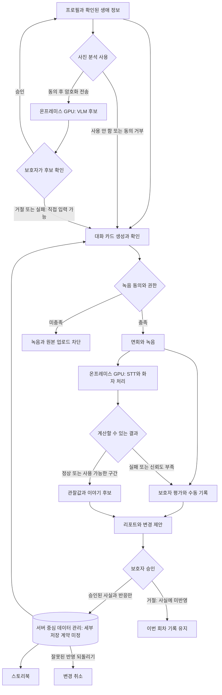

# 아키텍처 기준

## 현재 결정과 구현

STT와 VLM은 온프레미스 GPU 1대에서 처리하고, 데이터 관리도 서버 중심으로 전환한다. 현재 RTX 3060 Ti는 개발용이며 시연 장비의 사양과 처리 성능은 추가 실험 후 정한다. 데이터별 서버 저장 범위, 단말 보관 여부와 기간은 BE가 정리하고 FE, AI와 PM이 함께 확인한다. 모델, API와 운영 방식도 미정이다. [ADR-006](decisions/ADR-006-server-side-ai-processing.md)에 결정 이유와 남은 조건을 기록한다.

현재 Flutter는 합성 목 데이터를 사용한다. FastAPI에는 상태 확인, 공통 오류 및 로그와 구글 인증 API가 있으며 PostgreSQL 개발 스키마도 반영됐다. 인증 저장소는 아직 프로세스 메모리 구현이다. 아래는 개발할 목표 흐름이며 실제 모델과 영속 저장소 연결이 완료됐다는 뜻은 아니다.

## 목표 사용자 흐름

이미지 메타데이터는 VLM의 보조 참고값이다. 태그, 이미지 설명과 결합 출력 중 무엇을 사용할지는 비교 후 정한다. 보호자 평가가 리포트의 입력이라는 현행 계약을 반영했으며, 음성 처리와 평가의 구체적인 실행 순서 및 API는 아직 설계가 필요하다.

## 데이터 경계

- 사용자 동의를 확인한 원본만 암호화 전송한다. 처리 후 즉시 삭제하고 최대 24시간을 넘기지 않으며 삭제 결과를 확인한다.
- 미확인 후보와 실패한 분석을 확정 사실로 저장하지 않는다. 계산 불가 값과 이유를 구분한다.
- 외부 AI의 업체, 국가, 처리 항목, 보유기간과 자체 학습 여부 등은 실제 자료 전송 전에 검토한다.
- 데이터별 서버 저장 항목, 단말 보관 및 캐시 여부, 접근 권한, 보관 기간과 삭제 구현은 미정이다. 서버 중심 전환이 모든 원본의 영구 저장이나 기존 전송 제한 해제를 뜻하지 않는다.
- 카드와 리포트 생성 모델, 큐와 재시도/취소/복구, 실제 저장 연동과 배포 방식은 미정이다. 구글 인증 API와 PostgreSQL 개발 스키마가 있다는 사실만으로 운영 준비 완료를 뜻하지 않는다. GPU 1대 결정으로 DB까지 같은 장비에 배치한다고 정한 것은 아니다.

동의와 원본 임시 처리 기준은 [ADR-001](decisions/ADR-001-consent-and-temporary-processing.md), 절차와 열린 쟁점은 [법률 문서](../legal/README.md)를 따른다.

## 상세 문서

| 필요한 내용 | 정본 |
| --- | --- |
| 역할과 지원 관계 | [PM 역할표](../pm/README.md#역할) |
| 요구사항과 검증 기준 | [테크스펙](../tech-spec.md) |
| 객체, 필드와 상태 | [공통 데이터 계약](data-contracts.md) |
| 화면용 합성 자료 | [목 데이터](mock/README.md) |
| 선택 이유와 과거 결정 | [ADR 목록](decisions/README.md) |

공통 계약은 FE, AI, BE가 공동 검토한다. 하위 호환성을 깨는 변경은 계약, 관련 README와 ADR을 함께 갱신한다.
