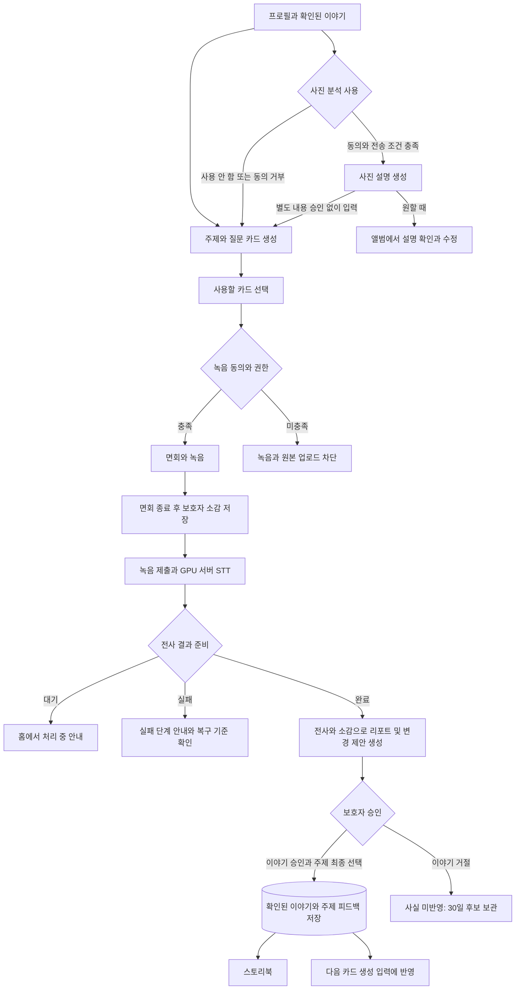

# 아키텍처 기준

## 현재 결정과 구현

STT는 GPU 서버에서 처리하고 사진 설명, 카드와 리포트 생성은 ML API를 활용하는 방향이다. 10월 6일 BE 논의에서 재확인했으며, [ADR-006의 후속 정정](decisions/ADR-006-server-side-ai-processing.md#현재-적용할-방향-2026-10-11-정정)에 기존 결정과 후속 논의를 구분했다. 현재 RTX 3060 Ti는 개발용이며 시연 장비 사양은 실험 후 정한다. ML API 사용 방향이 실제 사용자 자료 전송 승인이나 최종 모델 확정을 뜻하지는 않는다.

현재 Flutter는 합성 목 데이터를 사용한다. FastAPI에는 상태 확인, 공통 오류 및 로그와 구글 인증 API가 있으며 PostgreSQL 개발 스키마도 반영됐다. 계정은 PostgreSQL에 저장하며 세션 폐기 목록은 아직 프로세스 메모리 구현이다. 아래는 개발할 목표 흐름이며 실제 모델과 영속 저장소 연결이 완료됐다는 뜻은 아니다.

## 목표 사용자 흐름

```mermaid
flowchart TD
    P["프로필과 확인된 이야기"] --> G["주제와 질문 카드 생성"]
    P --> I{"사진 분석 사용"}
    I -->|동의와 전송 조건 충족| V["사진 설명 생성"]
    I -->|사용 안 함 또는 동의 거부| G
    V -->|별도 내용 승인 없이 입력| G
    V -->|원할 때| EDIT["앨범에서 설명 확인과 수정"]
    G --> SELECT["사용할 카드 선택"]
    SELECT --> A{"녹음 동의와 권한"}
    A -->|충족| R["면회와 녹음"]
    A -->|미충족| STOP["녹음과 원본 업로드 차단"]
    R --> E["면회 종료 후 보호자 소감 저장"]
    E --> T["녹음 제출과 GPU 서버 STT"]
    T --> Q{"전사 결과 준비"}
    Q -->|대기| WAIT["홈에서 처리 중 안내"]
    Q -->|실패| FAIL["실패 단계 안내와 복구 기준 확인"]
    Q -->|완료| REP["전사와 소감으로 리포트 및 변경 제안 생성"]
    REP --> U{"보호자 승인"}
    U -->|이야기 승인과 주제 최종 선택| D[("확인된 이야기와 주제 피드백 저장")]
    U -->|이야기 거절| KEEP["사실 미반영: 30일 후보 보관"]
    D --> B["스토리북"]
    D --> NEXT["다음 카드 생성 입력에 반영"]
```

사진 메타데이터는 AI 분석과 주제 추천 입력에서 제외한다. 사진 설명은 별도 승인 없이 카드 생성에 쓰고 앨범에서 선택적으로 수정한다. 이를 승인된 이야기로 자동 저장하지 않는다. 카드 전체 흐름과 결정 및 검토 항목은 [주제 카드 설계](card-generation-flow.md), 녹음 처리 상태는 [ADR-008](decisions/ADR-008-stt-pipeline.md), 실패한 단계부터 이어 처리하는 제안은 [복구 기준](processing-recovery.md)에 둔다.

## 데이터 경계

- 해당 처리의 동의와 권한을 확인한 원본만 암호화 전송한다. 녹음 원본은 STT 완료 후 즉시 삭제하며 업로드 후 최대 24시간을 넘기지 않는다. 등록 사진과 AI 분석용 임시 사본의 보관 구분, 삭제 조건 및 PR #92 검토 상태는 [ADR-001](decisions/ADR-001-consent-and-temporary-processing.md#등록-사진과-분석용-임시-사본의-구분)을 따른다.
- 미확인 후보와 실패한 분석을 확정 사실로 저장하지 않는다. 계산 불가 값과 이유를 구분한다.
- 외부 AI의 업체, 국가, 처리 항목, 보유기간과 자체 학습 여부 등은 실제 자료 전송 전에 검토한다.
- 데이터별 서버 저장 항목, 단말 보관 및 캐시 여부, 접근 권한, 보관 기간과 삭제 구현은 미정이다. 서버 중심 전환이 모든 원본의 영구 저장이나 기존 전송 제한 해제를 뜻하지 않는다.
- 카드와 리포트 생성 모델, 자동 재시도·취소·복구, 실제 배포 방식은 미정이다. ADR-008은 PostgreSQL 작업 상태와 별도 worker를 제안하지만 아직 accepted 결정이 아니다. 구글 인증 API와 PostgreSQL 개발 스키마가 있다는 사실만으로 운영 준비 완료를 뜻하지 않는다. GPU 1대 결정으로 DB까지 같은 장비에 배치한다고 정한 것은 아니다.

동의와 원본 임시 처리 기준은 [ADR-001](decisions/ADR-001-consent-and-temporary-processing.md), 절차와 열린 쟁점은 [법률 문서](../legal/README.md)를 따른다.

## 상세 문서

| 필요한 내용 | 정본 |
| --- | --- |
| 역할과 지원 관계 | [PM 역할표](../pm/README.md#역할) |
| 요구사항과 검증 기준 | [테크스펙](../tech-spec.md) |
| 주제 카드 생성과 다음 면회 반영 | [전체 기능 설계 검토안](card-generation-flow.md) |
| 객체, 필드와 상태 | [공통 데이터 계약](data-contracts.md) |
| API 경로, 요청과 오류 코드 | [API 명세](api-spec.md) |
| 작업 중단과 실패 후 재처리, 앱 안내 | [복구 기준 검토안](processing-recovery.md), 검토 중 |
| 화면용 합성 자료 | [목 데이터](mock/README.md) |
| 선택 이유와 과거 결정 | [ADR 목록](decisions/README.md) |

공통 계약은 FE, AI, BE가 공동 검토한다. 하위 호환성을 깨는 변경은 계약, 관련 README와 ADR을 함께 갱신한다.
