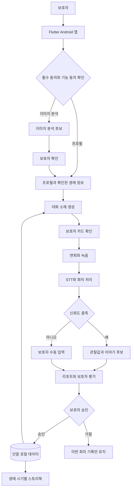

# 새록 테크스펙

상태: 초안

작성 기준일: 2026-08-24

문서 책임: 주 PM 김영석, 부 PM 이예은

기술 검토: FE 리드 이서형, AI 리드 이문영, BE 리드 김민혁

평가 검토: 이문영, 이인성

이 문서는 새록의 제품, 기술, 데이터와 검증 기준을 개발 전에 합의하기 위한 공용 청사진이다. 확정되지 않은 내용을 구현자가 임의로 선택하지 않도록 `확정`, `결정 대기`, `검증 필요`를 구분한다.

## 배경

### 해결하려는 문제

경도인지장애부터 경도 치매 단계의 부모를 면회하는 보호자는 안부 이후 꺼낼 이야기가 부족해 같은 말을 반복하거나 침묵하게 되고, 면회를 제대로 하지 못했다는 죄책감을 느낀다.

새록의 1차 사용자는 보호자다. 피보호자는 보호자가 준비한 대화를 함께 경험하는 간접 수혜자다. 최종 대상 범위를 대화가 어려워진 부모와 성인 자녀까지 넓힐지는 결정 대기 상태다.

### 제품 접근

새록은 확인된 생애 정보와 지난 면회의 반응을 이용해 대화 소재를 제안한다. 면회 후에는 음성 관찰값과 보호자 평가를 기록하고, 보호자가 확인한 정보만 다음 회차와 스토리북에 반영한다.

환자의 기억 회복, 병세 개선, 진단, 예측과 치료 효과는 제품의 목적이 아니다.

## 목표

### 이번 프로젝트의 목표

다음 사용자 흐름을 Android 앱에서 끊기지 않게 연결한다.

    프로필 설정
    → 대화 카드 생성과 확인
    → 녹음을 포함한 면회
    → STT와 화자 처리
    → 관찰값 리포트와 보호자 평가
    → 확인된 이야기와 반응 반영
    → 스토리북
    → 다음 회차 추천

### 검증 목표

- 맞춤 카드가 일반적인 대화 소재보다 실제 면회용으로 더 자주 선택되는지 확인
- 회차 기록을 반영한 카드가 다음 회차 준비에 도움이 되는지 확인
- 면회와 유사한 환경에서 STT와 화자 처리가 가능한지 확인
- 자동 관찰값과 보호자 평가가 얼마나 일치하는지 확인
- 보호자가 다음 면회에도 서비스를 사용하는지 확인

### 성공 지표 초안

| 지표 | 정의 | 상태 |
| --- | --- | --- |
| 2회차 이상 재사용률 | 첫 회차 사용자가 다음 면회에도 카드를 생성한 비율 | 측정식과 표본 기준 결정 필요 |
| 카드 사용률 | 제공된 카드 중 실제 면회에서 사용한 카드의 비율 | 카드 수 결정 후 확정 |
| 맞춤 카드 선택률 | 출처를 가린 비교에서 회차 기록 반영 카드를 선택한 비율 | 실험 설계 필요 |
| 준비 부담 변화 | 면회 전후 보호자가 느낀 대화 준비 부담의 변화 | 문항과 척도 검증 필요 |
| 관찰값 일치도 | 자동 관찰값과 보호자 평가가 같은 방향을 보이는 정도 | 평가 방식 결정 필요 |

환자의 발화량은 대화 품질 점수가 아닌 보조 관찰값으로만 사용한다.

## 일정

아래 일정은 카카오테크캠퍼스 2단계 운영 일정에 맞춘 상위 계획이다. 기능별 상세 일정은 테크스펙 리뷰 후 의존 관계를 확인해 확정한다.

| 구간 | 기간 | 목표와 산출물 |
| --- | --- | --- |
| 스프린트 0 | 4주차, 8월 31일에서 9월 6일 | 그라운드룰, 테크스펙, 스프린트별 목표, 상세 개발 일정, 첫 테크스펙 리뷰 |
| 스프린트 1 | 5주차에서 7주차, 9월 7일에서 9월 27일 | 핵심 사용자 흐름 개발, 1차 배포, CI와 CD 구성, API 문서, 핵심 시나리오 문서 |
| 스프린트 2 | 8주차에서 10주차, 9월 28일에서 10월 18일 | 기능 고도화, 2차 배포, 평가 메트릭 정의, 기준 모델과 벤치마크 결과 |
| 중간고사 조정 | 10주차 또는 11주차 | 팀 일정에 따라 프로젝트와 리뷰 주차 조정 |
| 스프린트 3 | 11주차에서 13주차, 10월 19일에서 11월 8일 | 최종 구현, 예외 처리, 장애 대응 시나리오, 데모 시나리오, 최종 기술 문서 |
| 최종 점검 | 14주차, 11월 11일까지 | 배포 주소, 발표 자료, 5분 시연 영상과 최종 산출물 제출 |
| 최종 발표 | 15주차, 11월 16일에서 11월 20일 | 학교 발표와 온라인 수료식 |

### 스프린트 0에서 확정할 개발 순서

1. 사용자 대상과 MVP 범위
2. 공통 데이터 계약과 상태 전이
3. 프로필에서 카드까지의 최소 흐름
4. 녹음에서 리포트까지의 처리 가능성 검증
5. 보호자 평가와 다음 회차 반영
6. 스토리북 최소 범위

## 담당

| 역할 | 담당 | 책임 |
| --- | --- | --- |
| 주 PM | 김영석 | 문제 정의, 범위, 우선순위, 최종 수렴, PR 관리와 제출 확인 |
| 부 PM | 이예은 | PM 결정 검토, 회의 결과 반영, 문서 누락 확인, 주 PM 부재 시 진행 |
| FE 리드 | 이서형 | Flutter 앱 구조, 화면, 사용자 권한, 앱 생명주기와 합의된 인터페이스 연동 |
| AI 리드 | 이문영 | 이미지와 음성 모델, STT, 화자 처리, 생성 모델, 품질 및 실패 기준 |
| BE 리드 | 김민혁 | 단말 데이터 구조와 로컬 DB, 모델 실행 연동, 처리 파이프라인, 데이터 경계와 선택적 서버 |
| 평가와 QA | 이문영, 이인성 | 평가 자료, 기준 정답, 평가 방식과 통과 기준 |
| 팀원 | 성채원, 이인성 | 기능 구현과 담당 영역 검토, 세부 배정은 스프린트 계획에서 확정 |

공통 데이터 계약 변경은 FE, AI와 BE가 함께 검토한다. 제품 범위 변경은 PM 검토가 필요하다. 개인정보 이동 경로 변경은 PM, BE와 법률 문서 검토가 필요하다.

## 요구사항

### 기능 요구사항

| ID | 기능 | 요구사항 | 상태 |
| --- | --- | --- | --- |
| FR-001 | 프로필 설정 | 이미지, 기본 정보, 취향과 생애 정보를 입력하고 수정할 수 있어야 함 | 확정 |
| FR-002 | 이미지 분석 | 이미지나 메타데이터에서 이야기 후보를 만들 수 있으나 보호자 확인 전 사실로 저장하지 않아야 함 | 기능 확정, 모델과 실행 위치 결정 대기 |
| FR-003 | 동의 확인 | 필수 동의와 피보호자 동의 확인 없이는 실제 녹음과 원본 업로드를 시작하지 않아야 함 | 확정 |
| FR-004 | 대화 소재 생성 | 확인된 생애 정보와 최근 회차 기록을 사용하고 최근 기억 확인형 질문과 확인되지 않은 사실을 생성하지 않아야 함 | 확정, 카드 수와 선택 방식 결정 대기 |
| FR-005 | 추가 대화 지원 | 대화가 멈췄을 때 추가 질문이나 소재를 요청할 수 있어야 함 | 필요성 확정, 더하기 버튼과 실시간 제안 중 결정 대기 |
| FR-006 | 면회 녹음 | 사용자가 녹음을 시작, 중단하고 처리 상태를 확인할 수 있어야 함 | 확정, 녹음 기술 결정 대기 |
| FR-007 | STT와 화자 처리 | 발화 구간, 화자 후보, 텍스트와 신뢰도를 반환하고 불확실한 결과를 구분해야 함 | 확정, 모델과 임계값 검증 필요 |
| FR-008 | 관찰값 리포트 | 계산 가능한 관찰값만 표시하고 의료적 해석이나 대화 품질 단일 점수를 만들지 않아야 함 | 확정 |
| FR-009 | 보호자 평가 | 카드 사용 여부, 분석 결과 동의 정도와 이야기 후보 승인 여부를 입력할 수 있어야 함 | 확정 |
| FR-010 | 반영과 되돌리기 | AI 제안은 승인 전까지 임시 상태로 두고 승인 후 변경도 되돌릴 수 있어야 함 | 확정 |
| FR-011 | 스토리북 | 보호자가 확인한 이야기만 생애 시기와 이야기 블록으로 정리해야 함 | 디지털 구조 확정, 직접 제공과 실물 판매 결정 대기 |
| FR-012 | 다음 회차 | 확인된 생애 사실과 회차별 반응 이력을 다음 카드 생성 입력으로 사용할 수 있어야 함 | 확정, 가중치 방식 검증 필요 |

### 대화 상태별 동작

| 상태 | 제품 동작 |
| --- | --- |
| 기존 주제가 이어짐 | 개입하지 않고 기록 |
| 다른 주제로 바뀌었지만 대화가 이어짐 | 새 주제로 기록하고 개입하지 않음 |
| 주제가 바뀐 뒤 대화가 멈춤 | 사용자가 추가 대화 지원을 요청할 수 있음, 실행 방식은 결정 대기 |
| 음성 분석 신뢰도 부족 | 자동 지표를 생성하지 않고 보호자 확인 또는 수동 입력으로 전환 |
| 부적절한 카드 | 보호자가 사용하지 않거나 대체할 수 있고, 단일 반응으로 영구 제외하지 않음 |

### 비기능 요구사항

| ID | 영역 | 요구사항 | 상태 |
| --- | --- | --- | --- |
| NFR-001 | 개인정보 | 프로필, 전사문과 회차 기록은 단말 저장을 기본으로 함 | 확정 |
| NFR-002 | 임시 처리 | 동의한 원본의 서버 처리는 암호화하고 완료 즉시 삭제하며 24시간을 넘기지 않음 | 확정 |
| NFR-003 | 외부 업체 | 업체, 국가, 처리 항목, 보유기간, 자체 학습 여부와 법적 근거 확인 전 외부 AI를 도입하지 않음 | 확정 |
| NFR-004 | 로그 | 실제 사용자 정보, 전사문과 원본 경로를 로그와 원격 분석에 남기지 않음 | 확정 |
| NFR-005 | 실패 안전성 | 신뢰도 부족, 타임아웃과 처리 실패를 성공 결과처럼 표시하지 않음 | 확정 |
| NFR-006 | 접근성 | 412 x 917 dp 세로 화면을 기준으로 하고 작은 화면과 글자 확대에서 잘림을 방지함 | 기준 확정, 시험 범위 FE 결정 필요 |
| NFR-007 | 성능 | 대상 단말, 녹음 길이, 모델별 처리 시간과 메모리 기준을 측정해야 함 | AI와 BE 검증 필요 |
| NFR-008 | 복구 | 녹음 또는 분석 중단 시 원본, 작업 상태와 재시도 가능 여부를 명확히 보여야 함 | 세부 정책 결정 필요 |
| NFR-009 | 호환성 | 공통 JSON은 버전을 가지며 없는 값은 `null`, 빈 목록은 빈 배열로 반환함 | 확정 |
| NFR-010 | 추적성 | 구조와 데이터 경계 변경은 관련 README와 ADR에 기록해야 함 | 확정 |

## 아키텍처 설계

### 현재 기준 흐름

### 실행 위치

| 처리 | 기본 방향 | 결정 상태 |
| --- | --- | --- |
| 프로필과 회차 데이터 | 단말 로컬 저장 | 확정 |
| 이미지 분석 | 단말 또는 동의 범위의 서버 임시 처리 | 실행 위치 결정 대기 |
| 녹음 원본 | 단말 우선, 기능상 필요한 경우 서버 최대 24시간 임시 처리 | 경계 확정, 구현 방식 결정 대기 |
| STT와 화자 처리 | 경량 모델을 이용한 단말 처리 우선 검토 | 검증 필요 |
| 카드와 리포트 생성 | 로컬 모델 또는 선택적 중계 서버 | 결정 대기 |
| 품질 개선 데이터 | 별도 선택 동의를 받은 가명정보만 대상 | 확정, 수집과 보관 방식 결정 대기 |

별도 서버를 사용하지 않는 상태를 기본안으로 둔다. 외부 LLM이나 서버가 필요하면 데이터 흐름, 법률 문서, 동의와 삭제 증명을 먼저 갱신한다.

## 데이터 모델

공통 형식의 세부 JSON은 [`architecture/data-contracts.md`](architecture/data-contracts.md)를 따른다.

| 객체 | 역할 | 주요 상태 또는 제약 |
| --- | --- | --- |
| `Profile` | 관계, 연령대, 취향과 생애 정보 연결 | 직접 식별정보와 로컬 파일 경로는 외부 요청에서 제외 |
| `LifeFact` | 보호자가 확인한 생애 사실 | 확인되지 않은 추정은 저장 금지 |
| `CardGenerationRequest` | 카드 생성 입력 | 확인된 사실, 최근 반응과 안전 제약 포함 |
| `ConversationCard` | 대화 소재와 질문 | 근거 참조, 위험 표시와 선택 상태 포함 |
| `VisitSession` | 면회와 동의 및 녹음 상태 | 유효한 동의 없이는 녹음과 업로드 차단 |
| `SpeechAnalysisResult` | 전사와 화자 구간 | 신뢰도 부족 구간은 확정 및 지표 계산 금지 |
| `VisitReport` | 관찰값과 이야기 후보 | 계산 불가 값은 `null`과 이유 코드 반환 |
| `CaregiverEvaluation` | 보호자 평가와 승인 | 자동 결과의 최종 품질 확인 입력 |
| `LifeStoryBlock` | 생애 시기별 확인된 이야기 | 보호자가 확인한 내용만 기본 반영 |
| `ChangeProposal` | 프로필과 스토리북 변경 제안 | 승인 전까지 실제 데이터에 미반영 |

### 데이터 상태 원칙

- JSON 필드는 `lowerCamelCase` 사용
- 시간은 시간대를 포함한 ISO 8601 문자열 사용
- 음성 구간은 밀리초 정수 사용
- 없는 값은 빈 문자열 대신 `null` 사용
- 신뢰도는 0.0 이상 1.0 이하이며 제공할 수 없으면 `null` 사용
- 오류 코드는 시스템용 `errorCode`와 사용자용 `message` 분리
- 모든 외부 교환 객체는 `schemaVersion` 포함

## 인터페이스 명세

### 초기 계약

| 인터페이스 | 입력 | 출력 | 주요 실패 |
| --- | --- | --- | --- |
| 프로필 저장 | 기본 정보, 취향, 확인된 생애 사실 | 저장된 프로필과 버전 | 필수값 누락, 저장 실패 |
| 이미지 분석 | 동의 상태와 이미지 입력 | 이야기 후보, 근거와 신뢰도 | 동의 없음, 분석 실패, 식별 위험 |
| 카드 생성 | `CardGenerationRequest` | 카드 목록, 근거와 위험 표시 | 정보 부족, 안전 필터 실패, 모델 실패 |
| 녹음 세션 | `VisitSession`과 동의 상태 | 녹음 및 처리 상태 | 권한 거부, 동의 없음, 저장 공간 부족 |
| 음성 분석 | 녹음 입력과 처리 설정 | `SpeechAnalysisResult` | STT 실패, 화자 불확실, 타임아웃 |
| 리포트 생성 | 분석 결과와 사용 카드 | `VisitReport` | 관찰값 부족, 신뢰도 부족 |
| 보호자 평가 | `CaregiverEvaluation` | 승인 및 거절 결과 | 회차 불일치, 중복 제출 |
| 이야기 반영 | 승인된 후보 | `LifeStoryBlock` 또는 `ChangeProposal` | 승인 없음, 출처 누락, 버전 충돌 |

### 첫 구현 전 확정할 계약

1. 카드 생성 요청과 결과의 카드 수 및 선택 상태
2. 녹음 세션의 저장 상태와 복구 상태
3. STT 중간 결과와 최종 결과의 구분
4. 화자 값과 불확실 상태 처리
5. 리포트 관찰값별 계산 가능 조건
6. 프로필과 스토리북 변경 제안의 승인 및 되돌리기
7. 타임아웃, 재시도 상한과 사용자 메시지

FE는 이 계약을 이용해 실제 AI와 BE 구현 전에도 합성 데이터로 화면 흐름을 개발할 수 있어야 한다.

## 리스크

| ID | 위험 | 영향 | 대응 | 담당 | 상태 |
| --- | --- | --- | --- | --- | --- |
| R-001 | 최종 사용자 범위가 미확정 | 요구사항과 검증 대상 변경 | 스프린트 0에서 PM 수렴 | PM | 결정 필요 |
| R-002 | 면회 환경에서 화자 구분 실패 | 관찰값 전체의 신뢰도 상실 | 유사 환경 조기 평가, 실패 시 수동 입력 | AI, BE, QA | 우선 검증 |
| R-003 | 발화량이 좋은 대화를 대표하지 않음 | 잘못된 추천 반영 | 관찰값으로만 표시하고 보호자 평가와 대조 | PM, QA | 검증 필요 |
| R-004 | 부적절한 카드가 피보호자에게 부담 | 사용자 안전과 신뢰 훼손 | 최근 기억 질문 차단, 보호자 사전 확인, 즉시 대체 | AI, FE, QA | 필수 가드레일 |
| R-005 | 동의 능력, 제3자 음성과 시설 규정 미확정 | 실제 면회 녹음 검증 중단 | 실제 사용자 녹음 전 법률 및 시설 절차 확인 | PM, BE | 외부 확인 필요 |
| R-006 | 모바일 모델 성능 부족 | 긴 처리 시간, 발열과 앱 종료 | 대상 단말에서 모델별 시간, 메모리와 실패 측정 | AI, BE | 우선 검증 |
| R-007 | 서버 또는 외부 AI 도입 시 개인정보 이동 | 법적 의무와 유출 위험 증가 | 업체와 처리 조건 확인 전 호출 금지, 최소 전송과 삭제 증명 | PM, BE, AI | 도입 전 검토 |
| R-008 | 카드, 실시간 제안과 스토리북의 범위 확대 | 핵심 흐름 미완성 | 스프린트별 범위 동결과 비범위 재확인 | PM | 지속 관리 |
| R-009 | 역할별 구현의 데이터 형식 불일치 | 통합 지연 | 공통 계약 우선 확정, 호환성 변경 공동 리뷰 | FE, AI, BE | 필수 절차 |
| R-010 | 자동 분석 오류가 다음 회차에 누적 | 개인화 품질 악화 | 승인 전 임시 제안, 되돌리기, 단일 반응으로 영구 제외 금지 | FE, AI, QA | 필수 가드레일 |

## 요청사항

### 개발 시작을 막는 결정

| 질문 | 결정자 | 완료 시점 |
| --- | --- | --- |
| MVP의 최종 사용자 범위는 어디까지인가 | 주 PM, 부 PM | 스프린트 0 |
| 초기 카드 수와 추가 제공 방식은 무엇인가 | PM, FE, AI | 스프린트 0 |
| 카드의 최종 선택권은 AI와 보호자 중 누구에게 있는가 | PM | 스프린트 0 |
| 추가 대화는 더하기 버튼과 실시간 자동 제안 중 무엇으로 시작하는가 | PM, FE, AI, BE | 스프린트 0 |
| 녹음, STT와 화자 처리의 실행 위치와 최소 단말은 무엇인가 | AI, BE | 기술 검증 후 |
| 로컬 DB, 암호화와 복구 방식은 무엇인가 | BE, FE | 첫 프로필 구현 전 |
| 별도 서버와 외부 LLM이 MVP에 필요한가 | BE, AI, PM | 데이터 흐름 검증 후 |
| 성공 지표의 문항, 표본과 통과 기준은 무엇인가 | PM, QA | 사용자 검증 전 |

개발 기준은 카테캠 공식 저장소로 확정했다. 기본 브랜치는 `develop`이며 팀 작업은 `feature/* → develop`, 멘토 리뷰는 `develop → main`으로 진행한다.

### 현재 구현을 막지 않는 결정

- 웹 검색, 날짜, 계절과 날씨 정보를 카드 생성에 사용할지
- 사용자가 화면과 카드 제공 방식을 어느 범위까지 설정할지
- 스토리북을 피보호자에게 직접 제공할지
- 스토리북을 실물 앨범으로 제작하고 판매할지
- iOS 지원 시점

위 항목은 담당자가 확정하기 전까지 인터페이스 확장을 막지 않는 수준으로만 고려하고 구현하지 않는다.

## 시나리오

### 정상 흐름

1. 보호자가 피보호자 프로필에 확인된 정보와 취향을 입력한다.
2. 이미지 분석 기능을 사용하면 별도 동의 후 이야기 후보를 받고 사실 여부를 확인한다.
3. 앱이 확인된 생애 정보와 이전 회차 기록으로 대화 소재를 제안한다.
4. 보호자가 면회에서 사용할 소재를 확인한다.
5. 동의와 권한을 확인한 뒤 녹음을 시작한다.
6. 면회 종료 후 STT와 화자 처리를 실행한다.
7. 앱은 계산 가능한 관찰값과 이야기 후보만 리포트로 보여준다.
8. 보호자가 결과와 카드별 반응을 평가하고 이야기 후보를 승인하거나 거절한다.
9. 승인된 내용만 프로필과 스토리북에 반영한다.
10. 다음 회차에는 새로 확인된 사실과 회차별 반응 이력을 다시 사용한다.

### 음성 분석 실패 흐름

1. STT 또는 화자 처리의 신뢰도가 기준에 미달한다.
2. 앱은 분석 완료처럼 표시하지 않고 계산하지 못한 이유를 보여준다.
3. 환자 발화량과 응답 지연 등 신뢰할 수 없는 수치는 비워 둔다.
4. 보호자가 카드 사용 여부와 반응을 직접 입력한다.
5. 잘못된 자동 분석값은 다음 회차에 반영하지 않는다.

## 트레이드오프

### 확정된 결정

- Android 우선 Flutter 앱
- Flutter 프로젝트명 `saerok`
- Android Application ID `com.saelog.app`
- 프로필, 전사문과 회차 기록은 단말 저장이 기본
- 사용자 원본의 서버 임시 처리는 동의 범위에서만 허용하고 최대 24시간 제한
- AI 제안은 보호자 승인 전 실제 프로필과 스토리북에 반영하지 않음
- 신뢰도 미달 결과는 수치로 만들지 않음

### 검증 중인 선택

- 단말 전용 처리와 서버 임시 처리의 성능 및 개인정보 트레이드오프
- 경량 STT 모델의 정확도, 처리 시간과 메모리
- 화자 전환 탐지와 화자 식별의 구현 범위
- 로컬 생성 모델과 외부 LLM 중계의 품질 및 비용

구조에 영향을 주는 결정은 [`architecture/decisions`](architecture/decisions/README.md)에 ADR로 남긴다.

## 테스트 전략

| 영역 | 최소 검증 |
| --- | --- |
| 프로필 | 필수값 누락, 수정, 삭제, 로컬 저장 실패와 변경 복구 |
| 동의 | 필수 동의 거부, 피보호자 확인 없음, 이미지 기능 거부와 선택 동의 거부 |
| 카드 | 정보 부족, 최근 기억 질문, 사별 등 민감 소재, 없는 사실 생성과 대체 카드 |
| 녹음 | 마이크 권한 거부, 중단, 앱 백그라운드, 저장 공간 부족과 원본 삭제 |
| STT와 화자 처리 | 작은 음성, 불명확한 발음, 사투리, 제3자, 안내방송과 중첩 발화 |
| 리포트 | 발화 부족, 신뢰도 부족, 계산 불가 값, 의료적 해석 생성 차단 |
| 보호자 평가 | 부분 동의, 거절, 중복 제출, 승인 전 데이터 미반영 |
| 스토리북 | 승인된 이야기만 반영, 출처 연결, 되돌리기와 시기 분류 |
| 개인정보 | 로그 유출, 미동의 업로드, 24시간 초과, 삭제 실패와 외부 요청 허용 목록 |

평가 자료는 합성 자료 또는 재배포 권한이 확인된 자료만 사용한다. 실제 사용자 자료와 마스킹한 실제 자료는 GitHub 평가셋에 포함하지 않는다.

정확한 실행 명령과 통과 기준은 [`../evals/README.md`](../evals/README.md)와 각 영역 README에 실제 검증 결과가 생길 때 기록한다.

## 릴리즈

### 1차 배포

- 프로필부터 보호자 평가까지 핵심 흐름 연결
- 합성 데이터 또는 허가된 테스트 자료로 실행
- 실패 상태와 수동 입력 경로 포함
- API 및 데이터 계약 문서 제공

### 2차 배포

- 실제 검증 결과를 반영한 STT와 화자 처리 개선
- 평가 메트릭과 기준 결과 제공
- 카드와 회차 반영 흐름 고도화

### 최종 배포

- 핵심 사용자 시나리오와 실패 시나리오 검증
- 개인정보, 동의와 삭제 흐름 확인
- 배포 서비스, 발표 자료, 5분 시연 영상과 기술 문서 제출

실제 사용자 대상 배포 범위는 녹음 동의, 시설 규정, 제3자 음성과 외부 처리에 대한 검토가 끝난 뒤 확정한다.

## 스펙 아웃

| 항목 | 제외 이유 | 재검토 조건 |
| --- | --- | --- |
| 의료 진단과 병세 예측 | 관찰 지원 도구의 범위를 벗어나며 잘못된 판단 위험이 큼 | 이번 프로젝트에서는 재검토하지 않음 |
| 치료 효과와 기억 회복 주장 | 현재 제품 기능으로 인과 효과를 입증할 수 없음 | 별도 임상 근거와 규제 검토가 있는 경우 |
| 피보호자 직접 인지 훈련 | 1차 사용자인 보호자의 면회 준비 문제와 다른 제품이 됨 | 사용자 검증에서 직접 사용 요구가 확인된 경우 |
| AI의 자동 대화 대행 | 보호자가 직접 대화하도록 돕는 제품 원칙과 충돌 | 이번 프로젝트에서는 재검토하지 않음 |
| 확인되지 않은 생애 사실의 자동 반영 | 거짓 정보가 다음 추천과 스토리북에 누적될 수 있음 | 재검토하지 않으며 보호자 승인을 유지 |
| 말기 치매 대상 초기 검증 | 언어적 상호작용과 동의 조건이 현재 가설과 다름 | 초기 대상 검증 완료 후 별도 연구 |
| 스토리북 실물 앨범 판매 | 제작, 저작권, 개인정보, 거래와 환불 조건이 추가됨 | 디지털 스토리북 검증과 법률 검토 완료 후 |
| iOS 지원 | 10주 개발 범위를 Android 핵심 흐름에 집중 | Android 최종 흐름 완료 후 |
| 검증되지 않은 외부 AI 도입 | 개인정보 이동, 비용과 데이터 처리 조건이 확정되지 않음 | 업체와 처리 조건을 문서화한 뒤 |

## 히스토리

### 프로젝트 문서

- 제품 범위와 미정 사항: [`pm/README.md`](pm/README.md)
- 12주 팀 목표: [`pm/12-week-team-goals.md`](pm/12-week-team-goals.md)
- 주간 운영: [`pm/weekly-operations.md`](pm/weekly-operations.md)
- FE 기준: [`../app/README.md`](../app/README.md)
- AI 기준: [`../local_ai/README.md`](../local_ai/README.md)
- BE 기준: [`../backend/README.md`](../backend/README.md)
- 평가 기준: [`../evals/README.md`](../evals/README.md)
- 공통 데이터 계약: [`architecture/data-contracts.md`](architecture/data-contracts.md)
- ADR: [`architecture/decisions`](architecture/decisions/README.md)
- 법률과 개인정보: [`legal/README.md`](legal/README.md)
- 협업과 PR 절차: [`../CONTRIBUTING.md`](../CONTRIBUTING.md)

### 테크스펙 작성 근거

- 2026-08-24 카카오테크캠퍼스 테크스펙 강의
- 아이디어톤 과제 1에서 과제 5까지의 최종 작성 내용
- 1차, 2차와 2026-08-20 팀 회의 결정 기록
- 보호자 인터뷰 2건과 치노사모 게시글 조사
- 회상 대화, 치매 의사소통과 보호자 부담 관련 검토 자료

자료의 실제 파일과 출처는 PM 문서와 별도 조사 문서에서 관리하며, 확인하지 않은 자료를 테크스펙 근거로 추가하지 않는다.

## 추가 지표

| 지표 | 목적 | 수집 위치 | 상태 |
| --- | --- | --- | --- |
| 카드 생성 성공률 | 프로필 입력으로 안전한 카드가 생성되는지 확인 | 앱과 AI 처리 결과 | 계산식 결정 필요 |
| 부적절 카드 제외율 | 보호자가 맞지 않다고 판단한 카드 비율 확인 | 보호자 카드 평가 | 입력 방식 결정 필요 |
| 추가 대화 요청률 | 초기 카드가 실제 면회 중 충분했는지 확인 | 면회 화면 | 추가 대화 방식 결정 후 확정 |
| STT 처리 성공률 | 대상 단말과 면회 환경에서 전사가 가능한지 확인 | 음성 처리 결과 | 통과 기준 검증 필요 |
| 화자 처리 실패율 | 자동 관찰값을 제공할 수 없는 회차 비율 확인 | 음성 처리 결과 | 신뢰도 기준 검증 필요 |
| 수동 전환율 | 자동 분석 실패가 보호자 입력으로 얼마나 이어지는지 확인 | 리포트 흐름 | 이벤트 정의 필요 |
| 프로필 변경 승인율 | AI 제안이 실제로 유효한지 확인 | 변경 제안과 보호자 승인 | 계산식 결정 필요 |
| 이야기 후보 승인율 | 스토리북 후보의 사실성과 유용성 확인 | 보호자 평가 | 계산식 결정 필요 |
| 원본 삭제 준수율 | 서버 임시 처리 원본이 기한 내 삭제되는지 확인 | 삭제 증명 | 서버 도입 시 필수 |
| 처리 시간과 메모리 | 모바일 STT와 화자 처리의 사용 가능성 확인 | 대상 단말 벤치마크 | 대상 단말과 기준 결정 필요 |

## 테크스펙 리뷰 완료 조건

- [ ] 모든 팀원이 문제, 목표와 MVP 흐름을 같은 의미로 설명할 수 있음
- [ ] 기능 요구사항과 비범위가 구분됨
- [ ] FE, AI와 BE의 입력 및 출력 계약이 합의됨
- [ ] 개발 시작을 막는 결정에 결론 또는 담당자와 기한이 있음
- [ ] 리스크별 담당자와 실패 시 대체 경로가 있음
- [ ] 스프린트 1의 기능별 담당자와 의존 작업이 정해짐
- [ ] QA가 성공 조건과 첫 평가 케이스를 검토함
- [ ] 개인정보 이동과 동의 흐름이 법률 문서와 충돌하지 않음
- [ ] 멘토에게 요청할 기술 검토 질문이 정리됨
