# 새록 VLM 테스트 결과

[PR #33](https://github.com/kakaotechcampus-4/ktc4-chungnam-1/pull/33)의 테스트와 동일한 이미지, 프롬프트 및 JSON Schema를 사용하여 테스트를 수행함.

응답이 비어 있거나 JSON 형식에 맞지 않은 경우 재시도함. 최종 306건 모두 출력 형식 검증을 통과함. 확정 데이터 원본은 [vlm-api-full-results.jsonl](./vlm-api-full-results.jsonl)에서 확인할 수 있음.

## 1. 전체 모델 목록

| 모델 | 파라미터 | 호출 경로 · 공급자 · 양자화 |
|---|---:|---|
| [GLM-5.3-Flash](https://huggingface.co/zai-org/GLM-5.3-Flash) | 320B total / 18B active | ML API · KTC ML API (sglang) · 미공개 |
| [Qwen3.8-27B](https://huggingface.co/Qwen/Qwen3.8-27B) | 27B | OpenRouter · Darkbloom · FP4<br>OpenRouter · Reka · FP8 |
| [Gemma 4 26B-A4B](https://huggingface.co/google/gemma-4-26B-A4B-it) | 25.2B total / 3.8B active | OpenRouter · SiliconFlow · FP8 |
| [Qwen3.6-27B](https://huggingface.co/Qwen/Qwen3.6-27B) | 27B | OpenRouter · DeepInfra · FP8 |
| [Qwen3.5-27B](https://huggingface.co/Qwen/Qwen3.5-27B) | 27B | OpenRouter · DeepInfra · FP8 |
| [Qwen3.5-9B](https://huggingface.co/Qwen/Qwen3.5-9B) | 9B | OpenRouter · Darkbloom · FP4<br>OpenRouter · DeepInfra · BF16 |
| [Qwen3-VL-8B-Instruct](https://huggingface.co/Qwen/Qwen3-VL-8B-Instruct) | 8B | OpenRouter · Alibaba · 미공개 |

## 2. 대상 이미지

PR #33에서 사용한 GitHub `target-image/`의 웹 문서용 압축본 17장이다. 17개 파일 모두 PR 커밋의 파일과 일치하며, 리사이징·재압축·크롭·색상 변환 없이 파일 바이트를 Base64 data URL로 인코딩해 API에 전송함.

|  |  |
|---|---|
| 1.<br>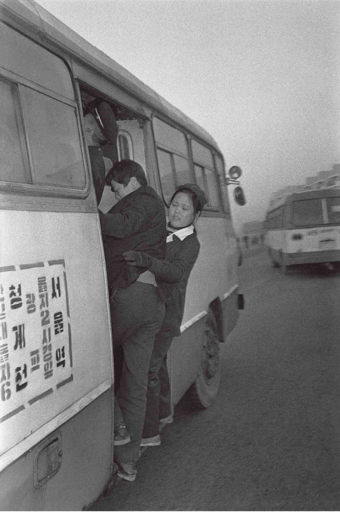<br>`1970s_01_bus_conductor.png` | 2.<br>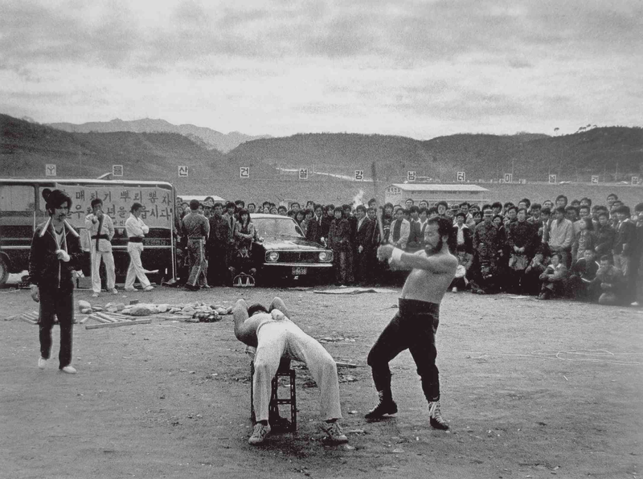<br>`1970s_02_medicine_hawker.png` |
| 3.<br>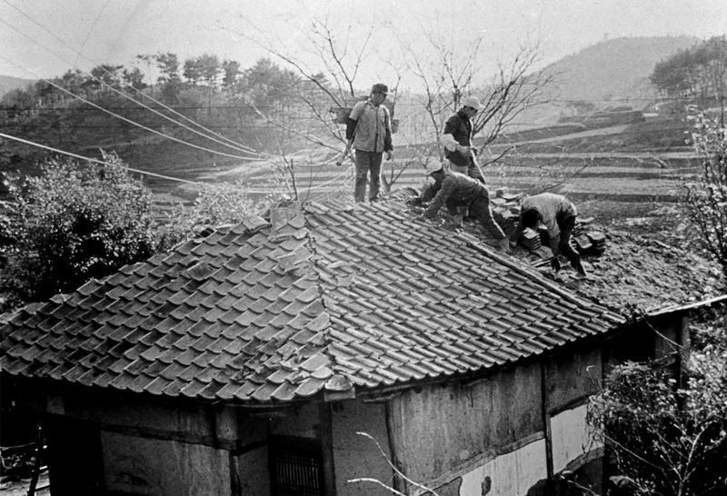<br>`1970s_03_saemaul_roof.jpg` | 4.<br>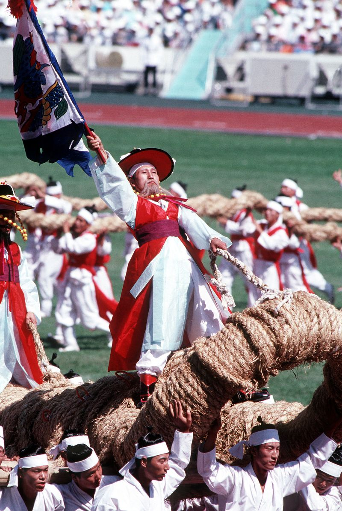<br>`1980s_01_olympics_opening.jpg` |
| 5.<br>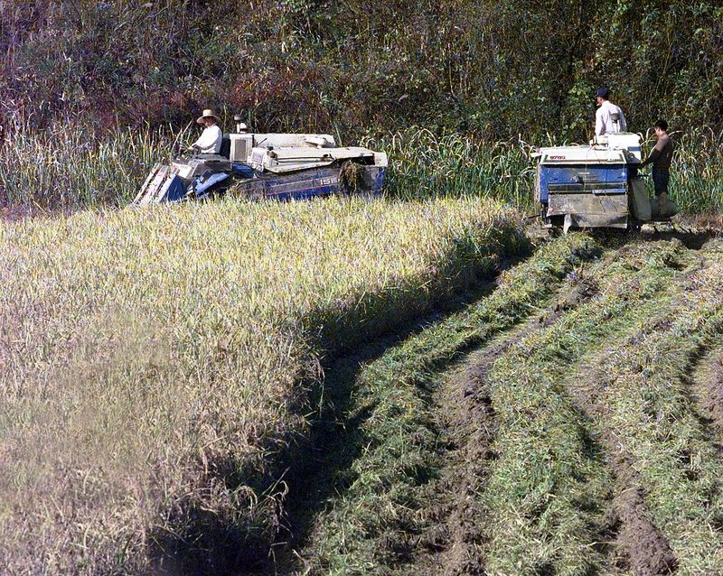<br>`1980s_02_rice_harvest.jpg` | 6.<br>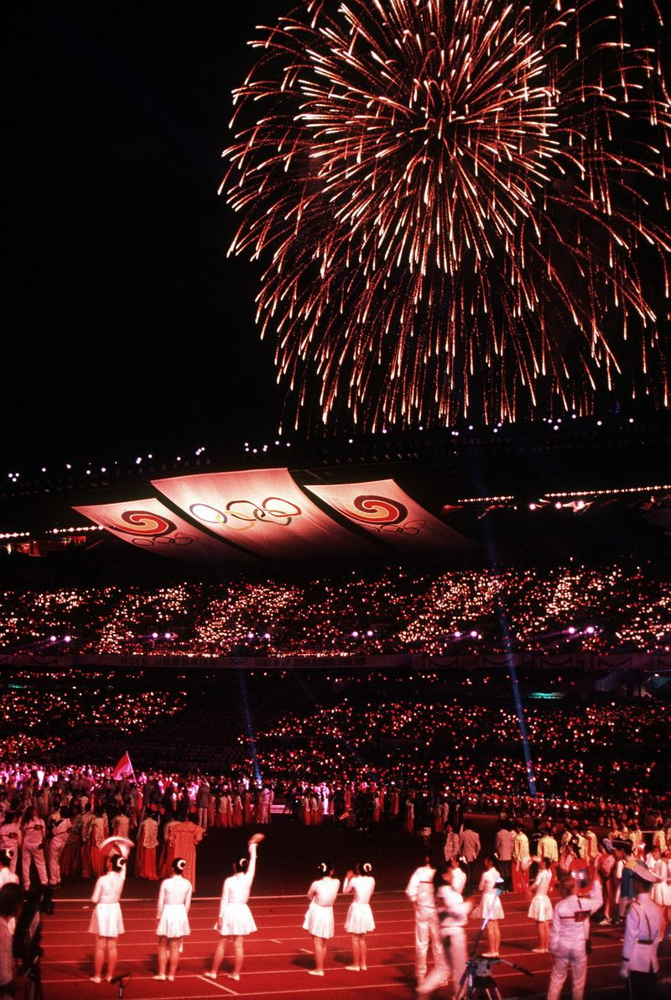<br>`1980s_03_olympics_fireworks.jpg` |
| 7.<br>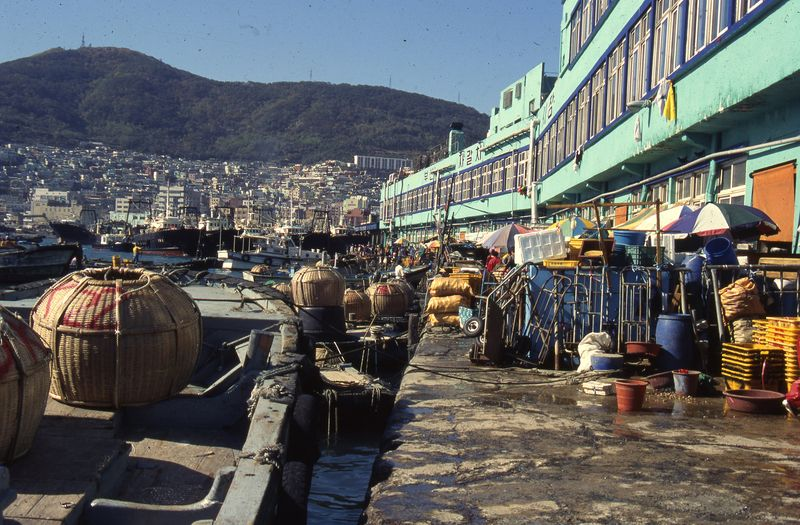<br>`1990s_01_jagalchi_market.jpg` | 8.<br>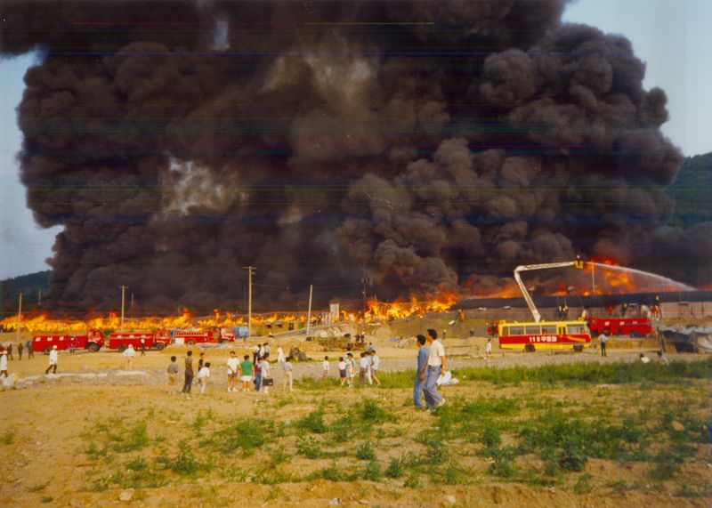<br>`1990s_02_seoul_fire_safety.jpg` |
| 9.<br>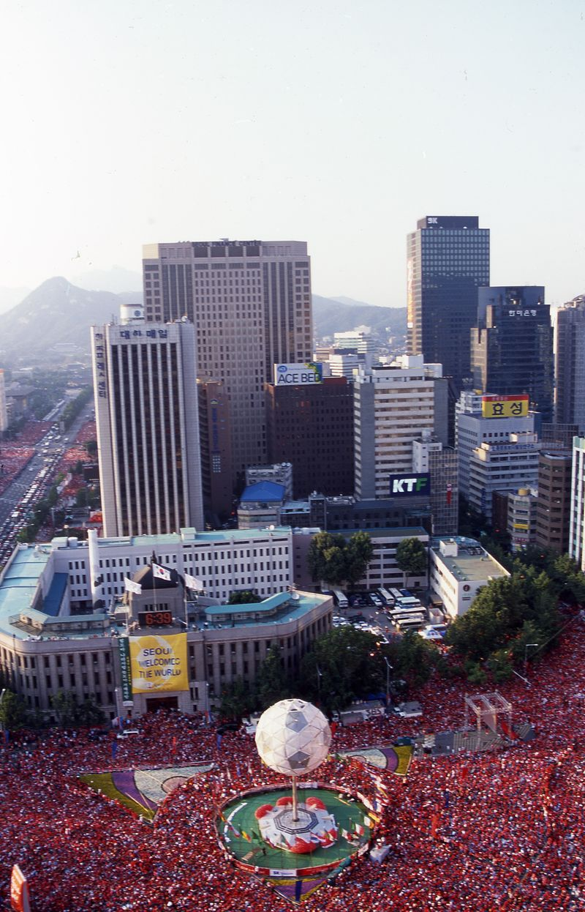<br>`2000s_01_worldcup_cheering.jpg` | 10.<br>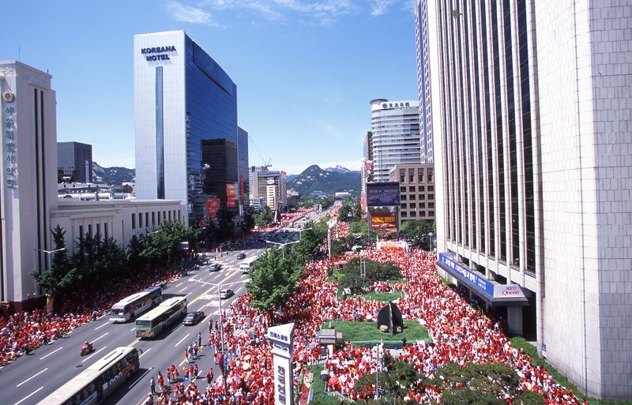<br>`2000s_02_worldcup_flag.jpg` |
| 11.<br>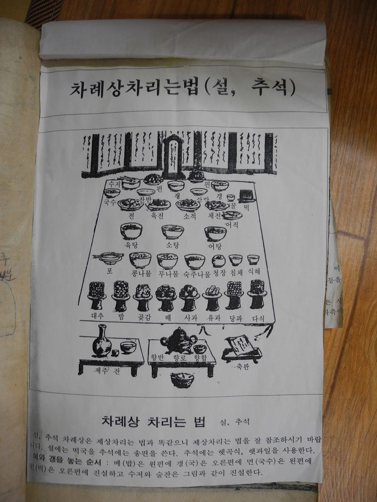<br>`2000s_03_chuseok_table.jpg` | 12.<br>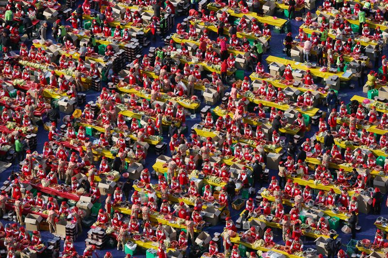<br>`2010s_01_kimchi_festival.jpg` |
| 13.<br>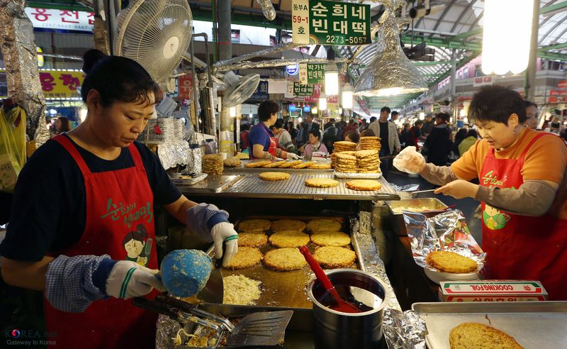<br>`2010s_02_gwangjang_market.jpg` | 14.<br>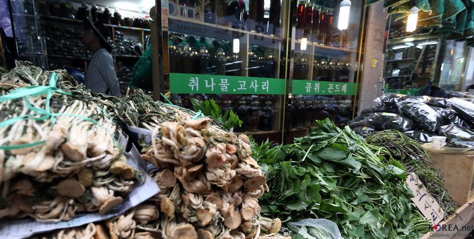<br>`2010s_03_jeongseon_market.jpg` |
| 15.<br>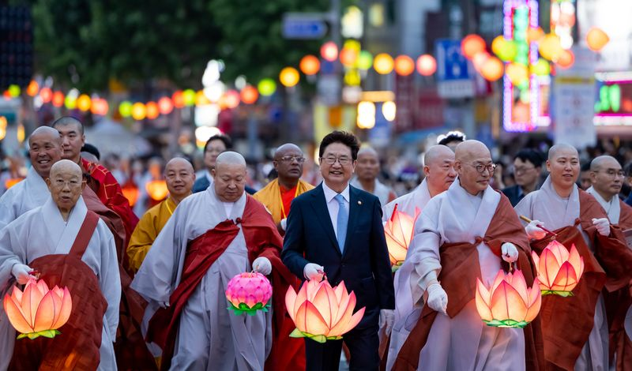<br>`2020s_01_lantern_festival.jpg` | 16.<br>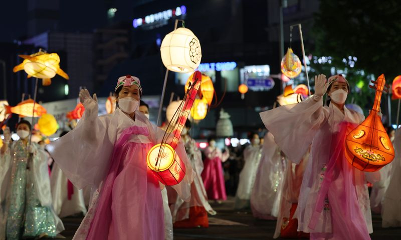<br>`2020s_02_lantern_crowd.jpg` |
| 17.<br>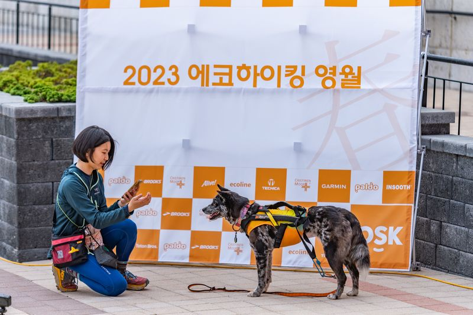<br>`2020s_03_hiking_outing.jpg` |  |

## 3. 사용한 프롬프트와 JSON Schema

### 태깅 프롬프트

```text
이 사진에서 그 시절의 일상 생활, 일거리, 도구, 음식 등 이야기 소재가 될 수 있는 구체적인 옛 추억 단어 키워드 3~5개를 JSON으로 출력해줘. (예: 연탄불, 재봉틀, 국민학교 도시락 등 일상 소재 / 사람, 건물, 풍경 같은 단순 일반명사는 제외)

반드시 다음 형식의 JSON 객체만 출력하고 다른 설명은 쓰지 마세요.
{"topics":["키워드1","키워드2","키워드3"]}
```

### 태깅 JSON Schema

```json
{
  "$schema": "https://json-schema.org/draft/2020-12/schema",
  "type": "object",
  "additionalProperties": false,
  "required": [
    "topics"
  ],
  "properties": {
    "topics": {
      "type": "array",
      "minItems": 3,
      "maxItems": 5,
      "items": {
        "type": "string",
        "minLength": 1
      }
    }
  }
}
```

### 이미지 설명·질문 생성 프롬프트

```text
사진을 직접 관찰하고, 보호자가 대화 소재로 검토할 수 있는 문맥을 문장으로 작성하세요.

규칙:
1. 파일명, 촬영 연도, 장소와 행사명을 알고 있다고 가정하지 마세요. 사진에서 직접 읽히거나 보이는 내용만 관찰 사실로 적으세요.
2. observedContext에는 인물의 행동, 물건, 복장과 공간의 관계를 2문장으로 적으세요. 태그나 단어 목록으로 쓰지 마세요.
3. conversationContext에는 이 장면이 어떤 경험이나 생활 이야기를 꺼내는 데 도움이 될 수 있는지 1문장으로 적으세요. 사진 속 인물의 실제 기억이나 관계를 단정하지 마세요.
4. uncertainties에는 사진만으로 확인할 수 없거나 사용자의 확인이 필요한 내용을 1개에서 3개 적으세요.
5. conversationOpeners에는 보호자가 부담 없이 물어볼 수 있는 열린 질문을 정확히 2개 적으세요. 최근 일을 기억하는지 시험하거나 사진에 없는 사실을 전제하지 마세요.
6. 의료 진단, 기억 회복 효과와 치료 효과를 말하지 마세요.
7. 반드시 지정된 JSON 형식만 출력하세요.
```

### 이미지 설명·질문 생성 JSON Schema

```json
{
  "$schema": "https://json-schema.org/draft/2020-12/schema",
  "type": "object",
  "additionalProperties": false,
  "required": [
    "observedContext",
    "conversationContext",
    "uncertainties",
    "conversationOpeners"
  ],
  "properties": {
    "observedContext": {
      "type": "string",
      "minLength": 1
    },
    "conversationContext": {
      "type": "string",
      "minLength": 1
    },
    "uncertainties": {
      "type": "array",
      "minItems": 1,
      "maxItems": 3,
      "items": {
        "type": "string",
        "minLength": 1
      }
    },
    "conversationOpeners": {
      "type": "array",
      "minItems": 2,
      "maxItems": 2,
      "items": {
        "type": "string",
        "minLength": 1
      }
    }
  }
}
```

## 4. 전체 태깅 결과

### 1. `1970s_01_bus_conductor.png`

| 테스트한 API | 생성된 태그 |
|---|---|
| GLM-5.3-Flash · ML API | `만원버스 똥차` · `버스 차장 승무원` · `직행버스 표` · `서울-온양 버스 노선` |
| Qwen3.8-27B · OpenRouter FP4 | `시골버스` · `버스운전사` · `시골마을` · `버스정류장` · `시골풍경` |
| Qwen3.8-27B · OpenRouter FP8 | `시골 버스` · `서울행 노선` · `등교길` · `군복무 시절` · `옛날 버스표` |
| Gemma 4 26B-A4B · OpenRouter FP8 | `마을버스` · `통근버스` · `대중교통` · `출근길` |
| Qwen3.6-27B · OpenRouter FP8 | `서울역 행 시외버스` · `청계천` · `서울시경` · `군복` · `시외버스 승차` |
| Qwen3.5-27B · OpenRouter FP8 | `마을버스` · `서울역행` · `청계천` · `광교` · `통학버스` |
| Qwen3.5-9B · OpenRouter FP4 | `버스정류장` · `버스운전사` · `버스승객` · `버스운행` · `버스요금` |
| Qwen3.5-9B · OpenRouter BF16 | `버스정류장` · `버스운전사` · `버스승객` · `버스운행노선표` · `버스정차표` |
| Qwen3-VL-8B-Instruct · OpenRouter | `버스` · `도시락` · `재봉틀` · `연탄불` · `국민학교` |

### 2. `1970s_02_medicine_hawker.png`

| 테스트한 API | 생성된 태그 |
|---|---|
| GLM-5.3-Flash · ML API | `쇠곡예(쇠덩어리 꺾기)` · `매치기 뽑기 팔찌` · `마흔세인치` · `길거리 곡예 공연` · `쌍둥이 곡예사` |
| Qwen3.8-27B · OpenRouter FP4 | `태권도 시범` · `마차` · `군복` · `산길` · `마을회관` |
| Qwen3.8-27B · OpenRouter FP8 | `태권도 시범` · `돌부수기` · `70년대 승용차` · `마을 광장 행사` |
| Gemma 4 26B-A4B · OpenRouter FP8 | `동네 구경꾼` · `길거리 공연` · `옛날 옷차림` |
| Qwen3.6-27B · OpenRouter FP8 | `무술 시범` · `목도리` · `군용버스` · `민속놀이` · `군복` |
| Qwen3.5-27B · OpenRouter FP8 | `태권도장` · `목도리` · `군용버스` · `민속무기` · `산촌마을` |
| Qwen3.5-9B · OpenRouter FP4 | `태권도` · `무술` · `바람차기` |
| Qwen3.5-9B · OpenRouter BF16 | `매직기` · `무술` · `바지` |
| Qwen3-VL-8B-Instruct · OpenRouter | `도끼` · `사람들` · `자동차` · `장소` · `관중` |

### 3. `1970s_03_saemaul_roof.jpg`

| 테스트한 API | 생성된 태그 |
|---|---|
| GLM-5.3-Flash · ML API | `기와지붕 손질` · `양철부옥` · `대못과 지붕널` · `계단식 밭` · `호미질` |
| Qwen3.8-27B · OpenRouter FP4 | `지붕 기와지붕` · `논두렁` · `낫` · `논농사` · `산골 마을` |
| Qwen3.8-27B · OpenRouter FP8 | `기와지붕 보수` · `등짐` · `논두렁` · `농사철 일손` · `전신주 전선` |
| Gemma 4 26B-A4B · OpenRouter FP8 | `기와지붕` · `초가집` · `지붕 개량` · `농촌 풍경` |
| Qwen3.6-27B · OpenRouter FP8 | `기와집 지붕 수리` · `농촌 일손` · `전통 가옥` · `농기구` · `계단식 논밭` |
| Qwen3.5-27B · OpenRouter FP8 | `기와집 지붕 수리` · `농촌 일손` · `전통 지붕 작업` · `마을 공동 노동` · `옛날 농가 생활` |
| Qwen3.5-9B · OpenRouter FP4 | `집수리` · `농사` · `노동` |
| Qwen3.5-9B · OpenRouter BF16 | `기와장, 기와, 지붕, 농사, 농기구` · `산골, 계곡, 논밭` · `농부, 농촌` |
| Qwen3-VL-8B-Instruct · OpenRouter | `지붕瓦` · `도시락` · `연탄불` · `재봉틀` · `국민학교` |

### 4. `1980s_01_olympics_opening.jpg`

| 테스트한 API | 생성된 태그 |
|---|---|
| GLM-5.3-Flash · ML API | `짚으로 엮은 용줄(줄다리기)` · `농악 대금` · `꽃사모와 도포 차림` · `머리띠 두른 청년들` · `민속 행사 견학` |
| Qwen3.8-27B · OpenRouter FP4 | `강강술래` · `한복` · `깃발` · `삼베줄` · `탈춤` |
| Qwen3.8-27B · OpenRouter FP8 | `한복` · `마포` · `태극기` |
| Gemma 4 26B-A4B · OpenRouter FP8 | `민속놀이` · `전통 의상` · `줄다리기` |
| Qwen3.6-27B · OpenRouter FP8 | `줄다리기` · `한복` · `관모` · `농경기` · `마제` |
| Qwen3.5-27B · OpenRouter FP8 | `농악` · `한복` · `부채춤` · `줄다리기` · `전통놀이` |
| Qwen3.5-9B · OpenRouter FP4 | `씨름` · `전통 의상` · `줄다리기` |
| Qwen3.5-9B · OpenRouter BF16 | `태극기` · `농악대` · `한복` · `농악장` · `농악` |
| Qwen3-VL-8B-Instruct · OpenRouter | `전통놀이` · `무궁무진한 끈` · `도리대` · `관중석` · `국민학교 도시락` |

### 5. `1980s_02_rice_harvest.jpg`

| 테스트한 API | 생성된 태그 |
|---|---|
| GLM-5.3-Flash · ML API | `가을 추수` · `콤바인 벼 수확` · `황금빛 벼판` · `벼타작` · `논두렁 이앙` |
| Qwen3.8-27B · OpenRouter FP4 | `보리수확` · `탈곡기` · `논두렁` · `보릿가루` · `농사철` |
| Qwen3.8-27B · OpenRouter FP8 | `콤바인` · `보리 수확` · `논두렁` |
| Gemma 4 26B-A4B · OpenRouter FP8 | `벼 베기` · `경운기` · `농번기` · `논둑` |
| Qwen3.6-27B · OpenRouter FP8 | `논두렁` · `수확철` · `농기계` · `논갈이` · `농사철` |
| Qwen3.5-27B · OpenRouter FP8 | `벼베기` · `수확기` · `농기계` · `논밭` · `농사철` |
| Qwen3.5-9B · OpenRouter FP4 | `벼수확기` · `농기계` · `논밭` |
| Qwen3.5-9B · OpenRouter BF16 | `수확기` · `벼베기` · `농기계` · `논두렁` · `가을걷이` |
| Qwen3-VL-8B-Instruct · OpenRouter | `벼 수확기` · `논두렁` · `농기계` · `벼가루` · `벼알` |

### 6. `1980s_03_olympics_fireworks.jpg`

| 테스트한 API | 생성된 태그 |
|---|---|
| GLM-5.3-Flash · ML API | `88서울올림픽 개막식` · `올림픽 불꽃놀이` · `잠실 올림픽 주경기장` · `흰 치마 저고리 환영 의상` · `올림픽 성화봉송` |
| Qwen3.8-27B · OpenRouter FP4 | `2008 베이징 올림픽` · `화약불꽃놀이` · `올림픽 성화봉` · `국가대표 선수단` · `개회식 의상` |
| Qwen3.8-27B · OpenRouter FP8 | `1988 서울올림픽` · `올림픽 성화` · `야외 스포츠 경기장` · `축하 불꽃놀이` · `추억의 TV 중계` |
| Gemma 4 26B-A4B · OpenRouter FP8 | `올림픽 개막식` · `축제 불꽃놀이` · `경기장 관중석` |
| Qwen3.6-27B · OpenRouter FP8 | `개막식 불꽃놀이` · `올림픽 성화` · `수영복` · `화려한 의상` · `경기장 응원` |
| Qwen3.5-27B · OpenRouter FP8 | `올림픽 성화` · `화려한 불꽃놀이` · `경기장 응원봉` · `개회식 퍼포먼스` · `국가대표 유니폼` |
| Qwen3.5-9B · OpenRouter FP4 | `올림픽 개막식` · `불꽃놀이` · `올림픽 플래카드` |
| Qwen3.5-9B · OpenRouter BF16 | `올림픽 불꽃놀이` · `야간 경기장` · `올림픽 개막식` |
| Qwen3-VL-8B-Instruct · OpenRouter | `화려한 불꽃놀이` · `올림픽 퍼포먼스` · `관중의 빛나는 손전등` · `경기장 분위기` · `체육관 음악회` |

### 7. `1990s_01_jagalchi_market.jpg`

| 테스트한 API | 생성된 태그 |
|---|---|
| GLM-5.3-Flash · ML API | `대나무 바구니` · `부두 어시장` · `어선` · `그물` · `파라솔` |
| Qwen3.8-27B · OpenRouter FP4 | `조개통` · `어선` · `부두` · `조개구이` · `낚싯대` |
| Qwen3.8-27B · OpenRouter FP8 | `대나무 바구니` · `어시장` · `낚싯대` · `플라스틱 양동이` · `우산 그늘` |
| Gemma 4 26B-A4B · OpenRouter FP8 | `어선` · `그물` · `수산물 시장` · `항구 작업` |
| Qwen3.6-27B · OpenRouter FP8 | `대바구니` · `어시장` · `배합금` · `물건장수` · `바다풍경` |
| Qwen3.5-27B · OpenRouter FP8 | `통발` · `어시장` · `배` · `물고기` · `바구니` |
| Qwen3.5-9B · OpenRouter FP4 | `어망` · `낚시바구니` · `어선` · `어시장` · `어망수거함` |
| Qwen3.5-9B · OpenRouter BF16 | `대나무 바구니` · `어망` · `물통` · `우산` · `어선` |
| Qwen3-VL-8B-Instruct · OpenRouter | `연어` · `선박` · `물건` · `망치` · `낚싯대` |

### 8. `1990s_02_seoul_fire_safety.jpg`

| 테스트한 API | 생성된 태그 |
|---|---|
| GLM-5.3-Flash · ML API | `대형 화재 사고` · `빨간 소방차` · `119 구조대` · `화재 구경꾼` · `임시 시장 화재` |
| Qwen3.8-27B · OpenRouter FP4 | `소방차` · `화재현장` · `화염` · `연기` · `구급대원` |
| Qwen3.8-27B · OpenRouter FP8 | `119 소방차` · `대형 화재 진압` · `고무호스 물줄기` · `화재 참관 군중` · `필름 사진 질감` |
| Gemma 4 26B-A4B · OpenRouter FP8 | `소방차` · `화재 진압` · `검은 연기` |
| Qwen3.6-27B · OpenRouter FP8 | `소방차 사다리차` · `소방관 유니폼` · `화재 진압 호스` · `관중 군중` · `연기 구름` |
| Qwen3.5-27B · OpenRouter FP8 | `소방차 출동` · `화재 진압` · `연기 피난` · `구경꾼` · `소방관 활동` |
| Qwen3.5-9B · OpenRouter FP4 | `소방차` · `소방관` · `화재` · `구급차` · `비상대응` |
| Qwen3.5-9B · OpenRouter BF16 | `소방차` · `연기` · `화염` · `구급대` · `소방관` |
| Qwen3-VL-8B-Instruct · OpenRouter | `소방차` · `연기` · `화재` · `방수포` · `구급차` |

### 9. `2000s_01_worldcup_cheering.jpg`

| 테스트한 API | 생성된 태그 |
|---|---|
| GLM-5.3-Flash · ML API | `2002 한일월드컵` · `붉은악마 거리 응원` · `시청광장 응원 열기` · `비상근무` · `빨간 티셔츠 응원단` |
| Qwen3.8-27B · OpenRouter FP4 | `월드컵 붉은악마` · `서울광장 거리응원` · `KT 아날로그 광고판` · `대하해운 빌딩` · `요성 전광판` |
| Qwen3.8-27B · OpenRouter FP8 | `98 한일 월드컵` · `서울광장 붉은 물결` · `대형 전광판` · `빌딩 옥상 간판` · `90년대 서울 시내 전경` |
| Gemma 4 26B-A4B · OpenRouter FP8 | `88 서울올림픽` · `올림픽 경기장` · `대규모 인파` · `도시 개발` |
| Qwen3.6-27B · OpenRouter FP8 | `98월드컵 붉은악마` · `대중교통 마비` · `건물 옥상 응원` · `휴대전화 신호대란` · `응원봉` |
| Qwen3.5-27B · OpenRouter FP8 | `서울 월드컵 열기` · `붉은 옷 군중` · `KT 광고판` · `대우백화점` · `효성빌딩` |
| Qwen3.5-9B · OpenRouter FP4 | `월드컵 광장` · `세종로 거리` · `대통령궁` · `KT 빌딩` · `효성 빌딩` |
| Qwen3.5-9B · OpenRouter BF16 | `서울시청 광장` · `1988 올림픽` · `대형 전광판` |
| Qwen3-VL-8B-Instruct · OpenRouter | `연탄불` · `재봉틀` · `국민학교 도시락` · `방울토마토` · `한라산` |

### 10. `2000s_02_worldcup_flag.jpg`

| 테스트한 API | 생성된 태그 |
|---|---|
| GLM-5.3-Flash · ML API | `붉은악마 거리 응원` · `2002 월드컵 가로응원` · `시내버스` · `고가도로` · `대형 전광판 광고` |
| Qwen3.8-27B · OpenRouter FP4 | `코라마호텔` · `대형버스` · `시위복` · `도심시위` · `광장집회` |
| Qwen3.8-27B · OpenRouter FP8 | `코르사 호텔` · `서울월드컵경기장` · `월드컵 붉은 물결` · `90년대 서울 시내` · `대중교통 버스` |
| Gemma 4 26B-A4B · OpenRouter FP8 | `대규모 집회` · `거리 시위` · `광장 모임` |
| Qwen3.6-27B · OpenRouter FP8 | `대통령 선거 집회` · `홍보용 버스` · `전광판` · `시위대 붉은 옷` · `광장 연설` |
| Qwen3.5-27B · OpenRouter FP8 | `코리안호텔` · `청년회관` · `서울시청 앞 광장` · `버스정류장` · `홍보용 대형 현수막` |
| Qwen3.5-9B · OpenRouter FP4 | `버스` · `도시락` · `국민학교` |
| Qwen3.5-9B · OpenRouter BF16 | `노란색 버스` · `신세계백화점` · `서울역사` · `홍보대사` · `시민행진` |
| Qwen3-VL-8B-Instruct · OpenRouter | `연탄불` · `재봉틀` · `국민학교 도시락` · `방울토마토` · `대형 텔레비전` |

### 11. `2000s_03_chuseok_table.jpg`

| 테스트한 API | 생성된 태그 |
|---|---|
| GLM-5.3-Flash · ML API | `차례상 차리는 법` · `제사 음식 탕과 적` · `촛대와 향로` · `밥과 국 그릇` · `송편과 약과 제물` |
| Qwen3.8-27B · OpenRouter FP4 | `차례상 차리기` · `제사 음식` · `향로` · `제수` · `추석 차례상` |
| Qwen3.8-27B · OpenRouter FP8 | `차례상` · `설추석 차례` · `향로 향합` · `다식` |
| Gemma 4 26B-A4B · OpenRouter FP8 | `차례상` · `제사 음식` · `명절 음식` · `전과 나물` · `제례 절차` |
| Qwen3.6-27B · OpenRouter FP8 | `차례상차림` · `제사 음식` · `향로` · `축판` · `국수 접시` |
| Qwen3.5-27B · OpenRouter FP8 | `차례상 차리는 법` · `설 추석` · `떡국` · `송편` · `향로` |
| Qwen3.5-9B · OpenRouter FP4 | `차례상` · `설, 추석` · `제수` |
| Qwen3.5-9B · OpenRouter BF16 | `차례상 차리는 법` · `설과 추석 차례상` · `해동식` · `해과일` |
| Qwen3-VL-8B-Instruct · OpenRouter | `국수` · `수저` · `재첩` · `해장국` · `주석` |

### 12. `2010s_01_kimchi_festival.jpg`

| 테스트한 API | 생성된 태그 |
|---|---|
| GLM-5.3-Flash · ML API | `김장 담그기` · `배추 절이기` · `고춧가루 양념 버무리기` · `김치독(장독)` · `이웃과 함께하는 공동 김장` |
| Qwen3.8-27B · OpenRouter FP4 | `공장 라인` · `조립 작업` · `생산 현장` · `공구` · `부품` |
| Qwen3.8-27B · OpenRouter FP8 | `김장김치` · `장갑` · `김장독` |
| Gemma 4 26B-A4B · OpenRouter FP8 | `집단 작업` · `수작업 공정` · `생산 라인` · `공장 노동` |
| Qwen3.6-27B · OpenRouter FP8 | `도매시장` · `상자 쌓기` · `장갑 낀 손` · `도매상` · `물량 정리` |
| Qwen3.5-27B · OpenRouter FP8 | `연탄불` · `재봉틀` · `국민학교 도시락` · `전통 시장` · `한과 만들기` |
| Qwen3.5-9B · OpenRouter FP4 | `봉사활동` · `식탁` · `식기` · `식료품` · `식자재` |
| Qwen3.5-9B · OpenRouter BF16 | `연탄불` · `재봉틀` · `국민학교 도시락` |
| Qwen3-VL-8B-Instruct · OpenRouter | `도시락` · `연탄불` · `재봉틀` · `한복` · `전등갓` |

### 13. `2010s_02_gwangjang_market.jpg`

| 테스트한 API | 생성된 태그 |
|---|---|
| GLM-5.3-Flash · ML API | `전통시장 빈대떡` · `뒤집개` · `시장 먹거리 장인` · `녹두전 부침판` |
| Qwen3.8-27B · OpenRouter FP4 | `시장떡볶이` · `부엌장갑` · `전판` · `시장통` · `손님대기` |
| Qwen3.8-27B · OpenRouter FP8 | `호떡` · `전통시장` · `호떡판` |
| Gemma 4 26B-A4B · OpenRouter FP8 | `부침개` · `시장 노점` · `전 부치기` · `시장 음식` |
| Qwen3.6-27B · OpenRouter FP8 | `시장 순대국밥` · `알루미늄 호일` · `손수건 장갑` · `철제 팬` · `시장 간판` |
| Qwen3.5-27B · OpenRouter FP8 | `전통시장 호떡` · `호떡 반죽 퍼` · `호떡 팬` · `호떡 시럽` · `시장 간판` |
| Qwen3.5-9B · OpenRouter FP4 | `순회빈대떡` · `빈대떡` · `손수레` |
| Qwen3.5-9B · OpenRouter BF16 | `빈대떡` · `전골` · `알루미늄 호일` · `손수레` · `손수건` |
| Qwen3-VL-8B-Instruct · OpenRouter | `도시락` · `연탄불` · `재봉틀` · `국민학교` · `한복` |

### 14. `2010s_03_jeongseon_market.jpg`

| 테스트한 API | 생성된 태그 |
|---|---|
| GLM-5.3-Flash · ML API | `곤드레나물` · `고사리·취나물 산나물 장사` · `장아찌 독` · `전통시장 나물가게` · `묵은 나물 말린 나물` |
| Qwen3.8-27B · OpenRouter FP4 | `시장 장보기` · `건더기` · `나물 고사리` · `시장 상인` · `장바구니` |
| Qwen3.8-27B · OpenRouter FP8 | `고사리` · `취나물` · `산나물 장터` · `건나물` · `봄나물` |
| Gemma 4 26B-A4B · OpenRouter FP8 | `나물 무침` · `재래시장` · `제철 나물` · `산나물` |
| Qwen3.6-27B · OpenRouter FP8 | `시장 나물 장사` · `건조 고사리` · `시장 간판` · `시장 상인` · `시장 물가표` |
| Qwen3.5-27B · OpenRouter FP8 | `고사리` · `취나물` · `김치` · `건어물` · `전통시장` |
| Qwen3.5-9B · OpenRouter FP4 | `고사리` · `취나물` · `곰취` · `곤드레` · `건더기` |
| Qwen3.5-9B · OpenRouter BF16 | `취나물` · `고사리` · `곰취` · `곤드레` · `전통시장` |
| Qwen3-VL-8B-Instruct · OpenRouter | `추나물` · `고사리` · `곰취` · `곤드레` · `건조채소` |

### 15. `2020s_01_lantern_festival.jpg`

| 테스트한 API | 생성된 태그 |
|---|---|
| GLM-5.3-Flash · ML API | `연등회 연꽃등불` · `부처님 오신 날 법회` · `등불 만들기` · `가로수 거리 등불 축제` |
| Qwen3.8-27B · OpenRouter FP4 | `연등` · `스님` · `법회` · `사찰` · `불교` |
| Qwen3.8-27B · OpenRouter FP8 | `연등회` · `연등` · `승복` · `불교행렬` · `등불` |
| Gemma 4 26B-A4B · OpenRouter FP8 | `연등회` · `연등` · `사찰 행렬` · `불교 축제` |
| Qwen3.6-27B · OpenRouter FP8 | `연등회` · `연등` · `승려` · `불교축제` · `한복` |
| Qwen3.5-27B · OpenRouter FP8 | `연등회` · `연등` · `불교 의식` · `화상` · `법회` |
| Qwen3.5-9B · OpenRouter FP4 | `불교식 행렬` · `등불` · `의식복식` · `불교도` · `불교 행사` |
| Qwen3.5-9B · OpenRouter BF16 | `연등회` · `불교제전` · `한복` · `전통의식` · `불교문화` |
| Qwen3-VL-8B-Instruct · OpenRouter | `불교 행렬` · `莲花등` · `도시락` · `연탄불` · `재봉틀` |

### 16. `2020s_02_lantern_crowd.jpg`

| 테스트한 API | 생성된 태그 |
|---|---|
| GLM-5.3-Flash · ML API | `연등회 퍼레이드` · `치마저고리 한복` · `물고기 모양 등롱` · `비파 등불` · `부처님 오신 날` |
| Qwen3.8-27B · OpenRouter FP4 | `한복` · `민속악기` · `민속축제` · `민속춤` · `민속등` |
| Qwen3.8-27B · OpenRouter FP8 | `한복` · `민속악기` · `민속등` |
| Gemma 4 26B-A4B · OpenRouter FP8 | `전통 등불` · `한복` · `민속 축제` |
| Qwen3.6-27B · OpenRouter FP8 | `한복` · `등불` · `지화등` · `야행` · `전통악기 모형` |
| Qwen3.5-27B · OpenRouter FP8 | `등불축제` · `전통악기` · `한복` · `가면극` · `야간거리축제` |
| Qwen3.5-9B · OpenRouter FP4 | `한복` · `등불` · `가야금` |
| Qwen3.5-9B · OpenRouter BF16 | `한복` · `등불` · `민속놀이` |
| Qwen3-VL-8B-Instruct · OpenRouter | `전통놀이` · `무등산불` · `가을밤행사` · `한복의빛` · `대的传统악기` |

### 17. `2020s_03_hiking_outing.jpg`

| 테스트한 API | 생성된 태그 |
|---|---|
| GLM-5.3-Flash · ML API | `반려견 하네스 산책` · `휴대폰 사진 찍기` · `이벤트 현수막 포토존` |
| Qwen3.8-27B · OpenRouter FP4 | `등산복` · `강아지 산책줄` · `등산배낭` · `등산화` · `등산 간식` |
| Qwen3.8-27B · OpenRouter FP8 | `에코하이킹` · `등산배낭` · `견공` · `스포츠웨어` · `스폰서 배너` |
| Gemma 4 26B-A4B · OpenRouter FP8 | `에코하이킹` · `반려견 산책` · `아웃도어 활동` |
| Qwen3.6-27B · OpenRouter FP8 | `2023 에코하이킹` · `Garmin` · `Brooks` · `Petio` · `INSOOTH` |
| Qwen3.5-27B · OpenRouter FP8 | `등산용 배낭` · `강아지 등산` · `스마트폰 사진 촬영` · `아웃도어 브랜드` · `산행 이벤트` |
| Qwen3.5-9B · OpenRouter FP4 | `애견인생` · `산책용품` · `견주와의 추억` |
| Qwen3.5-9B · OpenRouter BF16 | `휴대폰` · `견조끼` · `하이킹` |
| Qwen3-VL-8B-Instruct · OpenRouter | `휴대폰` · `登山용 장갑` · `자전거 페달` |

## 5. 전체 이미지 설명 결과

### 1. `1970s_01_bus_conductor.png`

| 테스트한 API | 이미지 설명 |
|---|---|
| GLM-5.3-Flash · ML API | 흑백 사진에서 여러 사람이 오래된 버스의 앞문으로 몸을 비스듬히 기울여 객차 안으로 오르고 있으며, 앞쪽 사람은 이미 몸이 반쯤 들어간 상태이고 뒤에 선 사람이 그 등을 밀어 올리고 있습니다. 버스 옆면에는 한글로 된 안내 문구가 크게 붙어 있고, 뒤편 도로에는 다른 버스 한 대가 더 지나가고 있어 출퇴근길이나 장거리 이동이 붐비던 풍경을 보여줍니다. |
| Qwen3.8-27B · OpenRouter FP4 | 한 남성과 한 여성이 버스 문 앞에 서서 차체에 기대어 있는 모습으로, 여성은 남성의 팔을 감싸 안고 있습니다. 버스 차체에는 한글로 된 광고 문구가 인쇄되어 있고, 배경에는 다른 차량이 흐릿하게 보입니다. |
| Qwen3.8-27B · OpenRouter FP8 | 두 사람이 버스 문 앞에 서서 한쪽은 차체에 기대어 있고 다른 쪽은 버스에 올라타려 하고 있습니다. 버스 측면에는 '서울역'과 '청계천' 등 노선 정보가 적혀 있으며, 배경에는 다른 버스 한 대가 흐릿하게 보입니다. |
| Gemma 4 26B-A4B · OpenRouter FP8 | 두 인물이 버스 입구 근처에서 서로의 몸을 맞대고 서 있습니다. 한 인물은 버스 안쪽을 향해 몸을 기울이고 있으며 다른 인물은 그를 붙잡고 있습니다. |
| Qwen3.6-27B · OpenRouter FP8 | 한 남성이 버스 문에 기대어 서 있고, 그 뒤에서 한 여성이 그의 등을 감싸 안고 있는 모습이 보입니다. 버스 차체에는 '서울역', '청계천' 등 노선 정보가 적혀 있으며, 배경에는 다른 버스가 보입니다. |
| Qwen3.5-27B · OpenRouter FP8 | 한 남성이 버스 문에 기대어 타고 있고, 그 옆에 서 있는 여성이 그의 등을 감싸 안고 있는 모습입니다. 버스 측면에는 한글로 된 노선 정보가 적혀 있으며, 배경에는 다른 버스가 흐릿하게 보입니다. |
| Qwen3.5-9B · OpenRouter FP4 | 남자가 버스 문에 기대어 서 있고, 여자애가 그의 등을 감싸 안고 있다. 버스 문에는 한글로 된 표지판이 붙어 있다. |
| Qwen3.5-9B · OpenRouter BF16 | 남성이 버스 문에 기대어 내리고 있는 동안, 여성이 그의 등 뒤에서 손을 뻗어 옷깃이나 가방을 잡는 듯한 자세로 그를 붙잡고 있다. 배경에는 다른 버스가 멀리 있고, 버스 차체에는 '서울역'과 '청계천'이라는 글자가 선명하게 적혀 있다. |
| Qwen3-VL-8B-Instruct · OpenRouter | 여성은 남성을 버스 문 옆에서 안내하며, 그의 손을 잡고 있습니다. 남성은 버스 안으로 들어가는 자세를 취하고 있으며, 두 사람은 도로 위에 서 있습니다. |

### 2. `1970s_02_medicine_hawker.png`

| 테스트한 API | 이미지 설명 |
|---|---|
| GLM-5.3-Flash · ML API | 흑백 사진의 야외 흙바닥에서 한 남성이 맨몸에 긴 막대기를 양손으로 들어 올려 시위하는 동작을 하고 있고, 그 앞에서 다른 사람이 낮은 받침대에 엎드려 몸을 조이고 있습니다. 주변으로 수십 명의 구경꾼이 둘러서서 지켜보고 있으며, 뒤쪽에는 한글 문구가 적힌 현수막과 승합차, 승용차가 있고 배경에는 산이 펼쳐져 있습니다. |
| Qwen3.8-27B · OpenRouter FP4 | 사진 중앙에는 한 사람이 의자 위에 등을 대고 몸을 뒤로 젖혀 구부리고 있고, 그 옆에 선 남성이 주먹을 들어 올린 자세로 그 사람에게 다가가 있다. 배경에는 산과 구름 낀 하늘 아래 많은 사람들이 모여 서 있고, 왼쪽에는 버스 한 대와 검은 승용차가 주차되어 있으며, 버스 옆에는 흰색 도복을 입은 사람들이 서 있다. |
| Qwen3.8-27B · OpenRouter FP8 | 한 남성이 무릎을 꿇고 앉아 있는 다른 남성의 등을 향해 주먹을 휘두르는 동작을 취하고 있으며, 그 주변에는 수많은 관중이 모여 지켜보고 있습니다. 배경에는 '맥치기 뿌리뽑자'라는 문구가 적힌 버스, 검은색 승용차, 그리고 멀리 산이 펼쳐져 있는 야외 공간이 보입니다. |
| Gemma 4 26B-A4B · OpenRouter FP8 | 한 인물이 의자에 앉아 몸을 굽히고 있고, 다른 인물은 그 앞에서 팔을 들어 올리며 동작을 취하고 있습니다. 주변에는 많은 사람들이 모여 이 장면을 지켜보고 있습니다. |
| Qwen3.6-27B · OpenRouter FP8 | 빈터에 모여 있는 많은 사람들 앞에서 한 남자가 맨몸으로 공중에서 차는 동작을 하고 있으며, 그 맞은편에 있는 남자는 의자에 엎드려 등을 내밀고 있습니다. 배경에는 군중들이 둘러싸고 있고, 트럭과 승용차, 멀리 산맥이 보입니다. |
| Qwen3.5-27B · OpenRouter FP8 | 한 남자가 흰색 상의와 검은 바지를 입고 주먹을 쥔 채 다른 남자를 향해 공격 자세를 취하고 있으며, 그 앞에는 흰색 복장을 입은 사람이 의자에 엎드려 등을 드러내고 있습니다. 배경에는 많은 관중들이 모여 있고, 버스나 트럭 같은 차량과 산이 보입니다. |
| Qwen3.5-9B · OpenRouter FP4 | 한 남자가 무언가를 들고 서서 다른 사람의 등을 향해 공격하는 듯한 자세를 취하고 있습니다. 바닥에는 여러 개의 물건들이 흩어져 있고, 배경에는 많은 사람들이 모여서 이 장면을 지켜보고 있습니다. |
| Qwen3.5-9B · OpenRouter BF16 | 한 남자가 무릎을 꿇고 앉아 있는 다른 사람의 등 위를 칼로 찌르는 동작을 하고 있으며, 주변에는 관중들이 모여 지켜보고 있습니다. 배경에는 트럭과 자동차가 있고, 땅 위에는 나무 조각이나 돌 같은 물건들이 흩어져 있습니다. |
| Qwen3-VL-8B-Instruct · OpenRouter | 한 남성이 무릎을 꿇고 의자 위에 누워 있으며, 다른 남성이 그의 몸 위에 무언가를 쳐대는 듯한 자세를 취하고 있습니다. 주변에는 여러 사람들이 모여서 이 장면을 관찰하고 있으며, 한 남자는 검정색 재킷을 입고 서 있습니다. |

### 3. `1970s_03_saemaul_roof.jpg`

| 테스트한 API | 이미지 설명 |
|---|---|
| GLM-5.3-Flash · ML API | 네 명의 남성이 기와지붕 위에서 작업하고 있는데, 한 사람은 삽 같은 도구를 들고 서 있고 나머지 사람들은 몸을 숙여 지붕 위에 쌓아 둔 기와를 다루고 있습니다. 집 주변으로 전깃줄이 지나가고, 뒤쪽 언덕에는 계단식으로 정리된 밭과 나무들이 보이는 시골 마을 풍경입니다. |
| Qwen3.8-27B · OpenRouter FP4 | 사진 속에는 기와지붕을 얹은 작은 건물이 있고, 지붕 위에는 네 명의 사람이 서 있거나 몸을 숙여 일하고 있다. 한 사람은 지붕 위에 서서 도구를 들고 있고, 나머지 세 사람은 기와를 정리하거나 옮기는 자세로 몸을 낮추고 있다. |
| Qwen3.8-27B · OpenRouter FP8 | 여러 명의 남성이 기와지붕 위에 올라가서 기와를 정리하거나 옮기는 작업을 하고 있습니다. 배경에는 계단식 논과 나무들이 있는 산골 마을 풍경이 펼쳐져 있습니다. |
| Gemma 4 26B-A4B · OpenRouter FP8 | 여러 명의 남성이 기와가 얹힌 지붕 위에서 몸을 굽히거나 서서 작업하고 있습니다. 주변에는 나무와 경사진 언덕이 보이며 전선들이 하늘을 가로지르고 있습니다. |
| Qwen3.6-27B · OpenRouter FP8 | 여러 명의 남성이 기와지붕 위에 올라가서 기와를 정리하거나 작업을 하고 있습니다. 배경에는 계단식 논과 산이 보이며, 작업자들은 작업복 차림에 모자를 쓰고 있습니다. |
| Qwen3.5-27B · OpenRouter FP8 | 사진 속 네 명의 인물이 기와지붕 위에 서 있거나 구부정한 자세로 일하고 있으며, 배경에는 계단식 밭과 나무들이 보입니다. 인물들은 작업복이나 평상복을 입고 있고, 지붕 위에는 기와와 도구들이 놓여 있어 집 수리나 지붕 작업을 하는 것으로 보입니다. |
| Qwen3.5-9B · OpenRouter FP4 | 세 명의 사람이 지붕 위에 올라가서 기와를 정리하고 있습니다. 배경에는 나무와 밭이 보입니다. |
| Qwen3.5-9B · OpenRouter BF16 | 네 명의 남성이 전통 기와 지붕 위에 서서 작업을 하고 있으며, 한 명은 손에 도구를 들고 있고 나머지는 기와를 옮기거나 고정하는 동작을 취하고 있습니다. 배경에는 계단식 논과 나무가 보이며, 전원 지역의 농촌 풍경이 펼쳐져 있습니다. |
| Qwen3-VL-8B-Instruct · OpenRouter | 몇 명의 사람들이 지붕 위에 서 있으며, 일부는 지붕 타일을 다루고 있습니다. 주변에는 나무와 언덕이 보이며, 건물은 전통적인 구조를 가지고 있습니다. |

### 4. `1980s_01_olympics_opening.jpg`

| 테스트한 API | 이미지 설명 |
|---|---|
| GLM-5.3-Flash · ML API | 흰 수염을 기른 한 사람이 빨간 조끼와 흰 두루마기를 입고 갓을 쓴 채, 굵은 짚으로 엮은 큰 밧줄 위에 올라서서 한 손에는 용이 그려진 깃발을 높이 들고 있다. 그 주위로 흰 옷에 머리띠를 두른 여러 사람들이 같은 짚밧줄을 어깨에 메거나 손으로 받치며 운동장 잔디 위에서 함께 움직이고 있고, 배경에는 관중석에 앉은 많은 사람들이 보인다. |
| Qwen3.8-27B · OpenRouter FP4 | 흰색 상의에 붉은색 조끼를 입은 남자가 두 손을 들어 깃발을 들고 있으며, 그 아래에는 흰색 옷을 입은 여러 명이 굵은 밧줄을 들어 올리고 있다. 배경에는 녹색 잔디와 붉은색 트랙이 보이며, 관중석에는 흰색 옷을 입은 사람들이 앉아 있다. |
| Qwen3.8-27B · OpenRouter FP8 | 붉은색과 흰색의 전통 의상을 입고 갓을 쓴 인물이 거대한 마루를 밟고 서 있으며, 한 손에는 문양이 새겨진 깃발을 높이 들고 있습니다. 그 아래에는 흰 옷을 입은 여러 명이 함께 거대한 마루를 들어올리고 있고, 배경에는 녹색 잔디와 관중석의 인파가 흐릿하게 보입니다. |
| Gemma 4 26B-A4B · OpenRouter FP8 | 흰색 상의와 붉은색 조끼를 입은 인물이 커다란 밧줄을 위로 들어 올리고 있습니다. 주변에는 비슷한 복장을 한 여러 사람이 밧줄을 함께 받치거나 들고 있습니다. |
| Qwen3.6-27B · OpenRouter FP8 | 초록색 잔디 운동장 위에서 한 남성이 붉은색과 흰색의 전통 의상을 입고 큰 깃발을 높이 들고 있으며, 그의 발아래에는 거대한 마른 풀로 만든 줄을 여러 사람이 함께 들어 올리고 있습니다. 배경에는 관중석이 보이며, 주변에는 비슷한 복장을 한 사람들이 줄을 들고 행진하는 모습이 보입니다. |
| Qwen3.5-27B · OpenRouter FP8 | 한복을 입은 여러 사람이 거대한 짚으로 만든 구조물을 들어 올리고 있으며, 중앙에 선 한 남자는 붉은색과 흰색 옷을 입고 깃발을 높이 들고 있습니다. 배경에는 운동장 트랙과 관중석이 보이며, 많은 사람들이 같은 복장을 입고 행렬을 이루고 있는 것으로 보입니다. |
| Qwen3.5-9B · OpenRouter FP4 | 여러 명의 사람들이 두꺼운 줄을 어깨에 메고 힘을 주고 당고 있는 모습이 보입니다. 줄 위에는 전통 복장을 입은 사람이 올라타서 큰 깃발을 들고 있습니다. |
| Qwen3.5-9B · OpenRouter BF16 | 한 남성이 붉은색과 흰색 전통 복장을 입고 큰 줄을 타고 있으며, 손에는 깃발을 들고 있다. 그 주변에는 흰색 옷을 입은 여러 사람들이 줄을 들어 올리고 함께 움직이고 있다. |
| Qwen3-VL-8B-Instruct · OpenRouter | 한 남성이 붉은색과 흰색의 전통 복장을 입고 큰 깃발을 들고 있습니다. 그는 거대한 갈색 줄 위에 서 있으며, 다른 참가자들이 줄을 들어 올리고 있습니다. |

### 5. `1980s_02_rice_harvest.jpg`

| 테스트한 API | 이미지 설명 |
|---|---|
| GLM-5.3-Flash · ML API | 벼가 무르익은 논에서 두 대의 콤바인이 수확 작업을 하고 있으며, 한 대에는 삿갓을 쓴 사람이 탑승해 기계를 조작하고 있습니다. 다른 콤바인 옆에는 두 명의 남자가 서서 기계를 함께 다루고 있고, 논바닥에는 진흙 바퀴 자국와 벼 잘린 흔적이 뚜렷이 남아 있습니다. |
| Qwen3.8-27B · OpenRouter FP4 | 넓은 들판에서 두 대의 농기계가 나란히 움직이며, 한 대는 앞부분에서 밀을 베어내고 다른 한 대는 뒤에서 그 밀을 수거하는 모습이다. 기계 위에는 모자를 쓴 사람과 흰색 상의를 입은 사람들이 탑승해 작업을 하고 있으며, 기계가 지나간 자리에는 잘려 나간 밀이 줄지어 놓여 있다. |
| Qwen3.8-27B · OpenRouter FP8 | 넓은 들판에서 두 대의 수확용 기계가 나란히 움직이고 있으며, 한 명은 기계 위에 앉아 운전하고 다른 두 명은 기계 뒤에서 작업을 돕고 있습니다. 기계가 지나간 자리에 잘려진 작물이 줄줄이 쌓여 있고, 배경에는 짙은 초록색 나무들이 빽빽하게 자라고 있습니다. |
| Gemma 4 26B-A4B · OpenRouter FP8 | 두 명의 인물이 논밭에서 커다란 농기계를 조작하며 작업에 집중하고 있습니다. 기계 주변으로는 수확된 것으로 보이는 작물과 진흙이 묻은 바퀴 자국이 보입니다. |
| Qwen3.6-27B · OpenRouter FP8 | 두 대의 파란색 농기계(수확기)가 논밭에서 작물을 베어들이고 있으며, 한 사람은 기계를 운전하고 다른 한 사람은 기계 뒤에서 작업하고 있습니다. 기계가 지나간 자리는 작물이 베어져 땅이 드러나 있고, 아직 수확하지 않은 부분은 노랗게 익어 있습니다. |
| Qwen3.5-27B · OpenRouter FP8 | 두 대의 파란색과 흰색 콤바인이 논밭에서 작물을 수확하고 있으며, 한 사람은 콤바인 운전석에 앉아 있고 다른 두 사람은 기계 옆에 서서 작업을 돕고 있습니다. 배경에는 높은 풀과 나무가 울창하게 자라고 있어 시골 농촌의 풍경임을 알 수 있습니다. |
| Qwen3.5-9B · OpenRouter FP4 | 두 대의 농기계가 논밭에서 작물을 수확하는 작업을 하고 있으며, 각각 한 명씩 운전석에 앉아 있습니다. 배경에는 높은 풀과 나무가 울창하게 자라고 있습니다. |
| Qwen3.5-9B · OpenRouter BF16 | 두 대의 농기계가 황금빛 벼밭에서 작물을 수확하고 있으며, 한 기계는 운전석에 사람이 앉아 있고 다른 기계 옆에는 두 사람이 서서 작업 중인 것으로 보입니다. 기계 뒤로는 잘라진 벼가 길게 늘어져 있고, 배경에는 울창한 나무와 관목이 보입니다. |
| Qwen3-VL-8B-Instruct · OpenRouter | 두 명의 사람이 농기계를 조작하며 논 위에서 작업하고 있습니다. 그들은 흙길을 따라 서로 다른 위치에 서 있으며, 주변에는 길게 자란 식물들이 보입니다. |

### 6. `1980s_03_olympics_fireworks.jpg`

| 테스트한 API | 이미지 설명 |
|---|---|
| GLM-5.3-Flash · ML API | 밤에 열린 대형 경기장 행사장 위로 커다란 불꽃이 터졌고, 관중석에는 수많은 작은 불빛이 흩어져 있으며, 스탠드에는 오륜기와 붉은 소용돌이 문양이 그린 깃발이 걸려 있습니다. 트랙 위에는 흰 원피스를 입은 여성들이 한 줄로 서서 손을 흔들고 있고, 주변에는 다양한 복장의 사람들이 모여 있습니다. |
| Qwen3.8-27B · OpenRouter FP4 | 어두운 밤하늘에 붉은색 불꽃이 크게 피어오르는 가운데, 경기장 중앙에는 흰색 치마를 입은 여러 여성이 서 있고, 그 뒤쪽에는 무대 구조물과 함께 올림픽 상징이 그려진 대형 패널이 보입니다. 관중석에는 수많은 관객이 앉아 있으며, 그들 사이로 붉은빛이 가득한 조명이 공간을 채우고 있습니다. |
| Qwen3.8-27B · OpenRouter FP8 | 밤하늘에 붉은색 불꽃이 터지는 가운데, 경기장 중앙에는 흰색 원피스 차림의 여성들이 서 있고 일부는 손을 들어 인사하는 자세를 취하고 있습니다. 그 뒤쪽에는 올림픽 5개 고리 문양이 그려진 대형 천막 구조물이 설치되어 있으며, 관중석에는 수많은 사람들이 촘촘히 앉아 있습니다. |
| Gemma 4 26B-A4B · OpenRouter FP8 | 어두운 밤하늘에 커다란 불꽃이 터지고 있으며, 아래쪽에는 흰색 옷을 입은 사람들이 무대 위에서 손을 흔들고 있습니다. 관중석에는 수많은 사람이 모여 있으며 상단에는 커다란 문양이 그려진 현수막이 걸려 있습니다. |
| Qwen3.6-27B · OpenRouter FP8 | 어두운 밤하늘에 붉은 불꽃이 터져 오르고, 그 아래에는 올림픽 상징인 오륜기가 그려진 대형 구조물이 설치되어 있습니다. 붉은 트랙 위에는 흰색 의상을 입은 사람들이 서 있거나 춤을 추고 있으며, 주변 관중석에는 수많은 불빛이 반짝이고 있습니다. |
| Qwen3.5-27B · OpenRouter FP8 | 수많은 관중들이 손전등이나 빛나는 물건을 들어 올려 경기장 전체를 붉은 빛으로 가득 채우고 있으며, 그 아래 트랙 위에는 하얀 옷을 입은 사람들이 일렬로 서 있거나 춤추는 듯한 자세를 취하고 있습니다. 경기장 천장에는 오륜기가 그려진 커다란 배너가 걸려 있고, 그 위로는 밤하늘을 밝히는 화려한 폭죽이 터지고 있습니다. |
| Qwen3.5-9B · OpenRouter FP4 | 야외 경기장 중앙 무대에는 흰색 드레스를 입은 사람들이 서서 손을 들어 올리고 있으며, 배경에는 붉은색 불빛이 가득한 관중석과 밤하늘에 피어오르는 폭죽이 보입니다. |
| Qwen3.5-9B · OpenRouter BF16 | 야간 경기장 트랙 위에 흰색 드레스를 입은 여성들이 손을 들어 올리며 서 있고, 배경에는 오륜기가 그려진 대형 구조물과 폭죽이 터지는 밤하늘이 보입니다. 관중석은 붉은색 조명과 손전등으로 가득 차 있으며, 일부 사람들은 의자에 앉아 있고 일부는 서서 행사에 참여하고 있습니다. |
| Qwen3-VL-8B-Instruct · OpenRouter | 수많은 사람들이 모여 있는 경기장에서 화려한 불꽃이 하늘을 채우고 있습니다. 무대 위에는 흰색 의상을 입은 사람들이 줄지어 서 있으며, 관중석은 붉은빛으로 가득 차 있습니다. |

### 7. `1990s_01_jagalchi_market.jpg`

| 테스트한 API | 이미지 설명 |
|---|---|
| GLM-5.3-Flash · ML API | 부둣가에 작은 배들이 늘어서 있고, 배 위에는 커다란 대나무 엮음 바구니들이 가득 실려 있습니다. 물에 젖은 콘크리트 부두 옆에는 파란색과 초록색 건물이 있으며, 그 아래에 우산, 플라스틱 상자, 양동이 같은 물건들이 놓여 사람들이 일하는 모습이 보입니다. |
| Qwen3.8-27B · OpenRouter FP4 | 구름이 없는 맑은 날, 산기슭에 밀집한 주택가 아래로 배들이 정박한 부두가 펼쳐져 있습니다. 콘크리트 부둣가에는 원통형 대나무 바구니와 노란색 바구니, 파란색 통, 우산, 손수레 등이 뒤섞여 놓여 있고, 그 사이로 사람들이 오가며 물건을 정리하는 모습이 보입니다. |
| Qwen3.8-27B · OpenRouter FP8 | 수면 위에 둥근 형태의 대나무 바구니가 여러 개 떠 있고, 그 옆에는 파란색과 흰색의 창문이 있는 긴 건물이 자리 잡고 있습니다. 건물 앞쪽의 콘크리트 바닥 위에는 우산, 플라스틱 통, 바구니 등 다양한 물건들이 무질서하게 놓여 있으며, 멀리 산기슭을 따라 밀집된 주택들이 펼쳐져 있습니다. |
| Gemma 4 26B-A4B · OpenRouter FP8 | 항구의 선착장 근처에 커다란 원형 바구니들이 놓여 있고 여러 척의 배들이 물 위에 떠 있습니다. 배경에는 산비탈을 따라 건물들이 밀집해 있는 마을이 보입니다. |
| Qwen3.6-27B · OpenRouter FP8 | 물가에는 거대한 원통형 갈대 그물과 어선들이 정박해 있으며, 건물 앞에는 노란색 바구니와 통들이 쌓여 있습니다. 사람들이 어시장이나 선착장 주변을 오가며 물건을 다루고 있는 모습이 보입니다. |
| Qwen3.5-27B · OpenRouter FP8 | 사진 속에는 항구나 시장 같은 공간에 다양한 물건들이 놓여 있으며, 큰 바구니와 통, 그늘막 등이 보입니다. 배경에는 산과 건물들이 보이며, 사람들이 활동하는 모습이 어렴풋이 관찰됩니다. |
| Qwen3.5-9B · OpenRouter FP4 | 물가에는 여러 개의 큰 원통형 바구니와 통조림 통이 놓여 있고, 그 옆에는 파란색과 노란색 플라스틱 용기들이 쌓여 있습니다. 배경으로는 산과 도시의 건물들이 보이며, 물가에는 여러艘의 작은 배들이 정박해 있습니다. |
| Qwen3.5-9B · OpenRouter BF16 | 물가에는 큰 짚으로 만든 원통형 바구니와 플라스틱 통, 빨대 같은 물체가 놓여 있고, 배경으로는 산과 도시가 보이며 건물 옆에는 여러 색상의 우산이 펼쳐져 있습니다. |
| Qwen3-VL-8B-Instruct · OpenRouter | 사진 속 인물들은 바다와 가까운 곳에서 활동하고 있으며, 큰 바구니와 물건들이 주변에 놓여 있습니다. 건물 앞에는 여러 색깔의 우산이 펼쳐져 있고, 사람들은 그 아래에서 움직이고 있습니다. |

### 8. `1990s_02_seoul_fire_safety.jpg`

| 테스트한 API | 이미지 설명 |
|---|---|
| GLM-5.3-Flash · ML API | 드넓은 빈터 너머에서 큰 불이 붙어 하늘을 뒤덮을 만큼 짙은 검은 연기가 피어오르고 있으며, 여러 대의 빨간 소방차와 사다리차가 물을 뿜으며 불을 잡고 있습니다. 전경에는 민소매 차림의 어른들과 아이들을 포함한 구경꾼들이 흩어져 서서 불길을 바라보고 있고, 노란색 소방차 옆에는 119 화재신고 문구가 보입니다. |
| Qwen3.8-27B · OpenRouter FP4 | 넓은 들판에 서 있는 여러 명의 사람들은 멀리서 큰 검은 연기가 치솟는 화재 현장을 바라보고 있으며, 일부는 서로 모여 서 있거나 걷고 있습니다. 화재 현장에는 붉은 소방차 여러 대가 배치되어 있고, 한 대의 소방차는 긴 물줄기를 향해 물을 뿌리고 있습니다. |
| Qwen3.8-27B · OpenRouter FP8 | 거대한 검은 연기가 하늘을 뒤덮고 있는 화재 현장에서, 여러 대의 소방차가 배치되어 물을 뿌리며 진화 작업을 벌이고 있습니다. 전방의 초원 위에는 사람들이 모여서 불길과 소방대의 움직임을 지켜보고 있습니다. |
| Gemma 4 26B-A4B · OpenRouter FP8 | 검은 연기가 하늘을 가득 채운 가운데 지면에는 불길이 치솟고 있으며 여러 대의 빨간색 소방차가 배치되어 있습니다. 현장에는 소방차 근처에서 상황을 지켜보거나 이동하는 여러 명의 사람들이 서 있습니다. |
| Qwen3.6-27B · OpenRouter FP8 | 거대한 검은 연기가 하늘을 뒤덮고 있으며, 그 아래로 붉은 소방차들이 진화 작업을 하고 있습니다. 초원 지대에 있는 여러 사람들이 화재 현장을 바라보거나 소방관들의 활동을 지켜보고 있습니다. |
| Qwen3.5-27B · OpenRouter FP8 | 사진 속에는 거대한 검은 연기가 하늘을 덮고 있으며, 그 아래로 붉은 불길이 건물이나 시설물을 타고 번지고 있습니다. 여러 대의 소방차가 현장에 배치되어 있고, 일부는 물줄기를 뿜어내며 진화 작업을 하고 있으며, 멀리서 지켜보는 군중들이 흩어져 서 있습니다. |
| Qwen3.5-9B · OpenRouter FP4 | 사진에는 붉은색 소방차가 여러 대 보이고, 큰 검은 연기가 하늘로 피어오르고 있습니다. 사람들이 소방차와 멀리 떨어진 곳에서 서 있거나 걸어다니고 있습니다. |
| Qwen3.5-9B · OpenRouter BF16 | 사진에는 거대한 검은 연기가 하늘을 덮으며 피고 있는 불길과 그 앞에 서 있는 여러 대의 소방차가 보입니다. 사람들은 멀리서 지켜보며 일부는 소방차 쪽으로 걸어가고 있고, 한 쌍의 남성은 사진 앞쪽에서 서로를 바라보며 서 있습니다. |
| Qwen3-VL-8B-Instruct · OpenRouter | 사진 속 사람들은 불길과 연기 앞에서 서로를 바라보며 서 있거나 걷고 있습니다. 화재 진압 차량들이 불길을 향해 물을 분사하고 있으며, 그 앞에는 사람들이 모여 있습니다. |

### 9. `2000s_01_worldcup_cheering.jpg`

| 테스트한 API | 이미지 설명 |
|---|---|
| GLM-5.3-Flash · ML API | 높은 곳에서 내려다본 도심 광장에 붉은 옷을 입은 사람들이 가득 차 있고, 중앙에는 축구공 모양의 큰 구조물이 깃대처럼 세워져 있다. 건물에는 'SEOUL WELCOMES THE WORLD'라는 노란 현판과 6:39를 가리키는 시계가 보이며, 주변 고층 빌딩들과 뒤쪽 산이 함께 보인다. |
| Qwen3.8-27B · OpenRouter FP4 | 사진은 고층 건물들이 밀집한 도심 한복판 광장을 위에서 내려다본 모습으로, 광장 중앙에는 흰색의 대형 구형 구조물이 세워져 있고 그 주위로 붉은 옷을 입은 수많은 인파가 가득 메우고 있습니다. 광장 뒤편의 건물 외벽에는 'SEOUL WELCOME THE WORLD'라는 문구가 적힌 노란색 현수막이 걸려 있으며, 주변 건물에는 'KT', 'ACE BEC' 등 여러 기업 간판이 보입니다. |
| Qwen3.8-27B · OpenRouter FP8 | 고층 건물들이 밀집한 도심 한복판 광장에 붉은 옷을 입은 수많은 인파가 가득 차 있으며, 중앙에는 대형 구형 구조물이 설치되어 있습니다. 주변 건물 외벽에는 'SEOUL WELCOMES THE WORLD'라는 문구가 적힌 대형 현수막과 'KT', 'ACE' 등의 기업 로고가 선명하게 보입니다. |
| Gemma 4 26B-A4B · OpenRouter FP8 | 수많은 사람들이 붉은색 옷을 입고 넓은 광장에 가득 모여 있습니다. 배경에는 고층 빌딩들이 늘어서 있고 광장 중앙에는 커다란 구 형태의 구조물이 설치되어 있습니다. |
| Qwen3.6-27B · OpenRouter FP8 | 광장 중앙의 대형 공 모양 조형물을 중심으로 수많은 사람들이 붉은 옷을 입고 밀집해 있으며, 배경의 고층 건물 사이로 산맥이 보입니다. 건물 외벽에는 'SEOUL WELCOMES THE WORLD'라는 문구가 적힌 대형 현수막이 걸려 있습니다. |
| Qwen3.5-27B · OpenRouter FP8 | 사진에는 붉은 옷을 입은 수많은 사람들이 광장에 모여 있고, 중앙에는 거대한 축구공 모양의 조형물이 세워져 있습니다. 배경에는 고층 빌딩들이 밀집해 있으며, 건물 외벽에는 'SEOUL WELCOMES THE WORLD'라는 문구가 적힌 현수막이 걸려 있습니다. |
| Qwen3.5-9B · OpenRouter FP4 | 수많은 사람들이 붉은색 옷을 입고 광장에 모여 있으며, 중앙에는 대형 공 모양의 구조물이 설치되어 있습니다. 주변에는 고층 건물들이 밀집해 있고, 건물 외벽에는 'SEOUL WELCOMES THE WORLD'라는 문구가 적힌 배너가 걸려 있습니다. |
| Qwen3.5-9B · OpenRouter BF16 | 수많은 붉은 옷을 입은 사람들이 광장에 모여 있고, 중앙에는 대형 공 모양 구조물이 설치되어 있습니다. 배경에는 고층 건물들이 서 있으며, 한 건물에는 'SEOUL WELCOMES THE WORLD'라는 문구가 적힌 노란 배너가 걸려 있습니다. |
| Qwen3-VL-8B-Instruct · OpenRouter | 많은 사람들이 붉은 옷을 입고 광장을 가득 메우고 있으며, 중앙에는 큰 구형 조각물이 있습니다. 주변 건물들은 고층으로 이루어져 있고, 일부에는 큰 간판이 부착되어 있습니다. |

### 10. `2000s_02_worldcup_flag.jpg`

| 테스트한 API | 이미지 설명 |
|---|---|
| GLM-5.3-Flash · ML API | 높은 곳에서 내려다본 도시의 넓은 대로 양쪽과 중앙 녹지까지 붉은 옷을 입은 수많은 사람들이 가득 메우고 있으며, 도로 위에는 버스와 차량 몇 대가 지나가고 있습니다. 사진 왼쪽에는 'KOREANA HOTEL'이라는 글자가 보이는 고층 건물이 서 있고, 하늘은 맑으며 멀리 산이 보입니다. |
| Qwen3.8-27B · OpenRouter FP4 | 사진 속 많은 인물이 붉은색과 흰색 옷을 입고 도로 옆 광장과 보도를 가득 메우고 서 있거나 앉아 있다. 도로 위에는 버스와 승용차가 지나가고, 주변에는 'KORSAMA HOTEL'이라는 글씨가 보이는 고층 건물과 상점 간판이 세워져 있다. |
| Qwen3.8-27B · OpenRouter FP8 | 고층 건물 사이로 뻗은 거대한 광장과 도로에 붉은 옷을 입은 수많은 인파가 밀집해 있는 광경이 펼쳐져 있습니다. 왼쪽에는 'KORSANA HOTEL'이라는 글자가 선명한 건물이 보이며, 도로 위를 버스가 지나가는 모습이 관찰됩니다. |
| Gemma 4 26B-A4B · OpenRouter FP8 | 붉은색 옷을 입은 수많은 사람이 도로와 광장을 가득 채우고 있습니다. 높은 건물들 사이로 도로에는 버스와 자동차들이 지나가고 있습니다. |
| Qwen3.6-27B · OpenRouter FP8 | 높은 빌딩들이 둘러싼 넓은 거리와 광장 공간에 붉은색 옷을 입은 수많은 사람들이 가득 모여 있습니다. 도로 위에는 버스와 자동차가 운행하고 있으며, 건물 외벽에는 'KOREANA HOTEL'이라는 영문 표지판이 보입니다. |
| Qwen3.5-27B · OpenRouter FP8 | 광활한 거리와 광장에는 붉은색 옷을 입은 수많은 사람들이 모여 있으며, 일부는 손을 흔들거나 모여 있는 듯합니다. 주변에는 고층 빌딩과 버스가 지나가는 도로가 보이며, 하늘은 맑고 푸릅니다. |
| Qwen3.5-9B · OpenRouter FP4 | 많은 사람들이 붉은색 옷을 입고 거리로 모여서 행진하고 있으며, 도로 위에는 버스와 자동차가 통행하고 있습니다. 건물 사이로 산이 보이고, 하늘은 맑게 비추고 있습니다. |
| Qwen3.5-9B · OpenRouter BF16 | 도로 양쪽과 중앙에 붉은 옷을 입은 많은 사람들이 모여 있고, 건물 사이로 차량이 이동하며 배경에는 산이 보입니다. 사진 중앙에는 작은 무대나 설치물이 있고, 그 주변에도 사람들이 모여 있습니다. |
| Qwen3-VL-8B-Instruct · OpenRouter | 많은 사람들이 붉은 옷을 입고 도시의 거리와 광장을 가득 메우고 있습니다. 건물 사이로 차량이 지나가며, 일부 인물들은 마을의 중앙에 있는 작은 녹색 공간에서 모여 있습니다. |

### 11. `2000s_03_chuseok_table.jpg`

| 테스트한 API | 이미지 설명 |
|---|---|
| GLM-5.3-Flash · ML API | 책이나 자료집 한 페이지가 펼쳐진 모습이 촬영되어 있으며, 페이지에는 '차례상 차리는 법(설, 추석)'이라는 제목과 함께 차례상에 놓이는 음식들을 배치도로 그린 삽화가 들어 있다. 삽화에는 과일, 밥, 국, 탕, 나물 등 각 음식의 이름이 표로 적혀 있고, 아래에는 제삿상 차리는 방법을 설명하는 글이 인쇄되어 있다. |
| Qwen3.8-27B · OpenRouter FP4 | 책상 위에 펼쳐진 인쇄물에는 '차례상 차리는 법(설, 추석)'이라는 제목과 함께 제사 음식의 배치를 보여주는 도식이 그려져 있습니다. 도식에는 밥, 국, 전, 육전, 소적, 제전, 어적, 포, 과일, 술, 향, 제수잔, 축판 등 다양한 음식과 기물의 위치가 한글로 표기되어 있습니다. |
| Qwen3.8-27B · OpenRouter FP8 | 종이 위에 '차례상 차리는 법(설, 추석)'이라는 제목과 함께 제수, 전, 육전, 소적, 포, 대추, 밥, 과일, 술잔, 향로 등 제사 음식과 기물의 배치도를 그린 흑백 삽화가 인쇄되어 있습니다. 삽화 아래에는 설과 추석의 차이를 설명하는 텍스트가 인쇄되어 있으며, 이 종이는 나무 바닥 위에 펼쳐져 있는 상태입니다. |
| Gemma 4 26B-A4B · OpenRouter FP8 | 종이에는 설과 추석 차례상을 차리는 방법이 그림과 함께 설명되어 있습니다. 그림 속에는 전, 과일, 국, 떡 등 다양한 음식들이 정해진 위치에 놓여 있는 모습이 그려져 있습니다. |
| Qwen3.6-27B · OpenRouter FP8 | 책이나 안내문으로 보이는 종이 위에 '차례상 차리는 법'이라는 제목과 함께 제사 음식의 배열 순서와 방향을 나타내는 도식화가 그려져 있습니다. 그림에는 밥, 국, 생선, 고기, 과일, 술잔 등 다양한 음식들이 정해진 위치에 놓여 있는 모습이 상세하게 묘사되어 있습니다. |
| Qwen3.5-27B · OpenRouter FP8 | 나무 바닥 위에 펼쳐진 종이에는 설과 추석에 차려지는 차례상 배치도가 그려져 있으며, 각 음식의 이름과 위치가 한글로 표기되어 있습니다. 그림 아래에는 차례상 차리는 법에 대한 설명 문구가 적혀 있고, 오른쪽 가장자리에는 다른 종이가 살짝 겹쳐져 있는 모습이 보입니다. |
| Qwen3.5-9B · OpenRouter FP4 | 책장 위에 놓인 종이에 '차례상 차리는 법'이라는 제목과 그림이 그려져 있습니다. 그림 속에는 차례상을 차리는 순서대로 음식과 술, 과일 등을 배치한 모습이 그려져 있습니다. |
| Qwen3.5-9B · OpenRouter BF16 | 사진 속 종이는 '차례상 차리는 법 (설, 추석)'이라는 제목 아래 다양한 음식과 술병, 향로 등을 그림으로 표현하고 있으며, 아래에는 설명 텍스트가 적혀 있습니다. 종이는 나무 책상 위에 펼쳐져 있고, 왼쪽에는 다른 종이 일부가 보입니다. |
| Qwen3-VL-8B-Instruct · OpenRouter | 식탁 위에는 여러 가지 음식이 그려져 있고, 각각의 위치가 명확하게 표시되어 있습니다. 테이블 아래쪽에는 술잔과 차 세트 등이 따로 놓여 있는 모습입니다. |

### 12. `2010s_01_kimchi_festival.jpg`

| 테스트한 API | 이미지 설명 |
|---|---|
| GLM-5.3-Flash · ML API | 수많은 사람들이 노란 테이블에 둘러앉아 앞치마와 모자를 쓰고 함께 무언가를 손질하고 있으며, 테이블 위에는 채소와 용기가 가득 놓여 있습니다. 파란 바닥 위에 테이블이 여러 줄로 규칙적으로 배치되어 있어, 많은 사람이 한꺼번에 모여 음식을 준비하는 대규모 행사장처럼 보입니다. |
| Qwen3.8-27B · OpenRouter FP4 | 사진 속에는 붉은 상의와 흰색 조끼를 입은 사람들이 긴 작업대 앞에 줄지어 서서 상자를 다루고 있다. 노란색과 흰색으로 구분된 작업대 위에는 여러 상자와 소품이 놓여 있고, 사람들은 각자의 자리에서 손으로 물건을 정리하거나 옮기는 동작을 하고 있다. |
| Qwen3.8-27B · OpenRouter FP8 | 수많은 인원이 빨간색 상의와 흰색 앞치마를 착용하고, 노란색 테이블 주위에 빽빽하게 모여 앉아 있습니다. 테이블 위에는 과일이나 채소로 보이는 원형의 물건들이 놓여 있으며, 사람들은 이를 손으로 다듬거나 정렬하는 작업을 하고 있습니다. |
| Gemma 4 26B-A4B · OpenRouter FP8 | 붉은색 계열의 옷을 입은 많은 사람들이 야외의 긴 테이블에 줄지어 앉아 있습니다. 테이블 위에는 음식이나 물건들이 놓여 있으며 사람들은 서로 마주 보거나 앞을 향해 앉아 있습니다. |
| Qwen3.6-27B · OpenRouter FP8 | 수많은 사람들이 붉은색과 흰색의 산타클로스 복장을 입고 긴 노란색 테이블 양옆에 앉아 있습니다. 참가자들은 테이블 위에 놓인 과일이나 음식을 손질하거나 담는 작업을 하며, 주변에는 수많은 상자와 물품이 쌓여 있습니다. |
| Qwen3.5-27B · OpenRouter FP8 | 높은 곳에서 내려다본 사진 속에는 빨간색과 흰색 옷을 입은 수많은 사람들이 긴 노란색 테이블 앞에 줄지어 서 있습니다. 각 테이블 위에는 과일이나 채소로 보이는 물건들이 가득 쌓여 있고, 사람들은 그 물건들을 손으로 다루며 정렬하거나 포장하는 활동을 하고 있습니다. |
| Qwen3.5-9B · OpenRouter FP4 | 많은 사람들이 붉은색 상의와 모자를 착용하고 긴 테이블 앞에 앉아 음식을 나누고 있습니다. 테이블 위에는 다양한 종류의 음식과 박스들이 놓여 있으며, 사람들은 서로 대화하거나 음식을 나누고 있는 모습입니다. |
| Qwen3.5-9B · OpenRouter BF16 | 많은 사람들이 붉은 옷과 모자를 입고 긴 테이블 앞에 앉아 음식을 포장하거나 나누고 있으며, 바닥은 파란색으로 깔려 있고 주변에 상자와 물품들이 진열되어 있습니다. |
| Qwen3-VL-8B-Instruct · OpenRouter | 많은 사람들이 붉은색 옷을 입고 긴 테이블에 앉아 있습니다. 테이블 위에는 다양한 물건들이 놓여 있고, 사람들은 서로 대화하거나 물건을 다루는 행동을 하고 있습니다. |

### 13. `2010s_02_gwangjang_market.jpg`

| 테스트한 API | 이미지 설명 |
|---|---|
| GLM-5.3-Flash · ML API | 전통시장의 노점 안에서 두 명의 여성이 빨간 앞치마를 두르고 큰 철판 위에서 노란 납작 부침개를 부치고 있습니다. 왼쪽 여성은 파란 국자로 반죽을 붓고 오른쪽 여성은 손질된 재료를 담은 그릇을 들고 있으며, 주변에는 쌓여 있는 부침개와 포일, 시장을 오가는 사람들로 가득합니다. |
| Qwen3.8-27B · OpenRouter FP4 | 빨간 앞치마를 두른 두 여성이 시장 안의 부엌 공간에서 팬에 올려진 동그란 과자를 뒤집거나 기름을 바르는 작업을 하고 있다. 그들 앞에는 기름이 담긴 팬과 쌓아 올린 과자, 그리고 알루미늄 호일과 조리 도구가 놓여 있고, 뒤쪽에는 많은 사람이 오가는 통로가 보인다. |
| Qwen3.8-27B · OpenRouter FP8 | 빨간 앞치마를 두른 두 여성이 넓은 철판 위에서 원형의 부침개를 굽고 있으며, 한 명은 파란색 도구를 이용해 기름을 바르고 다른 한 명은 포크로 음식을 다루고 있습니다. 그들 뒤로는 '순희네 빈대떡'이라는 간판이 걸려 있고, 붐비는 시장 환경 속에서 다른 상인과 손님들이 뒤섞여 있습니다. |
| Gemma 4 26B-A4B · OpenRouter FP8 | 붉은색 앞치마를 착용한 두 인물이 조리대 앞에 서서 팬 위에 놓인 전을 조리하고 있습니다. 주변에는 조리 도구와 은박지, 그리고 시장의 간판들이 배치되어 있습니다. |
| Qwen3.6-27B · OpenRouter FP8 | 두 명의 여성이 붉은 앞치마를 입고 대형 프라이팬에서 여러 개의 원형 부침개를 구워내고 있습니다. 부침개는 알루미늄 호일이나 트레이에 담겨 있으며, 배경에는 시장 내부의 다른 상점과 사람들이 보입니다. |
| Qwen3.5-27B · OpenRouter FP8 | 두 명의 여성이 붉은 앞치마를 두르고 시장 부스 안에서 팬케이크 모양의 음식을 굽고 있습니다. 그들 앞에는 여러 개의 원형 음식이 구워지고 있고, 뒤쪽에는 다른 손님들과 상점들이 보입니다. |
| Qwen3.5-9B · OpenRouter FP4 | 여러 명의 사람들이 붉은 앞치마를 입고 음식 조리대 앞에서 바쁘게 일하고 있으며, 그들 앞에는 팬케이크나 도넛 같은 원형의 음식들이 구워지고 있습니다. |
| Qwen3.5-9B · OpenRouter BF16 | 두 명의 여성이 붉은 앞치마를 두르고 철판 위에서 원형의 반죽을 구워내고 있으며, 주변에는 팬과 알루미늄 호일, 조리 도구들이 놓여 있다. 배경에는 다른 상점과 사람들로 붐비는 실내 시장 공간이 보인다. |
| Qwen3-VL-8B-Instruct · OpenRouter | 한 여성이 빵을 굽는 냄비 위에 반죽을 붓고 있으며, 다른 여성은 이미 굽힌 빵을 접시에 담고 있습니다. 두 사람은 모두 앞치마를 착용하고 있고, 주변에는 다른 사람들과 다양한 물건들이 보입니다. |

### 14. `2010s_03_jeongseon_market.jpg`

| 테스트한 API | 이미지 설명 |
|---|---|
| GLM-5.3-Flash · ML API | 시장 가게 앞에 말린 나물과 버섯 다발, 그리고 푸른 잎채소가 쌓여 있고, 가게 유리에는 '취나물, 고사리'와 '곰취, 곤드레'라는 한글 표시가 붙어 있습니다. 가게 안쪽에는 액체가 담긴 병들이 가득 진열되어 있고, 모자를 쓴 사람이 카운터 뒤에 서 있습니다. |
| Qwen3.8-27B · OpenRouter FP4 | 시장이나 상점 내부로 보이는 공간에서 여러 종류의 채소와 버섯이 대량으로 쌓여 있고, 그 뒤쪽에는 유리 진열장과 녹색 배경의 한글 간판이 보인다. 왼쪽 배경에는 체크무늬 상의를 입은 인물이 서 있는 모습이 흐릿하게 보이며, 오른쪽에는 검은 비닐에 담긴 채소들이 쌓여 있다. |
| Qwen3.8-27B · OpenRouter FP8 | 전경에는 뿌리 채소와 잎채소들이 묶여 쌓여 있고, 배경에는 '취나물, 고사리'와 '곰취, 곤드레'라고 적힌 녹색 간판이 보입니다. 간판 뒤쪽에는 유리 진열장과 여러 물건을 진열한 선반이 보이며, 한 사람이 가게 안쪽을 바라보고 서 있습니다. |
| Gemma 4 26B-A4B · OpenRouter FP8 | 가게 진열대 위에 말린 나물 뭉치와 초록색 잎채소들이 가득 쌓여 있습니다. 배경의 유리창에는 취나물, 고사리, 곰취, 곤드레라는 글자가 적혀 있습니다. |
| Qwen3.6-27B · OpenRouter FP8 | 시장의 상점 유리창 앞에 말린 버섯과 푸른 나물들이 무더기로 쌓여 있고, 상점 안에는 병들이 진열되어 있습니다. 상점 내부에는 한 사람이 서 있는 모습이 보이며, 유리창에는 '취나물, 고사리'와 같은 한글 간판이 붙어 있습니다. |
| Qwen3.5-27B · OpenRouter FP8 | 사진에는 다양한 말린 버섯과 신선한 잎채소가 진열대에 쌓여 있고, 배경에는 유리창 너머로 병들이 진열된 가게 내부와 한 사람이 서 있는 모습이 보입니다. 가게 유리창에는 '취나물, 고사리'와 같은 한글 표지판이 붙어 있어 전통 식재료를 판매하는 시장이나 가게임을 알 수 있습니다. |
| Qwen3.5-9B · OpenRouter FP4 | 여러 가지 말린 채소와 허브가 쌓여 있고, 그 뒤쪽에는 병에 담긴 액체들이 진열된 가게 내부가 보입니다. 한 사람이 가게 안쪽에서 서서 물건을 정리하거나 확인하는 듯한 자세를 취하고 있습니다. |
| Qwen3.5-9B · OpenRouter BF16 | 사진 속에는 말린 버섯과 채소 같은 건초가 쌓여 있고, 배경에는 유리창에 붙은 녹색 표지판이 보입니다. 표지판에는 '취나물, 고사리'와 '곰취, 곤드레'라는 한글 단어가 적혀 있으며, 그 뒤로는 병에 담긴 액체들이 진열된 공간이 보입니다. |
| Qwen3-VL-8B-Instruct · OpenRouter | 사진 앞쪽에는 건조된 식물과 신선한 잎채소가 쌓여 있습니다. 그 뒤로는 유리창 안에 다양한 제품들이 진열되어 있으며, 한 사람이 그 안쪽을 서 있습니다. |

### 15. `2020s_01_lantern_festival.jpg`

| 테스트한 API | 이미지 설명 |
|---|---|
| GLM-5.3-Flash · ML API | 도심 거리에서 스님들과 정장을 입은 남성 한 분이 연등 모양의 등을 들고 함께 걷고 있으며, 참여자 대부분은 회색과 붉은색의 전통 스님 복장을 하고 있습니다. 거리 위로 다채로운 색의 등들이 늘어서 있고, 뒤쪽으로 많은 사람들이 함께 행렬하고 있어 거리 행사 분위기가 느껴집니다. |
| Qwen3.8-27B · OpenRouter FP4 | 사진 중앙의 검은 정장 차림 남성과 주위를 둘러싼 흰색과 붉은색 법의를 입은 스님들이 손에 연꽃 모양의 등불을 들고 함께 걷고 있습니다. 배경에는 흐릿하게 다수의 인파와 색색의 조명이 번져 있는 도시 거리가 보이며, 인물들은 모두 정면을 향해 걷는 모습입니다. |
| Qwen3.8-27B · OpenRouter FP8 | 검은 정장을 입은 남성이 중앙에 서서 미소를 짓고 있으며, 양옆으로는 붉은색과 흰색의 전통 의상을 입은 승려들이 줄지어 걷고 있습니다. 모든 인물은 손에 연꽃 모양의 등불을 들고 있으며, 배경에는 흐릿하게 다수의 군중과 화려한 조명이 가득한 거리가 펼쳐져 있습니다. |
| Gemma 4 26B-A4B · OpenRouter FP8 | 여러 명의 사람이 연등을 손에 들고 길을 따라 걷고 있습니다. 흰색과 붉은색 계열의 옷을 입은 사람들과 정장을 입은 한 남성이 함께 이동하고 있습니다. |
| Qwen3.6-27B · OpenRouter FP8 | 흰색과 붉은색 의복을 입은 수행자들과 정장을 입은 남성이 거리 행렬을 이루며 걷고 있습니다. 이들은 손에 연꽃 모양의 등불을 들고 있으며, 배경에는 밤하늘에 걸린 수많은 조명이 보입니다. |
| Qwen3.5-27B · OpenRouter FP8 | 중앙에 정장을 입은 남성이 밝게 웃으며 손에 연꽃 모양의 등불을 들고 있고, 그 주변으로 붉은 가사를 두른 스님들이 같은 등불을 들고 행진하고 있습니다. 배경에는 다양한 색상의 등불들이 걸려 있어 축제나 행사의 분위기가 느껴집니다. |
| Qwen3.5-9B · OpenRouter FP4 | 여러 명의 승려들이 붉은색과 흰색의 전통 의상을 입고 손에는 연꽃 모양의 등불을 들고 행진하고 있습니다. 한 남성이 검은색 정장을 입고 그들 사이에 서 있으며, 손에는 분홍색 연꽃 모양의 등불을 들고 있습니다. |
| Qwen3.5-9B · OpenRouter BF16 | 남성 한 명이 검은 정장을 입고 손에 분홍색 연꽃 모양의 등불을 들고 있으며, 주변에는 갈색과 흰색 법복을 입은 승려들이 같은 등불을 들고 행진하고 있습니다. 배경에는 밤거리의 조명과 사람들로 붐비는 길목이 보입니다. |
| Qwen3-VL-8B-Instruct · OpenRouter | 사진 속 인물들은 붉은색과 흰색의 옷을 입고 있으며, 각각 손에 꽃 모양의 등불을 들고 있습니다. 그들은 밝은 조명이 있는 거리에서 한 줄로 행진하고 있습니다. |

### 16. `2020s_02_lantern_crowd.jpg`

| 테스트한 API | 이미지 설명 |
|---|---|
| GLM-5.3-Flash · ML API | 밤 거리에서 분홍색 치마와 흰 저고리 차림의 여러 사람들이 행렬하며, 앞쪽 두 사람은 전통 현악기 모양의 등롱을 들고 손을 흔들고 있습니다. 참가자들은 흰색 마스크를 쓰고 있고, 주변에는 물고기와 꽃무늬 등 다양한 모양의 등롱이 밝게 빛나며 도시의 가게 간판들이 배경에 보입니다. |
| Qwen3.8-27B · OpenRouter FP4 | 밤거리에서 한복을 입은 사람들이 전통 악기 모양의 등불을 들고 손을 들어 인사하는 자세로 서 있다. 배경에는 다양한 색상의 등불과 불빛이 번지는 도시의 야경이 흐릿하게 보인다. |
| Qwen3.8-27B · OpenRouter FP8 | 흰색 상의와 분홍색 치마를 입은 여성들이 전통 악기 모양의 등불을 들고 밤거리 행진에 참여하고 있습니다. 참가자들은 모두 마스크를 착용하고 있으며, 주변에는 다양한 형태의 조명이 달린 등불들이 어둠 속에서 빛나고 있습니다. |
| Gemma 4 26B-A4B · OpenRouter FP8 | 분홍색과 흰색이 섞인 전통 의상을 입은 사람들이 마스크를 쓴 채 밝게 빛나는 다양한 모양의 연등을 들고 있습니다. 어두운 밤거리 배경 속에서 여러 명의 사람들이 행렬을 이루며 이동하고 있습니다. |
| Qwen3.6-27B · OpenRouter FP8 | 어두운 밤거리에서 전통 한복을 입은 사람들이 악기 모양과 등불을 든 채 행진하고 있습니다. 참가자들은 대부분 마스크를 착용하고 있으며, 배경에는 도시의 불빛과 다른 행렬이 보입니다. |
| Qwen3.5-27B · OpenRouter FP8 | 밤거리에서 전통 한복을 입은 사람들이 다양한 모양의 등불을 들고 춤추는 듯한 포즈를 취하고 있습니다. 배경에는 도시의 건물과 간판 불빛이 보이며, 참여자들은 모두 마스크를 착용하고 있습니다. |
| Qwen3.5-9B · OpenRouter FP4 | 여러 명의 사람들이 전통 의상을 입고 손에 밝은 색의 등불을 들고 행진하고 있습니다. 그들 중 일부는 전통 악기를 들고 있으며, 얼굴에는 마스크를 착용하고 있습니다. |
| Qwen3.5-9B · OpenRouter BF16 | 여러 명이 한복을 입고 밤거리에서 손에提灯을 들고 춤추고 있으며, 일부는 전통 악기 모양의 등불을 들고 있다. 배경에는 도시의 건물과 간판이 보이며, 사람들은 마스크를 착용하고 있다. |
| Qwen3-VL-8B-Instruct · OpenRouter | 두 명의 인물은 전통 의상을 입고 있으며, 손에 빛나는 등불 모양의 물건을 들고 있습니다. 그들은 거리 위에서 서로 마주 보며 팔을 들어 올린 자세로 서 있습니다. |

### 17. `2020s_03_hiking_outing.jpg`

| 테스트한 API | 이미지 설명 |
|---|---|
| GLM-5.3-Flash · ML API | 짧은 머리의 여성이 파란 레깅스와 초록 상의를 입고 한쪽 무릎을 세워 뛰어 앉아 휴대폰을 들고 있으며, 그 앞에서 노란 조끼와 하네스를 착용한 얼룩 무늬 개가 리드줄과 함께 서서 여성을 바라보고 있습니다. 두 사람 뒤에는 여러 스폰서 로고가 붙은 큰 흰색과 주황색 배너가 세워져 있고, 배너에는 '2023 예코하이킹 영월'이라는 글자가 읽힙니다. |
| Qwen3.8-27B · OpenRouter FP4 | 짧은 머리의 여성이 무릎을 꿇고 앉아 손에 든 작은 물건을 바라보고 있으며, 그 앞에는 노란색과 검은색 조끼를 입은 개가 서 있습니다. 배경에는 2023 에코하이킹 영월이라는 문구와 여러 브랜드 로고가 적힌 대형 배너가 세워져 있고, 주변은 회색 돌벽과 금속 난간으로 둘러싸인 야외 공간입니다. |
| Qwen3.8-27B · OpenRouter FP8 | 한 여성이 바닥에 무릎을 꿇고 앉아 손에 쥔 작은 물건을 바라보며, 그 앞에 서 있는 개를 향해 몸을 기울이고 있습니다. 검은색과 흰색 얼룩무늬의 개는 노란색 배낭을 착용하고 있으며, 주황색 리드줄이 바닥에 놓인 채로 여성을 향해 서 있습니다. |
| Gemma 4 26B-A4B · OpenRouter FP8 | 한 여성이 야외에서 무릎을 굽히고 앉아 손에 든 물건을 바라보며 옆에 있는 강아지를 응시하고 있습니다. 강아지는 노란색 조끼를 착용하고 있으며, 뒤편에는 여러 로고가 적힌 커다란 현수막이 세워져 있습니다. |
| Qwen3.6-27B · OpenRouter FP8 | 한 여성이 흰색과 주황색의 배너 앞에 무릎을 꿇고 앉아 손에 든 스마트폰을 바라보고 있습니다. 그 옆에는 등산용 배낭을 멘 얼룩무늬 개가 서 있으며, 배너에는 '2023 에코하이킹'이라는 글자와 여러 스폰서 로고가 보입니다. |
| Qwen3.5-27B · OpenRouter FP8 | 한 여성이 무릎을 꿇고 앉아 손에 든 작은 물건을 보며, 옆에 서 있는 강아지를 바라보고 있습니다. 강아지는 등받이와 배낭을 착용한 채, 배경의 행사 배너 앞에 서 있습니다. |
| Qwen3.5-9B · OpenRouter FP4 | 여성이 무릎을 꿇고 스마트폰을 들고 개를 바라보고 있습니다. 개는 목에 조끼를 착용하고 서 있습니다. |
| Qwen3.5-9B · OpenRouter BF16 | 여성은 무릎을 꿇고 스마트폰을 보며 개를 바라보고 있고, 개는 노란색과 검은색 조끼를 입고 목줄에 연결되어 서 있습니다. 배경에는 '2023 에코하이킹 영월'이라는 문구가 적힌 대형 배너가 설치되어 있으며, 주변에는 돌담과 철제 난간이 보입니다. |
| Qwen3-VL-8B-Instruct · OpenRouter | 여성은 바닥에 무릎을 꿇고 스마트폰을 들여다보고 있으며, 그녀 옆에는 노란색 배낭을 메고 있는 강아지가 서 있습니다. 강아지는 흑백 무늬의 털을 가지고 있고, 주변에는 행사 배너와 계단이 보입니다. |

## 6. 전체 질문 생성 결과

### 1. `1970s_01_bus_conductor.png`

| 테스트한 API | 질문 1 | 질문 2 |
|---|---|---|
| GLM-5.3-Flash · ML API | 예전에 버스 탈 때 이렇게 사람들이 많아서 밀려 올라간 적이 있으신가요? | 그 시절 버스 안이나 버스 터미널은 어떤 분위기였는지 기억 나시는 대로 이야기해 주시겠어요? |
| Qwen3.8-27B · OpenRouter FP4 | 이 버스는 어디로 가던 버스였나요? | 버스에 타기 전에는 어떤 일을 하고 계셨나요? |
| Qwen3.8-27B · OpenRouter FP8 | 이 버스를 타고 어디로 가려고 했는지 기억에 남는 부분이 있나요? | 버스에 타기 전, 주변 풍경이나 대기하던 분위기가 어땠나요? |
| Gemma 4 26B-A4B · OpenRouter FP8 | 사진 속에서 두 사람이 버스 옆에 있는데, 어떤 상황인 것 같나요? | 이 버스를 타고 어디론가 이동하던 중이었을까요? |
| Qwen3.6-27B · OpenRouter FP8 | 과거에 자주 이용하시던 대중교통이나 버스에 대해 기억나는 에피소드가 있으신가요? | 이 사진 속의 옷차림이나 분위기에서 과거의 어떤 시절이 떠오르시나요? |
| Qwen3.5-27B · OpenRouter FP8 | 이 버스 사진 보니까 옛날에 타던 버스 생각이 나시나요? | 이런 버스를 타고 어디를 가셨던 기억이 있으신가요? |
| Qwen3.5-9B · OpenRouter FP4 | 이 사진에 나오는 버스, 혹시 자주 타시던 곳인가요? | 이 사진이 찍힌 당시에는 이런 버스가 주로 사용되던 시절이었나요? |
| Qwen3.5-9B · OpenRouter BF16 | 이 사진에서 보이는 버스는 당시 어떤 역할을 했을까요? | 이 장면이 촬영된 당시의 일상생활은 어땠을까요? |
| Qwen3-VL-8B-Instruct · OpenRouter | 이 사진에서 보이는 장면, 어떤 감정이나 기억을 불러일으킵니까? | 이 장면에서 인물들이 함께 했던 일, 어떤 이야기가 있을까요? |

### 2. `1970s_02_medicine_hawker.png`

| 테스트한 API | 질문 1 | 질문 2 |
|---|---|---|
| GLM-5.3-Flash · ML API | 이런 야외 공연이나 시연을 구경해 본 적이 있으신가요? | 사람들이 둘러싸고 구경하는 장면을 보니 무척 붐볐을 것 같은데, 이런한 시끌벅적한 자리에 대한 기억이 있으신가요? |
| Qwen3.8-27B · OpenRouter FP4 | 이 사진에서 사람들이 모여서 무언가를 지켜보고 있는데, 혹시 예전에 이런 야외 행사나 시범을 보러 가 본 적이 있나요? | 사진 속 사람들이 입고 있는 옷이나 주변에 있는 자동차를 보면 과거의 분위기가 느껴지는데, 그 시절에 자주 보던 자동차나 옷에 대해 이야기해 주실 수 있나요? |
| Qwen3.8-27B · OpenRouter FP8 | 이렇게 많은 사람들이 모여서 무언가를 지켜보는 장면이 보이면, 예전에 이런 야외 행사에 가본 적이 있나요? | 사진 속 사람들이 입고 있는 옷이나 배경의 차를 보면 옛날 분위기가 느껴지는데, 그 시절에 이런 행사에 가볼 기회가 있었나요? |
| Gemma 4 26B-A4B · OpenRouter FP8 | 사진 속 사람들이 무엇을 하고 있는 모습인가요? | 이 장면을 보니 어떤 기분이 드시나요? |
| Qwen3.6-27B · OpenRouter FP8 | 이 사진 속 사람들이 모여 있는 장소가 예전에 자주 가던 곳인가요? | 이런 야외 행사나 무술 시범을 보러 가셨던 기억이 나시나요? |
| Qwen3.5-27B · OpenRouter FP8 | 이 사진 속 장면이 어떤 행사나 공연의 일부였을 것 같아요. 혹시 비슷한 걸 본 적이 있으세요? | 관중들이 많이 모여 있는 걸 보면 꽤 큰 행사였을 텐데, 이런 걸 보면 어떤 생각이 드세요? |
| Qwen3.5-9B · OpenRouter FP4 | 이 사진이 찍힌 특별한 행사나 공연이 있었나요? | 이 장면에서 어떤 일이 있었나요? |
| Qwen3.5-9B · OpenRouter BF16 | 이 사진에서 보이는 행사는 어떤 종류였나요? | 이 장면이 촬영된 당시에는 이런 종류의 행사가 자주 있었나요? |
| Qwen3-VL-8B-Instruct · OpenRouter | 이 사진에서 가장 눈에 띄는 행동은 무엇인가요? | 이 장면을 지켜보는 사람들의 반응은 어떻게 보이시나요? |

### 3. `1970s_03_saemaul_roof.jpg`

| 테스트한 API | 질문 1 | 질문 2 |
|---|---|---|
| GLM-5.3-Flash · ML API | 이 사람들이 지붕 위에서 어떤 일을 하고 있는 것 같으세요? | 예전에 집 기와를 손본다거나 마을 사람들이 함께 일한 기억이 있으신가요? |
| Qwen3.8-27B · OpenRouter FP4 | 지붕을 고치거나 기와를 올리는 일을 할 때, 보통 어떤 도구를 사용했나요? | 이런 공동 작업을 할 때, 함께 일했던 사람들과 어떤 이야기를 나누었나요? |
| Qwen3.8-27B · OpenRouter FP8 | 옛날에 지붕을 고칠 때 이렇게 올라가서 일하셨나요? | 이런 산속 마을에서 지내실 때, 지붕 보수 같은 큰일은 어떻게 하셨어요? |
| Gemma 4 26B-A4B · OpenRouter FP8 | 사진 속에서 사람들이 무엇을 하고 있는 것 같나요? | 지붕 위에 있는 물건들은 무엇일까요? |
| Qwen3.6-27B · OpenRouter FP8 | 지붕을葺는 작업을 직접 해보신 적이 있으신가요? | 이 사진 속의 풍경이나 작업 모습을 보니 어떤 생각이 드시나요? |
| Qwen3.5-27B · OpenRouter FP8 | 이 사진 속 지붕 작업 장면을 보면, 예전에 집이나 마을에서 함께 일했던 기억이 떠오르시나요? | 기와지붕 위에这么多人이 모여 일하는 모습을 보니, 그때는 어떤 일이 있었는지 궁금해지시나요? |
| Qwen3.5-9B · OpenRouter FP4 | 이 사진은 언제 찍으신 거예요? | 이 사진에서 보이는 집은 어떤 집이었나요? |
| Qwen3.5-9B · OpenRouter BF16 | 이 사진에서 보이는 작업은 어떤 목적으로 했나요? | 그때 함께 일했던 사람들과는 어떤 관계였나요? |
| Qwen3-VL-8B-Instruct · OpenRouter | 이 사진에서 사람들이 집 지붕에 무엇을 하고 있을까요? | 집 지붕 위에서 일을 하는 건 어떤 일이 있었는지 궁금해요. |

### 4. `1980s_01_olympics_opening.jpg`

| 테스트한 API | 질문 1 | 질문 2 |
|---|---|---|
| GLM-5.3-Flash · ML API | 이 장면을 보니까 옛날에 이런 민속 행사를 보거나 나가본 적이 있으신가요? | 짚으로 만든 이렇게 큰 줄을 다 같이 들어당기는 놀이에 대해 어떻게 생각하시나요? |
| Qwen3.8-27B · OpenRouter FP4 | 이 사진 속 행사가 어떤 행사였는지 기억하시나요? | 이런 전통 의식에 참여해 본 경험이 있으신가요? |
| Qwen3.8-27B · OpenRouter FP8 | 사진 속 거대한 줄을 함께 당기는 모습에서, 예전에는 이런 큰 행사에 참여할 때 어떤 기분이었나요? | 이런 전통적인 옷차림을 하고 행사에 나설 때, 주변에서 어떤 반응을 보였는지 기억에 남는 에피소드가 있을까요? |
| Gemma 4 26B-A4B · OpenRouter FP8 | 사진 속 사람들이 들고 있는 커다란 밧줄은 무엇을 하는 물건일까요? | 사람들이 다 같이 모여서 무언가를 함께 했던 기억이 있으신가요? |
| Qwen3.6-27B · OpenRouter FP8 | 이 사진 속 전통 의상을 입고 있는 모습이 정말 인상적인데, 이 행사에 대해 기억나는 점이 있으신가요? | 이렇게 많은 사람이 함께 줄을 들고 있는 모습이 흥미로운데, 당시 분위기는 어땠나요? |
| Qwen3.5-27B · OpenRouter FP8 | 이 사진 속 행사가 어떤 행사였는지 기억하시나요? | 이런 전통 행사에 참여했을 때 가장 기억에 남는 순간이 있으신가요? |
| Qwen3.5-9B · OpenRouter FP4 | 이 사진이 찍힌 행사는 어떤 행사였나요? | 이 사진 속 행사에 참여하셨던 기억이 있으신가요? |
| Qwen3.5-9B · OpenRouter BF16 | 이 사진에서 보이는 활동은 어떤 의미나 전통을 담고 있을까요? | 사람들이 함께 줄을 들고 움직이는 모습에서 어떤 협력이나 의미가 느껴지나요? |
| Qwen3-VL-8B-Instruct · OpenRouter | 이런 활동을 처음으로 본 적이 있나요? | 이 장면에서 어떤 감정이나 기억이 떠오르나요? |

### 5. `1980s_02_rice_harvest.jpg`

| 테스트한 API | 질문 1 | 질문 2 |
|---|---|---|
| GLM-5.3-Flash · ML API | 논에서 콤바인으로 벼 수확하는 광경을 보니 어떤 생각이 드세요? | 예전에 벼 수확 일을 하시거나 구경하신 기억이 있으세요? |
| Qwen3.8-27B · OpenRouter FP4 | 이 사진 속 들판에서 일하는 모습을 보면, 혹시 과거에 직접 농사일을 해본 적이 있으신가요? | 기계로 밀을 베어내는 작업은 힘들어 보이는데, 혹시 이런 작업을 해본 경험이 있으신가요? |
| Qwen3.8-27B · OpenRouter FP8 | 이 사진 속 들판에서 일하는 모습을 보니, 예전에는 이런 기계로 수확을 하셨나요? | 이렇게 넓은 밭에서 일하는 모습을 보면, 그때의 날씨나 분위기가 어땠을지 궁금합니다. |
| Gemma 4 26B-A4B · OpenRouter FP8 | 사진 속에서 사람들이 사용하고 있는 기계는 어떤 일을 하는 물건인가요? | 이 사진처럼 들판에서 농사를 지었던 경험이 있으신가요? |
| Qwen3.6-27B · OpenRouter FP8 | 이렇게 논밭에서 일하시는 모습을 보니, 예전 농사철이 생각나시나요? | 이 기계로 수확하는 모습을 보니, 예전에 쓰던 도구들과 비교해 보시면 어떤가요? |
| Qwen3.5-27B · OpenRouter FP8 | 이 사진 속 기계로 농사를 지을 때 어떤 일이 가장 기억에 남나요? | 이런 풍경에서 일할 때 가장 좋았던 점이나 어려웠던 점이 있었나요? |
| Qwen3.5-9B · OpenRouter FP4 | 이 사진은 어떤 농작물을 수확하는 장면인가요? | 이 농기계를 처음 사용했을 때 어떤 기억이 떠오르나요? |
| Qwen3.5-9B · OpenRouter BF16 | 이 사진에서 보이는 농기계를 처음 봤을 때 어떤 생각이 들었나요? | 이런 농사일을 함께 해본 경험이 있다면 어떤 기억이 떠오르나요? |
| Qwen3-VL-8B-Instruct · OpenRouter | 이 사진에서 보이는 작업은 어떤 상황에서 했는지 궁금해요. | 이런 농기계를 처음으로 본 적이 있나요? |

### 6. `1980s_03_olympics_fireworks.jpg`

| 테스트한 API | 질문 1 | 질문 2 |
|---|---|---|
| GLM-5.3-Flash · ML API | 이 밤 행사장의 불꽃과 불빛 장면을 보시면 어떤 생각이 드세요? | 경기장에서 이렇게 많은 사람들과 함께한 행사에 가본 적이 있으신가요? |
| Qwen3.8-27B · OpenRouter FP4 | 이 사진 속 불꽃놀이와 무대 장면을 보며, 과거에 직접 본 축제나 기념식 중 가장 인상 깊었던 순간이 떠오르시나요? | 화려한 조명과 함께 펼쳐지는 대형 행사의 분위기가, 가족이나 친구와 함께한 특별한 밤에 대한 기억을 떠올리게 하시나요? |
| Qwen3.8-27B · OpenRouter FP8 | 밤하늘에 이렇게 큰 불꽃이 터지는 모습을 보면 어떤 기분이 드시나요? | 이런 화려한 행사나 축제를 직접 보셨을 때 가장 인상 깊었던 순간은 언제였나요? |
| Gemma 4 26B-A4B · OpenRouter FP8 | 밤하늘에 화려하게 터지는 불꽃놀이를 보니 어떤 기분이 드시나요? | 이렇게 많은 사람이 모여서 구경하는 행사를 본 적이 있으신가요? |
| Qwen3.6-27B · OpenRouter FP8 | 밤하늘에 불꽃이 터지는 이 장면에서, 과거에 본 기억에 남는 불꽃놀이가 생각나시나요? | 이렇게 많은 사람이 모인 큰 행사장에서 느꼈던 특별한 기억이 있으신가요? |
| Qwen3.5-27B · OpenRouter FP8 | 이렇게 많은 사람이 함께 빛을 밝히는 모습을 보면 어떤 생각이 드세요? | 폭죽이 터지는 소리와 함께 이런 장면을 본 적이 있으신가요? |
| Qwen3.5-9B · OpenRouter FP4 | 이 사진이 찍힌 날, 어떤 특별한 행사에 참석하셨나요? | 사진 속 폭죽과 관중석의 불빛이 주는 분위기가 어땠나요? |
| Qwen3.5-9B · OpenRouter BF16 | 이 사진에서 가장 인상 깊게 본 부분은 뭐였어? | 이런 큰 행사에 함께 참석한 기억이 있다면, 그때 어떤 생각이 들었어? |
| Qwen3-VL-8B-Instruct · OpenRouter | 이 사진 속 사람들 중 어떤 분이 눈에 띄셨나요? | 이 장면에서 가장 인상 깊었던 부분은 무엇이었나요? |

### 7. `1990s_01_jagalchi_market.jpg`

| 테스트한 API | 질문 1 | 질문 2 |
|---|---|---|
| GLM-5.3-Flash · ML API | 배 위에 실린 커다란 바구니들이 무엇인지 아세요? | 예전에 이런 부두나 바닷가에 가본 적 있으세요? |
| Qwen3.8-27B · OpenRouter FP4 | 이 부둣가에서 보인 바구니나 배 같은 물건들이 눈에 들어오시나요? | 맑은 날 산 아래로 내려다본 풍경처럼, 이런 장소에서 보낸 하루가 기억에 남으시나요? |
| Qwen3.8-27B · OpenRouter FP8 | 이렇게 바다가 바로 앞인 곳에서 살았을 때, 바다 소리를 들으며 지내는 게 어땠나요? | 사진 속의 둥근 바구니를 보면, 예전에는 이런 물건들을 어디서 많이 보셨나요? |
| Gemma 4 26B-A4B · OpenRouter FP8 | 사진 속에 있는 커다란 바구니들은 무엇을 담는 용도였을까요? | 배들이 모여 있는 이 장소는 어떤 곳인 것 같나요? |
| Qwen3.6-27B · OpenRouter FP8 | 이곳은 어릴 적 자주 가던 바닷가나 어시장 같은 느낌이 드시나요? | 사진 속 거대한 갈대 그물이나 어선들을 보시면 어떤 생각이 드시나요? |
| Qwen3.5-27B · OpenRouter FP8 | 이 사진 속 장소에서 어떤 일을 하셨나요? | 이곳에서 기억에 남는 일이 있으신가요? |
| Qwen3.5-9B · OpenRouter FP4 | 이 사진이 찍힌 장소를 기억하시나요? | 이 사진과 관련된 특별한 기억이 있으신가요? |
| Qwen3.5-9B · OpenRouter BF16 | 이 사진에서 보이는 물건들 중 가장 눈에 띄는 것은 무엇인가요? | 이 장면이让您 연상시키는 기억이나 이야기가 있으신가요? |
| Qwen3-VL-8B-Instruct · OpenRouter | 이 사진에서 가장 눈에 띄는 물건은 무엇인가요? | 어떤 일이 벌어지고 있을까요? |

### 8. `1990s_02_seoul_fire_safety.jpg`

| 테스트한 API | 질문 1 | 질문 2 |
|---|---|---|
| GLM-5.3-Flash · ML API | 큰 불이 났을 때 현장 구경을 하러 가 본 적이 있으신가요? | 그때 소방차나 연기가 어떻게 생겼는지 기억나시는 장면이 있으신가요? |
| Qwen3.8-27B · OpenRouter FP4 | 이 사진에서 보이는 큰 검은 연기가 올라오는 장면을 보셨을 때 어떤 느낌이 드셨나요? | 소방차가 물을 뿌리며 대응하는 모습을 보면, 과거에 비슷한 상황을 직접 보신 적이 있으신가요? |
| Qwen3.8-27B · OpenRouter FP8 | 이렇게 큰 불이 났을 때, 주변에서 어떤 소리가 들렸나요? | 이런 큰 사건이 벌어졌을 때, 주변 사람들은 어떤 표정을 짓고 있었나요? |
| Gemma 4 26B-A4B · OpenRouter FP8 | 사진 속의 커다란 연기와 불길을 보니 어떤 생각이 드시나요? | 이 장면을 보니까 예전에 보았던 뉴스나 기억나는 장면이 있으신가요? |
| Qwen3.6-27B · OpenRouter FP8 | 이렇게 큰 연기가 나는 장면을 직접 본 적이 있으신가요? | 소방차와 소방관들이 이렇게 큰 불을 끄는 모습을 보면 어떤 생각이 드시나요? |
| Qwen3.5-27B · OpenRouter FP8 | 이 사진에서 가장 인상 깊게 남는 부분은 어디인가요? | 이런 장면을 볼 때 어떤 생각이 드시나요? |
| Qwen3.5-9B · OpenRouter FP4 | 이 사진은 어떤 기억과 연결되나요? | 이 장면에서 가장 기억에 남는 부분은 무엇인가요? |
| Qwen3.5-9B · OpenRouter BF16 | 이 사진이 찍힌 날, 주변에서 어떤 일이 있었나요? | 사진 속 그 장면이 기억나면, 그때 느꼈던 감정을 이야기해 주실 수 있을까요? |
| Qwen3-VL-8B-Instruct · OpenRouter | 당시 어떤 생각이나 느낌이 들었나요? | 그때 주변에 있었던 다른 사람들에게 무슨 일이 일어났다고 말했나요? |

### 9. `2000s_01_worldcup_cheering.jpg`

| 테스트한 API | 질문 1 | 질문 2 |
|---|---|---|
| GLM-5.3-Flash · ML API | 이렇게 사람들이 많이 모인 광경을 보면 어떤 생각이 드세요? | 붉은 색으로 가득 찬 거리를 본 적이 있으시면 그때 이야기를 들려주시겠어요? |
| Qwen3.8-27B · OpenRouter FP4 | 이 사진 속의 붉은 인파와 구형 구조물이 있는 광장을 본 적이 있나요? | 이런 대규모 행사가 열리는 도시의 분위기는 어땠나요? |
| Qwen3.8-27B · OpenRouter FP8 | 이렇게 많은 사람들이 한자리에 모인 모습을 보면, 그날은 어떤 특별한 날이었나요? | 사진 속 붉은 옷을 입은 사람들이 이렇게 많이 모인 이유는 무엇이었을까요? |
| Gemma 4 26B-A4B · OpenRouter FP8 | 사진 속의 이 넓은 장소는 어디인 것 같나요? | 이렇게 많은 사람들이 모여 있는 모습을 보니 어떤 기분이 드시나요? |
| Qwen3.6-27B · OpenRouter FP8 | 이 사진 속 붉은 옷을 입은 사람들이 모여 있는 광장 풍경이 인상적인데, 과거에 이런 큰 행사에 나가본 적이 있으신가요? | 건물 벽면에 'SEOUL WELCOMES THE WORLD'라고 적혀 있는 걸 보니 서울에서 열린 큰 행사인 것 같은데, 이 사진이 어떤 행사인지 기억나시나요? |
| Qwen3.5-27B · OpenRouter FP8 | 이렇게 많은 사람이 모인 장면을 보면 어떤 생각이 드세요? | 과거에 이런 큰 행사에 참여해 본 적이 있으신가요? |
| Qwen3.5-9B · OpenRouter FP4 | 이 사진에서 보이는 행사, 어떤 특별한 행사였나요? | 이 사진이 찍힌 날, 어떤 특별한 일이 있었나요? |
| Qwen3.5-9B · OpenRouter BF16 | 이 사진에서 보이는 행사나 모임은 어떤 의미였나요? | 당시 그 장소에서 있었던 특별한 기억이 있으신가요? |
| Qwen3-VL-8B-Instruct · OpenRouter | 이 사진에서 보이는 이벤트는 어떤 의미가 있었나요? | 이 장면을 본 후 가장 인상 깊었던 점은 무엇인가요? |

### 10. `2000s_02_worldcup_flag.jpg`

| 테스트한 API | 질문 1 | 질문 2 |
|---|---|---|
| GLM-5.3-Flash · ML API | 거리에 사람들이 이렇게 많이 모인 모습을 보면 어떤 생각이 드세요? | 붉은 옷을 입은 사람들이 이렇게 많이 모인 장면을 보신 적이 있으세요? |
| Qwen3.8-27B · OpenRouter FP4 | 이 사진에 보이는 많은 사람들이 모인 거리의 분위기가 어땠을 것 같나요? | 과거에 이런 대규모 행사가 열리는 도시 거리를 본 적이 있나요? |
| Qwen3.8-27B · OpenRouter FP8 | 이렇게 많은 사람들이 한자리에 모인 모습을 보면 어떤 기분이 드시나요? | 이런 큰 행사에 참여할 때 가장 기억에 남는 순간은 언제였나요? |
| Gemma 4 26B-A4B · OpenRouter FP8 | 사진 속 사람들이 입고 있는 옷 색깔이 모두 같은데, 어떤 날이었을까요? | 이렇게 많은 사람이 모여 있는 거리를 본 적이 있으신가요? |
| Qwen3.6-27B · OpenRouter FP8 | 이렇게 많은 사람들이 붉은 옷을 입고 거리에 가득한 모습이 인상적이네요, 과거에 이런 큰 행사에 나가보신 적이 있으신가요? | 건물들이 높고 거리가 넓게 보이는 이 풍경에서, 기억나시는 장소나 추억이 있으신가요? |
| Qwen3.5-27B · OpenRouter FP8 | 이 사진 속처럼 많은 사람이 모인 장면을 본 적이 있으세요? | 이런 큰 행사에 참여했을 때 가장 기억에 남는 순간이 무엇이었나요? |
| Qwen3.5-9B · OpenRouter FP4 | 이 사진은 어떤 특별한 날에 찍으신 거예요? | 이런 대규모 행사가 자주 열리나요? |
| Qwen3.5-9B · OpenRouter BF16 | 이 사진에서 보이는 행사나 모임은 어떤 기억을 떠올리게 해? | 당시 그 장소에서 있었던 일 중 가장 인상 깊었던 건 뭐였어? |
| Qwen3-VL-8B-Instruct · OpenRouter | 이 사진에서 어떤 일이 벌어지고 있었는지 궁금해요. | 이런 활기찬 장면을 본 적이 있나요? |

### 11. `2000s_03_chuseok_table.jpg`

| 테스트한 API | 질문 1 | 질문 2 |
|---|---|---|
| GLM-5.3-Flash · ML API | 차례상에 올리는 음식 중에 특별히 기억에 남는 것이 있으신가요? | 명절에 음식을 차리는 일을 도와드리거나 배운 적이 있으신가요? |
| Qwen3.8-27B · OpenRouter FP4 | 이 도식에서 가장 먼저 눈에 들어오는 음식은 어떤 것인가요? | 설이나 추석에 차례상을 차릴 때 가장 신경 쓰이던 부분은 어디였나요? |
| Qwen3.8-27B · OpenRouter FP8 | 이 그림에 있는 음식들 중에 직접 만들어 보신 것이 있나요? | 명절에 음식을 차릴 때 가장 기억에 남는 순간은 언제였나요? |
| Gemma 4 26B-A4B · OpenRouter FP8 | 사진 속에 그려진 음식들 중에서 어떤 음식을 가장 좋아하시나요? | 명절 때 상에 올렸던 음식 중에 기억에 남는 것이 있으신가요? |
| Qwen3.6-27B · OpenRouter FP8 | 이 그림에 나온 음식들 중에 옛날에 자주 차리셨던 음식이 있으신가요? | 이렇게 음식들을 정성스럽게 차려놓는 모습을 보니 옛날 명절 분위기가 떠오르시나요? |
| Qwen3.5-27B · OpenRouter FP8 | 이 그림에 나온 음식들 중에서 특히 기억에 남는 것이 있나요? | 과거 명절 때 차례상을 차리던 모습을 떠올려 보시면 어떤 생각이 드시나요? |
| Qwen3.5-9B · OpenRouter FP4 | 이 책에서 차례상을 차리는 법을 배운 적이 있나요? | 이 책이 있는 집에서는 설이나 추석에 차례를 지내는 전통이 있나요? |
| Qwen3.5-9B · OpenRouter BF16 | 이 그림에서 보인 음식들 중 기억나는 게 있나? | 명절에 차례상을 차리는 법을 본 적이 있나? |
| Qwen3-VL-8B-Instruct · OpenRouter | 이 그림에서 어떤 요리가 가장 먼저 나오는지 궁금해요? | 이런 식탁의 배치는 어떤 특별한 의미가 있을까요? |

### 12. `2010s_01_kimchi_festival.jpg`

| 테스트한 API | 질문 1 | 질문 2 |
|---|---|---|
| GLM-5.3-Flash · ML API | 이렇게 많은 사람이 모여서 함께 음식을 만드는 모습을 보니 어떤 생각이 드세요? | 예전에 이렇게 여러 사람이 모여 함께 요리하거나 준비한 일이 있으세요? |
| Qwen3.8-27B · OpenRouter FP4 | 이 사진에서 많은 사람들이 함께 일하는 모습을 보면, 혹시 과거에 함께 일했던 일터나 단체 활동이 떠오르시나요? | 사진 속 사람들이 상자를 정리하는 모습을 보며, 과거에 비슷한 작업을 해 보신 적이 있으신가요? |
| Qwen3.8-27B · OpenRouter FP8 | 이렇게 많은 사람들이 함께 모여서 무언가를 만드는 모습을 보면, 예전에 참여했던 특별한 모임이나 행사가 떠오르시나요? | 사진 속 사람들이 입고 있는 빨간 옷과 앞치마가 인상적인데, 비슷한 옷을 입고 활동했던 기억이 있으신가요? |
| Gemma 4 26B-A4B · OpenRouter FP8 | 사진 속 사람들처럼 야외에서 다 같이 모여 식사했던 적이 있으신가요? | 이렇게 많은 사람이 모여 있는 풍경을 보니 어떤 기분이 드시나요? |
| Qwen3.6-27B · OpenRouter FP8 | 이렇게 많은 사람들이 함께 모여 무언가를 만드는 장면을 보니, 과거에 함께 참여했던 행사나 모임이 생각나시나요? | 이 사진 속 사람들이 입고 있는 붉은색 복장을 보니, 특별한 날이나 명절에 입었던 옷이 생각나시나요? |
| Qwen3.5-27B · OpenRouter FP8 | 이렇게 많은 사람이 한자리에 모여 같은 일을 하는 모습을 보니 어떤 생각이 드세요? | 과거에 이런 대규모 행사나 함께 일했던 경험이 있으신가요? |
| Qwen3.5-9B · OpenRouter FP4 | 이 사진에서 가장 인상 깊었던 부분은 무엇인가요? | 이런 행사에 참여하게 된 계기가 있으신가요? |
| Qwen3.5-9B · OpenRouter BF16 | 이 사진에서 보이는 활동은 어떤 기억을 떠올리게 해 줍니까? | 이런 규모의 모임에 참여한 경험이 있다면, 그때 어떤 느낌이 들었나요? |
| Qwen3-VL-8B-Instruct · OpenRouter | 이 사진에서 가장 눈에 띄는 색상은 무엇인가요? | 이런 행사에서 사람들이 어떤 활동을 하고 있을까요? |

### 13. `2010s_02_gwangjang_market.jpg`

| 테스트한 API | 질문 1 | 질문 2 |
|---|---|---|
| GLM-5.3-Flash · ML API | 전통시장에서 장 보거나 노점 음식 드신 기억이 있으신가요? | 이런 부침개 같은 음식 중에 특히 좋아하시던 것이 있었나요? |
| Qwen3.8-27B · OpenRouter FP4 | 시장에서 이런 과자를 사 먹어 본 적이 있나요? | 과자를 직접 만들어 본 경험이 있나요? |
| Qwen3.8-27B · OpenRouter FP8 | 시장에서 이런 맛있는 냄새가 나면 어떤 음식이 가장 먼저 생각나세요? | 예전에 시장이나 골목에서 사 먹었던 기억에 남는 간식이 있었나요? |
| Gemma 4 26B-A4B · OpenRouter FP8 | 사진 속에서 만들고 있는 음식은 어떤 음식인가요? | 이곳은 어떤 분위기의 장소인가요? |
| Qwen3.6-27B · OpenRouter FP8 | 이곳은 사람들이 북적이는 시장 같은 곳인데, 예전에도 이런 곳에서 맛있는 거 사 먹으러 자주 다녔나요? | 여러분이 부침개를 구워내고 계신데, 이런 음식 냄새가 나면 어떤 생각이 드시나요? |
| Qwen3.5-27B · OpenRouter FP8 | 이런 시장 분위기에서 먹던 음식 중 가장 기억에 남는 게 뭐였어요? | 이 사진 속 음식처럼 집에서 만들어 먹거나 함께 먹었던 특별한 음식이 있나요? |
| Qwen3.5-9B · OpenRouter FP4 | 이 사진에서 보이는 음식 중 가장 좋아하는 것은 무엇인가요? | 이런 종류의 길거리 음식을 좋아하시는 이유가 무엇인가요? |
| Qwen3.5-9B · OpenRouter BF16 | 이 사진에서 보이는 음식은 어디서 먹어본 적이 있나요? | 시장에서 이런 식으로 음식을 만드는 모습을 본 적이 있으신가요? |
| Qwen3-VL-8B-Instruct · OpenRouter | 이 장면에서 어떤 음식을 만들고 계신가요? | 시장에서 이런 활동을 하시는 게 처음이신가요? |

### 14. `2010s_03_jeongseon_market.jpg`

| 테스트한 API | 질문 1 | 질문 2 |
|---|---|---|
| GLM-5.3-Flash · ML API | 장 보러 나가면 어떤 재료를 가장 먼저 보시는 편이세요? | 나물이나 산채 요리 중에 특히 좋아하시는 음식이 있으신가요? |
| Qwen3.8-27B · OpenRouter FP4 | 시장에서 채소를 고를 때 어떤 종류를 주로 사시나요? | 버섯이나 나물을 좋아하시나요? 어떤 요리에 쓰시나요? |
| Qwen3.8-27B · OpenRouter FP8 | 이 사진에 보이는 채소들 중에는 평소 좋아하시던 나물이 있나요? | 시장에 가서 채소를 고르실 때 가장 중요하게 보시는 부분이 무엇인가요? |
| Gemma 4 26B-A4B · OpenRouter FP8 | 이 나물들은 어떤 요리를 할 때 주로 사용하나요? | 평소에 이런 채소들을 자주 보시거나 드시나요? |
| Qwen3.6-27B · OpenRouter FP8 | 이곳에 쌓여 있는 나물이나 버섯을 보시면, 예전에 시장에서 자주 사 먹었던 음식이 생각나시나요? | 이 사진 속 상점의 모습이나 진열된 물건들을 보며, 과거의 시장 풍경에 대해 어떤 기억이 떠오르시나요? |
| Qwen3.5-27B · OpenRouter FP8 | 이런 채소들이 진열된 시장을 보시면 어떤 생각이 드시나요? | 과거에 이런 시장에서 직접 채소를 고르거나 장을 보신 적이 있으신가요? |
| Qwen3.5-9B · OpenRouter FP4 | 이 가게에서 주로 파시는 물건은 어떤 것들이신가요? | 이런 종류의 약재나 허브를 직접 구매해 보신 적이 있으신가요? |
| Qwen3.5-9B · OpenRouter BF16 | 이 사진에서 보이는 식물들은 어떤 용도로 쓰이는 걸까요? | 이런 종류의 식재료를 본 적이 있으신가요? 어디서 주로 구하시나요? |
| Qwen3-VL-8B-Instruct · OpenRouter | 이 사진에서 가장 눈에 띄는 물건은 무엇인가요? | 시장에서 이런 물건을 사는 이유가 궁금해요. |

### 15. `2020s_01_lantern_festival.jpg`

| 테스트한 API | 질문 1 | 질문 2 |
|---|---|---|
| GLM-5.3-Flash · ML API | 등을 들고 많은 사람들과 함께 걸어본 적이 있으신가요? | 거리에 등이 이렇게 많이 걸려 있는 모습을 보면 어떤 생각이 드시나요? |
| Qwen3.8-27B · OpenRouter FP4 | 사진 속의 연꽃 등불을 들고 걷는 모습에서, 예전에 비슷한 행사가 있을 때 참여해 보신 적이 있으신가요? | 이렇게 많은 사람들이 함께 걷는 장면을 보시면, 어떤 느낌이나 기억이 떠오르시나요? |
| Qwen3.8-27B · OpenRouter FP8 | 이렇게 많은 사람들이 함께 걷는 행사는 어떤 느낌이었나요? | 손에 들고 있는 연꽃 등불이 예쁘게 보이는데, 이런 등불을 본 적이 있으신가요? |
| Gemma 4 26B-A4B · OpenRouter FP8 | 사진 속 사람들이 들고 있는 예쁜 연등을 보니 어떤 생각이 드시나요? | 이렇게 많은 사람이 모여서 걷는 행사를 본 적이 있으신가요? |
| Qwen3.6-27B · OpenRouter FP8 | 이렇게 아름다운 연꽃 등불을 들고 행진하는 모습을 보니, 과거에 비슷한 축제를 경험해 보신 적이 있으신가요? | 이 사진 속의 화려한 조명과 행렬이 어떤 느낌으로 다가오시나요? |
| Qwen3.5-27B · OpenRouter FP8 | 이렇게 아름다운 등불을 들고 행진하는 모습을 보니 어떤 생각이 드시나요? | 과거에 이런 행사나 축제를 직접 경험해 보신 적이 있으신가요? |
| Qwen3.5-9B · OpenRouter FP4 | 이 사진에서 보시는 행사는 어떤 특별한 의미를 가지고 있나요? | 이 모임에 참여하신 분들은 어떤 계기로 모였나요? |
| Qwen3.5-9B · OpenRouter BF16 | 이 사진에서 보시는 행사는 어떤 의미 있는 모임이었나요? | 이런 종류의 행사는 자주 참여하시나요? |
| Qwen3-VL-8B-Instruct · OpenRouter | 이 사진에서 어떤 분위기나 감정이 가장 잘 전달되나요? | 이런 행사를 함께 보는 사람들은 어떤 마음가짐으로 참여하는지 궁금해요. |

### 16. `2020s_02_lantern_crowd.jpg`

| 테스트한 API | 질문 1 | 질문 2 |
|---|---|---|
| GLM-5.3-Flash · ML API | 밤에 등불 들고 행진하는 행렬 사진인데, 이런 밤 축제에 가보신 적이 있으세요? | 분홍 치마에 저고리 입고 악기 모양 등불을 든 모습이 눈에 띄는데, 전통 의상 입었던 기억 있으시면 이야기해 주시겠어요? |
| Qwen3.8-27B · OpenRouter FP4 | 이 사진 속 등불 행렬을 본 적이 있나요? | 한복을 입고 밤거리를 거닐어 본 경험이 있나요? |
| Qwen3.8-27B · OpenRouter FP8 | 이렇게 화려한 등불을 들고 행진하는 모습을 보면, 예전에 참여했던 특별한 축제나 행사가 떠오르시나요? | 사진 속 분홍색 치마와 흰색 상의의 전통 복장이 인상적인데, 이런 옷을 입어보신 적이 있으신가요? |
| Gemma 4 26B-A4B · OpenRouter FP8 | 사진 속 사람들이 들고 있는 밝은 등불을 보니 어떤 느낌이 드시나요? | 이렇게 화려한 옷을 입고 거리를 걷는 행사를 본 적이 있으신가요? |
| Qwen3.6-27B · OpenRouter FP8 | 이 사진 속 행렬을 보시면, 과거에 참여했던 기억나는 축제나 행사가 있으신가요? | 이처럼 전통 의상을 입고 등불을 들고 있는 모습이 어떤 느낌을 드시나요? |
| Qwen3.5-27B · OpenRouter FP8 | 이렇게 예쁜 등불을 들고 춤추는 모습을 보니 어떤 생각이 드세요? | 과거에 이런 전통 행사가 많았을 때, 가장 기억에 남는 순간이 있으신가요? |
| Qwen3.5-9B · OpenRouter FP4 | 이 사진에서 보이는 등불과 의상들은 어떤 의미를 가지고 있나요? | 이 행사가 어떤 전통이나 문화와 관련이 있을까요? |
| Qwen3.5-9B · OpenRouter BF16 | 이 사진에서 보이는 행사, 혹시 기억나나요? | 한복을 입고 등불을 들고 춤추는 모습이 정말 인상적이네요, 그때 어떤 기분이었나요? |
| Qwen3-VL-8B-Instruct · OpenRouter | 이런 행사에서 가장 기억에 남는 순간은 무엇인가요? | 이런 복장과 장식을 입고 축제를 참여한 적이 있나요? |

### 17. `2020s_03_hiking_outing.jpg`

| 테스트한 API | 질문 1 | 질문 2 |
|---|---|---|
| GLM-5.3-Flash · ML API | 이 사진을 보니 어떤 기분이 드시나요? | 사진 속 개와 여성이 무엇을 하고 있는 것 같으세요? |
| Qwen3.8-27B · OpenRouter FP4 | 반려동물과 함께한 야외 활동 중 가장 기억에 남는 순간이 있나요? | 반려동물과 함께할 때 가장 중요하게 생각하는 것은 무엇인가요? |
| Qwen3.8-27B · OpenRouter FP8 | 배낭을 메고 있는 이 개를 보며, 평소 반려동물과 함께 나들이를 다니는 것을 좋아하시나요? | 이런 야외 행사에 참여할 때, 가장 기억에 남는 순간이나 준비 과정이 있었나요? |
| Gemma 4 26B-A4B · OpenRouter FP8 | 사진 속 강아지는 어떤 종류인가요? | 강아지와 함께 산책 나가는 것을 좋아하시나요? |
| Qwen3.6-27B · OpenRouter FP8 | 이 사진은 어떤 행사나 모임에서 찍은 것인가요? | 반려견과 함께 산책이나 등산을 자주 다니시나요? |
| Qwen3.5-27B · OpenRouter FP8 | 강아지가 이렇게 배낭을 메고 다니는 걸 보면, 산책이나 외출을 정말 좋아하는 것 같아요. 어떤 활동을 할 때 주로 쓰시나요? | 배너를 보니 어떤 행사에 참석하신 것 같은데, 강아지와 함께 이런 활동을 하시는 게 얼마나 되셨나요? |
| Qwen3.5-9B · OpenRouter FP4 | 이 사진이 찍힌 행사는 어떤 행사였나요? | 이 사진이 찍힌 날은 언제였나요? |
| Qwen3.5-9B · OpenRouter BF16 | 이 사진에서 보이는 행사나 활동에 대해 기억나나요? | 반려견과 함께 이런 활동을 한 경험이 있다면 어떤 점이 좋았나요? |
| Qwen3-VL-8B-Instruct · OpenRouter | 이 사진에서 어떤 감정이나 기억이 떠오르나요? | 이런 활동을 함께 하신 적이 있나요? |
