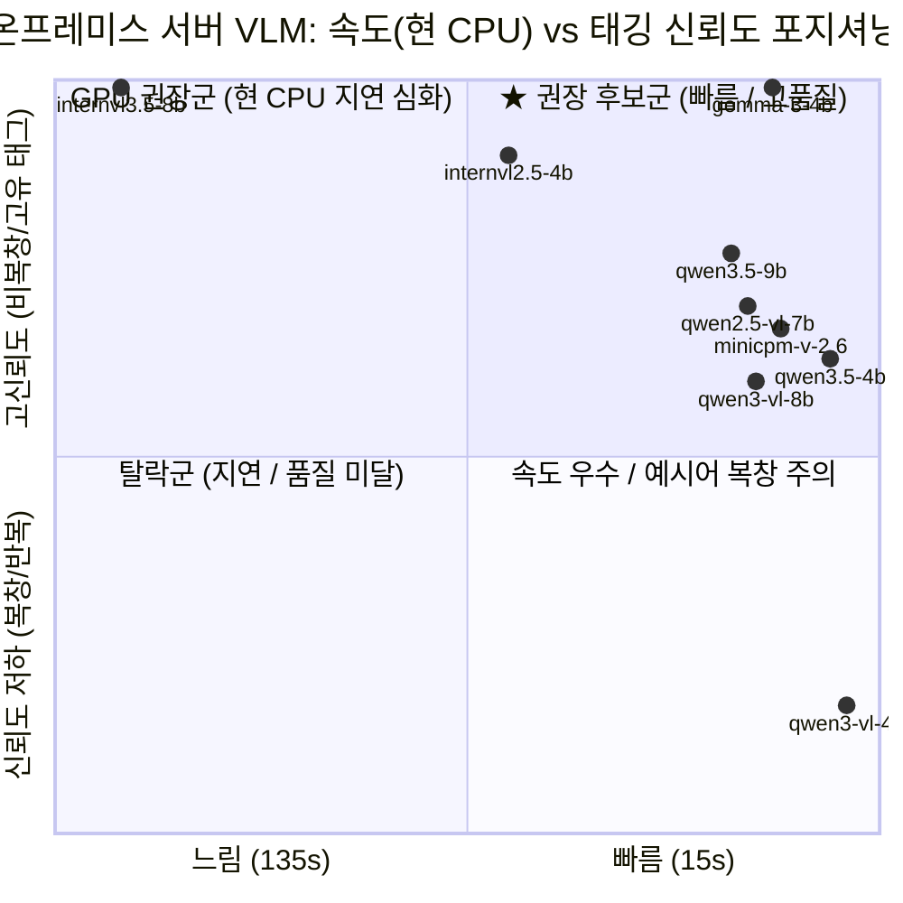

# 초기 VLM 후보 비교: 상세 분석과 전체 출력

[비교 요약, 실행 조건과 종합 수치](vlm-benchmark-report.md) | [이미지 분석 실험 안내](README.md)

초기 보고서의 4장, 5장과 6장을 원문 그대로 보관한다. 아래 추천과 향후 과제는 당시 평가자의 판단이며, 현재 제품 결정은 [ADR-006](../../../docs/architecture/decisions/ADR-006-server-side-ai-processing.md)을 따른다. 모델과 출력 형식은 비교 중이다.

## 4. 트랙별 후보 모델 심층 분석

### 4.1 트랙 1: 모바일 온디바이스(Mobile On-device) 후보 모델 분석

모바일 온디바이스 VLM은 태블릿 자체에서 오프라인 동작이 가능한 장점이 있으나, **이번에 시험한 3B 이하 후보와 본 문서의 프롬프트·양자화 설정에서는** 태깅 성능이 **실서비스 적용 불가 수준**이었음. (아래 판정은 이 시험 범위에 대한 것이며, 3B 이하 체급 전체의 한계를 확정한 것은 아님.)

1. **실패 패턴별 현황**:
   - **프롬프트 예시어 단순 복창 (Echoing)**: `qwen3.5-2b`(12/17회), `mobilevlm-3b`(10/17회), `smolvlm-500m`(9/17회). 사진의 시각 정보를 전혀 파악하지 못하고 프롬프트의 예시 단어(`연탄불, 재봉틀, 국민학교 도시락`)를 그대로 출력함.
   - **단어 무한 루프**: `qwen3.5-0.8b`는 17개 이미지 전량에서 한 단어만 5번 반복(`['한류', '한류', '한류', '한류', '한류']`, `['집', '집안', '집안', '집안']`).
   - **언어 오염**: `qwen2.5-vl-3b`는 시각 피처를 가장 잘 잡아냈으나 한국 사진을 보고 중국어 간체자(`国民学校`, `传统体育`, `传统服饰`, `传统渔村`, `建筑` 등)를 14회 출력함. `moondream-1.8b`는 영문 태그(`assistant`, `topics`)를 58회 출력함.
   - **런타임 크래시**: `smolvlm-2.2b`(토큰 디코드 -1 에러), `paligemma-3b`(Segfault)는 모바일 엔진 호환성 문제로 1장도 완주하지 못함.

2. **다장(Multi-image) 처리 시 치명적 지연 병목**:
   - 앱에서 사용자가 사진을 1장만 올리는 것이 아니라 여러 장을 일괄 업로드하는 경우, 장당 15~38초가 소요되어 3장만 처리해도 1분을 가볍게 초과함.
   - 단말 리소스 점유와 발열 쓰로틀링이 누적되어 사용자 대기 시간이 기하급수적으로 늘어남.

3. **단말 RAM 점유 한계 및 OOM Killer 강제 종료 위험**:
   - **스마트폰(S21 등) 가용 RAM 1.x GB 한계**: 3B 모델뿐 아니라 1.8B~2B급 모델(`moondream-1.8b`, `qwen3-vl-2b`, `qwen3.5-2b` 등)도 모델 가중치 파일만 1.5GB~2.0GB에 달하며, 실행 시 비전 버퍼를 포함해 최소 1.8GB~2.7GB(실측 `moondream-1.8b` 기준 2,156 MB)를 점유함. 가용 RAM이 1.x GB에 불과한 일반 스마트폰 환경에서는 OS 커널의 `ActivityManager`에 의해 OOM Killer(`SIGKILL`) 강제 종료 대상이 될 위험이 큼. (스마트폰 실기기 구동 실측이 아니라, 스마트폰 가용 RAM 확인값과 태블릿 실측 점유량을 비교한 추정임.)
   - **12GB 태블릿 환경의 실측 메모리 압박**: 12GB RAM을 탑재한 Galaxy Tab S9+에서도 VLM 1회 구동 시 가용 메모리가 5,715 MB에서 3,558 MB로 2.1GB 이상 급감함. 연속 추론 시 메모리 해제 지연 및 발열 쓰로틀링이 누적됨.
   - **초경량 모델의 성능 붕괴**: 1GB 미만으로 적재 가능한 500M~0.8B 모델(`smolvlm-500m`, `qwen3.5-0.8b`)은 메모리 부담은 적으나, 태깅 품질이 완전히 붕괴되어 실사용이 불가능함.

4. **모바일 온디바이스 트랙 종합 판정**:
   - **배제 강력 권고 (시험 범위 기준)**: 이번 시험 범위에서 확인된 품질 미달과 다장 처리 지연, 메모리 고갈 위험으로 인해 **현재 후보군으로는 온디바이스 탑재를 하지 않는 방향을 권고함.** (권고이며 실행 위치의 확정 결정은 아님. 1장 '전제 및 범위' 참고.)
   - **불가피한 경우의 차선책 (Single VLM)**: `qwen2.5-vl-3b` (시각 인지는 유일하게 가능하나, 38.3초 지연, 3.1GB 점유, 중국어 간체자 필터링 필수).
   - **제한적 대안 구조 (2-Stage)**: 보안/네트워크 단절로 온디바이스가 무조건 강제되는 특수 상황에 한해, **모바일 경량 비전/OCR + 모바일 한국어 SLM** 파이프라인 PoC를 고려해 볼 수 있음.

---

### 4.2 트랙 2: 온프레미스 서버(On-premise Server) 후보 모델 분석

> **포지셔닝 산출 공식 (3장 실측치 기반)**:
> - **X축 (추론 속도 점수)**: $X = 1.0 - \frac{\text{지연시간(초)} - 15}{120}$ (15초~135초 구간 정규화, 빠를수록 1.0에 수렴)
> - **Y축 (태깅 신뢰도 점수)**: $Y_{\text{raw}} = 0.5 \times \left(1 - \frac{\text{복창 횟수}}{17}\right) + 0.5 \times \left(\frac{\text{고유 태그 평균}}{\text{전체 태그 평균}}\right)$ (비복창률 50% + 고유 태그 비율 50% 산술평균)
>   - 시인성 및 사분면 변별을 위해 비교군 실측 범위(0.70~1.00)를 0.0~1.0으로 Min-Max 정규화: $Y = \frac{Y_{\text{raw}} - 0.70}{0.30}$

> **차트 포지셔닝 상세 해석 및 정성적 평가 유의사항**:
> 1. **`gemma-3-4b`의 Y축 최고점(0.99) 해석 주의**:
>    - Y축 지표는 프롬프트 지시 준수 및 단어 중복 방지라는 **'형식적 규칙 준수율'**을 측정하므로, 복창 0회·중복 0회인 `gemma-3-4b`가 차트 최상단에 위치함.
>    - 그러나 실제 정성 평가에서는 사진 맥락과 무관한 군사 테마(`군사도시`, `군함`, `군복`)를 출력하는 **도메인 편향(환각)**이 확인되어, 대화 소재 추천 실용성 관점에서는 Qwen 3.5 계열보다 후순위로 평가함.
> 2. **`qwen3-vl-4b`의 X축 우측 배치 주의 (Q4 탈락)**:
>    - 지연시간(20.2s)이 가장 짧아 X축 맨 우측(0.96)에 위치하나, 17장 중 7장에서 예시어를 단순 복창하여 Y축 최하위(0.17)로 떨어짐. 속도만 빠르고 품질이 불안정하여 실서비스 채택은 부적격함.
> 3. **실질적 추천 모델 (`qwen3.5-4b` & `qwen3.5-9b`)의 진짜 가치**:
>    - 수식 상 Y축(0.63, 0.77)은 중간~상위권에 분포하지만, 실제 사진 내 세부 OCR 판독(`서울역`, `광명`, `청계천`) 및 상황 맥락 묘사(`자율봉사`, `김치찌개`) 등 **정성적 시각 인지 및 대화 소재 생성 품질이 비교군 중 가장 뛰어남**.
>    - 이에 따라 **테스트 대상 모델 중 1순위는 `qwen3.5-4b`**, **향후 GPU 서버 배포 1순위는 `qwen3.5-9b`, 더 큰 qwen 계열**로 임의 결정함.

---

## 5. 이미지별 전체 실측 결과 및 모델 출력 대조 (17종 전수)

17개 이미지 전체 대상 **Claude Opus 5 Description/Baseline** 및 모델별 실측 출력/순수 추론 시간 대조 전수 기록.

#### 1970s_01_bus_conductor.png

> 🔗 **원본 출처**: [https://commons.wikimedia.org/wiki/File:Bus_conductor_1976-11-02.png](https://commons.wikimedia.org/wiki/File:Bus_conductor_1976-11-02.png) · 라이선스: `Public domain`

**Claude Opus 5 Description:** 버스 옆문에 매달려 올라타는 청년을, 제복·모자 차림의 안내양이 뒤에서 밀어 넣고 있다. 차체 왼쪽에 노선 행선판(서울역·을지2가 경유·청계천·제6). 뒤쪽에 또 다른 버스, 흙먼지 자욱한 비포장 도로. 거친 입자의 흑백 사진.

**Claude Opus 5 Baseline:** `버스안내양` · `만원버스` · `노선행선판` · `차장 밀어태우기` · `비포장길`

##### 📱 모바일 온디바이스 (Mobile On-device)

| 모델 | 추론 | 출력 |
|---|--:|---|
| `smolvlm-500m` | 8s | `연탄불`(예시어) · `재봉틀`(예시어) · `국민학교 도시락 등 일상 소재`(예시어) |
| `qwen3.5-0.8b` | 37s | `한류`×5 |
| `moondream-1.8b` | 16s | `assistant`×5 |
| `qwen3-vl-2b` | 20s | `서울` · `버스` · `정전` |
| `qwen3.5-2b` | 24s | `연탄불`(예시어) · `재봉틀`(예시어) · `국민학교 도시락`(예시어) |
| `mobilevlm-3b` | 15s | `연탄불`(예시어) · `재봉틀`(예시어) · `국민학교 도시락`(예시어) · `건물` · `풍경` |
| `qwen2.5-vl-3b` | 36s | `버스` · `여행` · `일상생활` |

##### 🖥️ 온프레미스 서버 (On-premise Server)

| 모델 | 추론 | 출력 |
|---|--:|---|
| `gemma-3-4b` | 28s | `군사도시` · `군함` · `군복` · `전보` · `군대생활` |
| `internvl2.5-4b` | 67s | `버스` · `승객` · `옷` · `주머니` · `주차장` |
| `qwen3-vl-4b` | 18s | `버스승강장` · `서울역` · `도시락`(예시어) · `기차역` · `버스문` |
| `qwen3.5-4b` | 19s | `버스` · `서울역` · `광명` · `청계천` |
| `qwen2.5-vl-7b` | 30s | `버스` · `일반인` · `도시 교통` |
| `internvl3.5-8b` | 127s | `버스 탑승` · `학교 다니기` · `장난감 열쇠차` · `야채 채취` · `전통 의상` |
| `minicpm-v-2.6` | 27s | `버스` · `아동` · `도시`(예시어) · `교통` · `일상` |
| `qwen3-vl-8b` | 30s | `버스 승강장` · `서울역` · `공장 근무` · `도시락`(예시어) · `신발끈` |
| `qwen3.5-9b` | 33s | `버스` · `버스정류장` · `버스운전사` · `버스승객` · `버스운전` |

##### 🔍 객체 탐지 비교군

| 모델 | 추론 | 출력 |
|---|--:|---|
| `efficientdet-lite0` | 0s | `person`×2 · `bus` · `truck` |

#### 1970s_02_medicine_hawker.png

> 🔗 **원본 출처**: [https://commons.wikimedia.org/wiki/File:Medicine_hawker_1976.png](https://commons.wikimedia.org/wiki/File:Medicine_hawker_1976.png) · 라이선스: `Public domain`

**Claude Opus 5 Description:** 흙바닥 공터에서 벌어진 차력 공연. 웃통을 벗은 수염 난 남자가 팔을 치켜들었다. 그 앞에 한 사람이 낮은 나무 의자 위로 몸을 뒤로 젖히고 누워 있다. 바닥에 돌덩이와 각목이 늘어놓여 있다. 왼쪽에 도복 차림 두 명과 트럭, 트럭 현수막에 '매치기 뿌리뽑자'. 수백 명의 구경꾼이 반원으로 둘러섰고 가운데 승용차가 한 대 서 있다. 뒤편 담장에 '물산건설 강남터미널 건설' 글자, 그 너머 산.

**Claude Opus 5 Baseline:** `차력쇼` · `약장수` · `구경꾼` · `터미널 공터` · `돌 깨기`

##### 📱 모바일 온디바이스 (Mobile On-device)

| 모델 | 추론 | 출력 |
|---|--:|---|
| `smolvlm-500m` | 15s | 실패 (invalid_output) |
| `qwen3.5-0.8b` | 37s | `집` · `집안`×3 |
| `moondream-1.8b` | 16s | `tables` · `cars` · `mountains`×3 |
| `qwen3-vl-2b` | 24s | `대리기 빠리 뽑자`×3 · `우리 빈을 봐`×2 |
| `qwen3.5-2b` | 25s | `연탄불`(예시어) · `재봉틀`(예시어) · `국민학교 도시락`(예시어) |
| `mobilevlm-3b` | 16s | `옛 추억 단어 키워드` · `일상 소재` · `국민학교 도시락`(예시어) · `연탄불`(예시어) · `재봉틀`(예시어) |
| `qwen2.5-vl-3b` | 38s | `연탄불`(예시어) · `재봉틀`(예시어) · `国民学校` · `도시락`(예시어) · `자전거` |

##### 🖥️ 온프레미스 서버 (On-premise Server)

| 모델 | 추론 | 출력 |
|---|--:|---|
| `gemma-3-4b` | 29s | `무투` · `전통 의상` · `농한` · `지역 축제` |
| `internvl2.5-4b` | 69s | `무도회` · `무술` · `대회` · `무술장비` · `무술장` |
| `qwen3-vl-4b` | 19s | `연탄불`(예시어) · `도시락`(예시어) · `고무장갑` · `자동차` · `도구상자` |
| `qwen3.5-4b` | 18s | `무술` · `연기` · `목재` · `산` |
| `qwen2.5-vl-7b` | 33s | `매치기` · `차량` · `인파` · `도시락`(예시어) · `산` |
| `internvl3.5-8b` | 125s | `도로공사` · `전통체육` · `버스여객` · `장사꾼` · `농구공` |
| `minicpm-v-2.6` | 29s | `무예` · `차` · `중국어` · `기타` · `체육대회` |
| `qwen3-vl-8b` | 31s | `연탄불`(예시어) · `도시락`(예시어) · `전기밥솥` · `전화기` · `전통시장` |
| `qwen3.5-9b` | 34s | `무술` · `검술` · `무도장` · `민속놀이` · `야외공연` |

##### 🔍 객체 탐지 비교군

| 모델 | 추론 | 출력 |
|---|--:|---|
| `efficientdet-lite0` | 0s | `person`×8 · `sheep` |

#### 1970s_03_saemaul_roof.jpg

> 🔗 **원본 출처**: [https://commons.wikimedia.org/wiki/File:%EB%86%8D%EC%B4%8C_%EC%83%88%EB%A7%88%EC%9D%84_%EC%9A%B4%EB%8F%99_%EC%A7%80%EB%B6%95_%EA%B0%9C%EB%9F%89_%EC%9E%91%EC%97%85.jpg](https://commons.wikimedia.org/wiki/File:%EB%86%8D%EC%B4%8C_%EC%83%88%EB%A7%88%EC%9D%84_%EC%9A%B4%EB%8F%99_%EC%A7%80%EB%B6%95_%EA%B0%9C%EB%9F%89_%EC%9E%91%EC%97%85.jpg) · 라이선스: `KOGL Type 1`

**Claude Opus 5 Description:** 시골집 지붕에 남자 네다섯이 올라가 기와를 새로 잇고 있다. 한 사람은 용마루에 서서 등짐을 졌고 나머지는 엎드려 기왓장을 옮긴다. 아래는 흙벽에 나무 기둥이 드러난 집. 잎이 없는 나뭇가지, 뒤로 다랑논과 산. 전선이 화면을 여러 갈래로 가로지른다. 흑백.

**Claude Opus 5 Baseline:** `지붕개량` · `기와잇기` · `새마을운동` · `품앗이` · `흙벽집`

##### 📱 모바일 온디바이스 (Mobile On-device)

| 모델 | 추론 | 출력 |
|---|--:|---|
| `smolvlm-500m` | 15s | `연탄불`(예시어) · `재봉틀`(예시어) · `국민학교 도시락 등 일상 소재`(예시어) |
| `qwen3.5-0.8b` | 37s | `집`×5 |
| `moondream-1.8b` | 17s | `topics`×5 |
| `qwen3-vl-2b` | 22s | `산책` · `집` · `도로` · `전기선` · `기계` |
| `qwen3.5-2b` | 26s | `연탄불`(예시어) · `재봉틀`(예시어) · `국민학교 도시락`(예시어) |
| `mobilevlm-3b` | 16s | `연탄불`(예시어) · `재봉틀`(예시어) · `국민학교 도시락`×3(예시어) |
| `qwen2.5-vl-3b` | 38s | `연탄불`(예시어) · `재봉틀`(예시어) · `国民学校` · `도시락`(예시어) · `집` |

##### 🖥️ 온프레미스 서버 (On-premise Server)

| 모델 | 추론 | 출력 |
|---|--:|---|
| `gemma-3-4b` | 30s | `기와집` · `수공업` · `농지 경사` · `전선` |
| `internvl2.5-4b` | 70s | `토끼집`×5 |
| `qwen3-vl-4b` | 19s | `돌기름`×5 |
| `qwen3.5-4b` | 19s | `지붕 치기` · `농촌` · `전선` · `산` |
| `qwen2.5-vl-7b` | 35s | `전기선` · `전통적인 지붕` · `작은 마을` · `작은 집` · `작은 마을의 일상` |
| `internvl3.5-8b` | 129s | `manually operated tools` · `terrace farming` · `traditional Korean roof tiles` · `rural community life` · `manual labor in agriculture` |
| `minicpm-v-2.6` | 29s | `roofing` · `traditional architecture` · `agriculture` · `rural life` · `traditional tools` |
| `qwen3-vl-8b` | 33s | `지붕 빗물` · `기와 작업` · `농촌 도로` · `전기선` · `산책길` |
| `qwen3.5-9b` | 36s | `지붕 수리` · `농사` · `산골 마을` |

##### 🔍 객체 탐지 비교군

| 모델 | 추론 | 출력 |
|---|--:|---|
| `efficientdet-lite0` | 0s | 실패 (invalid_output) |

#### 1980s_01_olympics_opening.jpg

> 🔗 **원본 출처**: [https://commons.wikimedia.org/wiki/File:1988_Summer_Olympics_opening_ceremony.JPEG](https://commons.wikimedia.org/wiki/File:1988_Summer_Olympics_opening_ceremony.JPEG) · 라이선스: `Public domain`

**Claude Opus 5 Description:** 잔디 경기장에서 벌어진 줄다리기(고싸움) 공연. 짚으로 굵게 꼰 거대한 동아줄을 흰 한복에 머리띠를 두른 사람들이 어깨로 떠받친다. 그 위에 붉은 도포와 검은 갓 차림의 흰 수염 남자가 올라서서 청룡이 그려진 깃발을 흔든다. 뒤로 붉은 띠를 두른 흰옷 공연자들과 관중석.

**Claude Opus 5 Baseline:** `줄다리기` · `동아줄` · `짚풀` · `갓 도포` · `개막식 공연`

##### 📱 모바일 온디바이스 (Mobile On-device)

| 모델 | 추론 | 출력 |
|---|--:|---|
| `smolvlm-500m` | 15s | `연탄불`(예시어) · `재봉틀`(예시어) · `국민학교 도시락 등 일상 소재`(예시어) |
| `qwen3.5-0.8b` | 37s | `한복`×5 |
| `moondream-1.8b` | 17s | `topic1` · `topic2` · `topic3` · `topic4` · `topic5` |
| `qwen3-vl-2b` | 23s | `무기장` · `장례식` · `기념일` · `사람` · `도구` |
| `qwen3.5-2b` | 26s | `고려사` · `전도사`×4 |
| `mobilevlm-3b` | 16s | `일상 소재` · `국민학교 도시락`×2(예시어) · `연탄불`(예시어) · `재봉틀`(예시어) |
| `qwen2.5-vl-3b` | 38s | `传统体育` · `绳索比赛` · `传统服饰` · `传统节日` · `传统娱乐活动` |

##### 🖥️ 온프레미스 서버 (On-premise Server)

| 모델 | 추론 | 출력 |
|---|--:|---|
| `gemma-3-4b` | 32s | `한복` · `전통무용` · `농악` · `짚단` |
| `internvl2.5-4b` | 69s | `농부` · `농사` · `농기구` · `쌀밥` · `농장` |
| `qwen3-vl-4b` | 20s | `장구` · `전통복장` · `대한민국 축제` · `신라식물` · `대한민국 국기` |
| `qwen3.5-4b` | 21s | `단청` · `한복` · `대나무` · `전통무용` |
| `qwen2.5-vl-7b` | 34s | `농경` · `전통의상` · `로프` · `전통문화` · `농민` |
| `internvl3.5-8b` | 125s | `농업` · `전통 의상` · `전통 축제` |
| `minicpm-v-2.6` | 30s | `연기` · `기타`×3 · `고무대` |
| `qwen3-vl-8b` | 34s | `전통 의상` · `짚신` · `대관령 마을` · `한복 퍼포먼스` · `국민체조` |
| `qwen3.5-9b` | 34s | `한복` · `농악` · `농사` |

##### 🔍 객체 탐지 비교군

| 모델 | 추론 | 출력 |
|---|--:|---|
| `efficientdet-lite0` | 0s | `person`×7 · `baseball bat` |

#### 1980s_02_rice_harvest.jpg

> 🔗 **원본 출처**: [https://commons.wikimedia.org/wiki/File:South_Koreans_harvest_rice_in_the_Demilitarized_Zone_of_Korea,_1988.JPEG](https://commons.wikimedia.org/wiki/File:South_Koreans_harvest_rice_in_the_Demilitarized_Zone_of_Korea,_1988.JPEG) · 라이선스: `Public domain`

**Claude Opus 5 Description:** 논에서 소형 콤바인 두 대가 벼를 베고 있다. 왼쪽 기계는 챙 넓은 모자를 쓴 사람이 몬다. 오른쪽 기계에서는 두 사람이 곡식을 자루에 받는다. 벤 자리에 짚이 눕고 진흙 바퀴자국이 남았다. 색이 바랜 컬러 사진.

**Claude Opus 5 Baseline:** `콤바인` · `벼베기` · `나락자루` · `논바닥` · `가을걷이`

##### 📱 모바일 온디바이스 (Mobile On-device)

| 모델 | 추론 | 출력 |
|---|--:|---|
| `smolvlm-500m` | 12s | 실패 (invalid_output) |
| `qwen3.5-0.8b` | 38s | `농장` · `집` · `집안`×3 |
| `moondream-1.8b` | 17s | `assistant`×5 |
| `qwen3-vl-2b` | 24s | `비닐봉투`×5 |
| `qwen3.5-2b` | 28s | `농장` · `고양이` · `농구` · `농구장`×2 |
| `mobilevlm-3b` | 16s | `연탄불`(예시어) · `재봉틀`(예시어) · `국민학교 도시락`(예시어) · `건물` · `풍경` |
| `qwen2.5-vl-3b` | 35s | `농장` · `수확기` · `농부` · `밭` · `미세먼지` |

##### 🖥️ 온프레미스 서버 (On-premise Server)

| 모델 | 추론 | 출력 |
|---|--:|---|
| `gemma-3-4b` | 31s | `수확` · `농기계` · `농촌 노동` · `벼` · `수확물` |
| `internvl2.5-4b` | 73s | `농기구` · `마을` · `농부` · `밭` · `농사` |
| `qwen3-vl-4b` | 21s | `수확기` · `곡식기계` · `농기계` · `벼농사` · `농촌생활` |
| `qwen3.5-4b` | 22s | `수확기`×2 · `벼` · `농부` |
| `qwen2.5-vl-7b` | 35s | `수확기` · `농작물` · `농민` · `야외 작업` · `농업` |
| `internvl3.5-8b` | 132s | `농장` · `수확기` · `밭두비기` · `농구두기` · `농가 도구` |
| `minicpm-v-2.6` | 30s | `시골 농사` · `기계 농업` · `농작물 수확` · `농어업 산업` · `농어업 도구` |
| `qwen3-vl-8b` | 34s | `벼 수확` · `combine harvester` · `논밭길` · `햇볕 좋은 농사` · `농촌 일손` |
| `qwen3.5-9b` | 38s | `벼베기` · `수확기` · `농기계` · `논밭` · `농사` |

##### 🔍 객체 탐지 비교군

| 모델 | 추론 | 출력 |
|---|--:|---|
| `efficientdet-lite0` | 0s | `truck`×2 · `person` |

#### 1980s_03_olympics_fireworks.jpg

> 🔗 **원본 출처**: [https://commons.wikimedia.org/wiki/File:Fireworks_at_the_closing_ceremonies_of_the_1988_Summer_Games.JPEG](https://commons.wikimedia.org/wiki/File:Fireworks_at_the_closing_ceremonies_of_the_1988_Summer_Games.JPEG) · 라이선스: `Public domain`

**Claude Opus 5 Description:** 야간 경기장. 머리 위로 붉은 불꽃이 크게 터졌다. 삼태극 무늬와 오륜기가 그려진 대형 현수막 세 장이 걸려 있다. 관중석 전체가 손에 든 붉은 불빛으로 뒤덮였다. 트랙 위에는 흰 제복과 흰 치마 차림의 인원들이 늘어서 있다.

**Claude Opus 5 Baseline:** `불꽃놀이` · `삼태극` · `오륜기` · `야간 개막식` · `관중 불빛`

##### 📱 모바일 온디바이스 (Mobile On-device)

| 모델 | 추론 | 출력 |
|---|--:|---|
| `smolvlm-500m` | 15s | `연탄불`(예시어) · `재봉틀`(예시어) · `국민학교 도시락 등 일상 소재`(예시어) |
| `qwen3.5-0.8b` | 38s | `시각예술` · `시각화`×4 |
| `moondream-1.8b` | 17s | `Olympics` · `Olympic`×4 |
| `qwen3-vl-2b` | 24s | `올림픽` · `연탄불`(예시어) · `국민학교 도시락`(예시어) · `오륜` · `화염` |
| `qwen3.5-2b` | 26s | `연탄불`(예시어) · `재봉틀`(예시어) · `국민학교 도시락`(예시어) |
| `mobilevlm-3b` | 16s | `연탄불`(예시어) · `재봉틀`(예시어) · `국민학교 도시락`(예시어) · `등 일상 소재 / 사람` · `건물` |
| `qwen2.5-vl-3b` | 36s | `대회` · `올림픽` · `화려한` · `장식` · `불꽃놀이` |

##### 🖥️ 온프레미스 서버 (On-premise Server)

| 모델 | 추론 | 출력 |
|---|--:|---|
| `gemma-3-4b` | 32s | `전통무용` · `가향의상` · `전통악기` · `국화` · `불꽃놀이` |
| `internvl2.5-4b` | 67s | `화염` · `축구선수` · `축제` |
| `qwen3-vl-4b` | 21s | `화사` · `빛나는 촛불` · `오리온 마스코트` · `축제의 열기` · `공중 불꽃` |
| `qwen3.5-4b` | 22s | `화분`×3 · `올림픽 로고` |
| `qwen2.5-vl-7b` | 35s | `올림픽` · `화산` · `화려한 불꽃` · `올림픽 로고` · `스포츠 경기` |
| `internvl3.5-8b` | 126s | `동네 장독대` · `전통시장 장독대` · `전통 음식 stalls` · `장인의 도구` |
| `minicpm-v-2.6` | 29s | `연타불` · `기념관` · `체육대회` · `오リン피다` · `기념모든` |
| `qwen3-vl-8b` | 36s | `화려한 불꽃놀이` · `올림픽 촬영용 라이트` · `수영장 옆의 빨래기` · `공식 행사용 흰색 유니폼` · `장미빛 조명` |
| `qwen3.5-9b` | 37s | `올림픽 개회식` · `불꽃놀이` · `야외 경기장` · `올림픽 마스코트` · `야외 공연` |

##### 🔍 객체 탐지 비교군

| 모델 | 추론 | 출력 |
|---|--:|---|
| `efficientdet-lite0` | 0s | `person`×9 |

#### 1990s_01_jagalchi_market.jpg

> 🔗 **원본 출처**: [https://commons.wikimedia.org/wiki/File:1995%EB%85%84_%EB%B6%80%EC%82%B0_%EC%9E%90%EA%B0%88%EC%B9%98%EC%8B%9C%EC%9E%A5_%EC%88%98%EB%B3%80.jpg](https://commons.wikimedia.org/wiki/File:1995%EB%85%84_%EB%B6%80%EC%82%B0_%EC%9E%90%EA%B0%88%EC%B9%98%EC%8B%9C%EC%9E%A5_%EC%88%98%EB%B3%80.jpg) · 라이선스: `CC BY 4.0`

**Claude Opus 5 Description:** 부산 자갈치 부둣가. '부산 자갈치' 간판이 붙은 청록색 건물이 오른쪽으로 길게 이어진다. 왼쪽 물가에는 어선이 여러 척 묶여 있다. 앞쪽 부두에 대나무로 엮은 커다란 둥근 광주리들이 놓였다. 노란 플라스틱 상자, 파란 통, 빨간 대야, 손수레, 파라솔도 늘어서 있다. 뒤로 산복도로 주택가와 산. 맑은 하늘.

**Claude Opus 5 Baseline:** `자갈치시장` · `대바구니` · `어선` · `부둣가 좌판` · `산복도로`

##### 📱 모바일 온디바이스 (Mobile On-device)

| 모델 | 추론 | 출력 |
|---|--:|---|
| `smolvlm-500m` | 16s | `연탄불`(예시어) · `재봉틀`(예시어) · `국민학교 도시락`(예시어) · `사람` · `건물, 풍경 같은 단순 일반명사` |
| `qwen3.5-0.8b` | 38s | `하루의 일`×5 |
| `moondream-1.8b` | 19s | `연탄불`(예시어) · `재봉틀`(예시어) · `국민학교`(예시어) · `건물` · `풍경 같은 단순 일반명사` |
| `qwen3-vl-2b` | 24s | `바닷가` · `잡고`×4 |
| `qwen3.5-2b` | 27s | `연탄불`(예시어) · `재봉틀`(예시어) · `국민학교 도시락`(예시어) |
| `mobilevlm-3b` | 16s | `일상 소재` · `건물`×3 · `풍경` |
| `qwen2.5-vl-3b` | 37s | `传统渔村` · `旧式渔具` · `传统渔网` · `旧式渔船` · `传统渔具市场` |

##### 🖥️ 온프레미스 서버 (On-premise Server)

| 모델 | 추론 | 출력 |
|---|--:|---|
| `gemma-3-4b` | 29s | `어망` · `어선` · `어시가` · `젓기` |
| `internvl2.5-4b` | 69s | `바다` · `어선` · `선박` · `바구니` · `바다사장` |
| `qwen3-vl-4b` | 20s | `배고운 배`×2 · `고래잡이 배`×3 |
| `qwen3.5-4b` | 24s | `대나무 통` · `바다 어선` · `바다 어부` · `어업 도구` |
| `qwen2.5-vl-7b` | 34s | `어선` · `바다` · `рыба` · `선착장` |
| `internvl3.5-8b` | 126s | `어선 장비` · `해산물 처리` · `바다 위의 생활` · `어부의 도구` · `바닷가의 농산물` |
| `minicpm-v-2.6` | 28s | `구리` · `해안` · `漁村` · `漁具` · `漁市` |
| `qwen3-vl-8b` | 33s | `바다물고기` · `바구니망` · `해산물장터` · `어부망` · `물고기구이` |
| `qwen3.5-9b` | 34s | `대나무 바구니` · `오징어` · `어선` · `바다` |

##### 🔍 객체 탐지 비교군

| 모델 | 추론 | 출력 |
|---|--:|---|
| `efficientdet-lite0` | 0s | `person`×2 · `cow` · `umbrella` |

#### 1990s_02_seoul_fire_safety.jpg

> 🔗 **원본 출처**: [https://commons.wikimedia.org/wiki/File:1990%EB%85%84%EB%8C%80_%EC%B4%88%EA%B8%B0_%EC%84%9C%EC%9A%B8%EC%86%8C%EB%B0%A9_%ED%99%9C%EB%8F%99_%EC%82%AC%EC%A7%84%EC%8A%A4%EC%BA%940006.jpg](https://commons.wikimedia.org/wiki/File:1990%EB%85%84%EB%8C%80_%EC%B4%88%EA%B8%B0_%EC%84%9C%EC%9A%B8%EC%86%8C%EB%B0%A9_%ED%99%9C%EB%8F%99_%EC%82%AC%EC%A7%84%EC%8A%A4%EC%BA%940006.jpg) · 라이선스: `CC BY-SA 4.0`

**Claude Opus 5 Description:** 긴 건물을 따라 불길이 번지고 검은 연기가 하늘을 뒤덮었다. 빨간 소방차 여러 대가 줄지어 섰고 노란색 고가사다리차가 물줄기를 쏜다. 흙바닥 공터에 여름옷 차림의 구경꾼 수십 명이 서서 보고 있다. 필름 스캔 줄무늬가 남아 있다.

**Claude Opus 5 Baseline:** `화재현장` · `소방차` · `고가사다리차` · `검은 연기` · `구경꾼`

##### 📱 모바일 온디바이스 (Mobile On-device)

| 모델 | 추론 | 출력 |
|---|--:|---|
| `smolvlm-500m` | 16s | 실패 (invalid_output) |
| `qwen3.5-0.8b` | 39s | `집안` · `집`×4 |
| `moondream-1.8b` | 18s | `topics/im_start`×2 · `topics/im_end`×2 |
| `qwen3-vl-2b` | 24s | `소방차` · `화재` · `민간자원`×2 · `소방서` |
| `qwen3.5-2b` | 27s | `연탄불`(예시어) · `재봉틀`(예시어) · `국민학교 도시락`(예시어) |
| `mobilevlm-3b` | 17s | `국민학교 도시락`×3(예시어) · `연탄불`(예시어) · `재봉틀`(예시어) |
| `qwen2.5-vl-3b` | 39s | `연탄불`(예시어) · `재봉틀`(예시어) · `국민학교 도시락`(예시어) · `소방차` · `화재` |

##### 🖥️ 온프레미스 서버 (On-premise Server)

| 모델 | 추론 | 출력 |
|---|--:|---|
| `gemma-3-4b` | 31s | `소방차` · `화염` · `산업단지` · `연기` · `군인` |
| `internvl2.5-4b` | 70s | `화재` · `화물차` · `소방차` · `화염` · `소방대` |
| `qwen3-vl-4b` | 21s | `연탄불`(예시어) · `국민학교 도시락`(예시어) · `화재 소화기` · `화재대응 차량` · `소방관의 구호` |
| `qwen3.5-4b` | 23s | `화물차` · `소방차` · `연막` · `산불` |
| `qwen2.5-vl-7b` | 36s | `연탄불`(예시어) · `재봉틀`(예시어) · `국민학교 도시락`(예시어) · `화재 소방대` · `일반인 대형 화재` |
| `internvl3.5-8b` | 125s | `전통시장` · `농촌의 가축 사육` · `전기밥솥` · `도자기 공장` · `자전거 타기` |
| `minicpm-v-2.6` | 29s | `연탄불`(예시어) · `재봉틀`(예시어) · `국민학교 도시락`(예시어) · `구리` · `고양이` |
| `qwen3-vl-8b` | 33s | `연탄불`(예시어) · `국민학교 도시락`(예시어) · `전화기` · `자전거` · `전통시장` |
| `qwen3.5-9b` | 36s | `화재 진압` · `소방차` · `구급차` |

##### 🔍 객체 탐지 비교군

| 모델 | 추론 | 출력 |
|---|--:|---|
| `efficientdet-lite0` | 0s | `person`×5 |

#### 2000s_01_worldcup_cheering.jpg

> 🔗 **원본 출처**: [https://commons.wikimedia.org/wiki/File:2002_FIFA_%ED%95%9C%EC%9D%BC%EC%9B%94%EB%93%9C%EC%BB%B5-%EC%8B%9C%EC%B2%AD_%EA%B1%B0%EB%A6%AC%EC%9D%91%EC%9B%90_(1).jpg](https://commons.wikimedia.org/wiki/File:2002_FIFA_%ED%95%9C%EC%9D%BC%EC%9B%94%EB%93%9C%EC%BB%B5-%EC%8B%9C%EC%B2%AD_%EA%B1%B0%EB%A6%AC%EC%9D%91%EC%9B%90_(1).jpg) · 라이선스: `KOGL Type 1`

**Claude Opus 5 Description:** 서울시청 앞 광장을 붉은 옷 인파가 가득 메운 항공 사진. 시청 건물에 태극기와 'SEOUL WELCOMES THE WORLD' 노란 현수막, 전광 시계에 6:39. 광장 가운데 흰 축구공 조형물이 섰다. 인파가 세종대로를 따라 멀리까지 이어진다. 주변 빌딩에 대한매일·SK·한미은행·KTF·효성 간판.

**Claude Opus 5 Baseline:** `거리응원` · `붉은악마` · `시청앞광장` · `축구공 조형물` · `인파`

##### 📱 모바일 온디바이스 (Mobile On-device)

| 모델 | 추론 | 출력 |
|---|--:|---|
| `smolvlm-500m` | 16s | `연탄불`(예시어) · `재봉틀`(예시어) · `국민학교 도시락 등 일상 소재`(예시어) · `사람` · `건물, 풍경 같은 단순 일반명사` |
| `qwen3.5-0.8b` | 40s | `시나리오` · `집` · `집안`×3 |
| `moondream-1.8b` | 18s | `topics/assistant`×5 |
| `qwen3-vl-2b` | 25s | `세계대회` · `국민의회` · `광장` · `대중문화` · `스포츠` |
| `qwen3.5-2b` | 27s | `연탄불`(예시어) · `재봉틀`(예시어) · `국민학교 도시락`(예시어) |
| `mobilevlm-3b` | 20s | 실패 (invalid_output) |
| `qwen2.5-vl-3b` | 41s | `대한민국` · `월드컵` · `서울` · `도시`(예시어) · `建筑` |

##### 🖥️ 온프레미스 서버 (On-premise Server)

| 모델 | 추론 | 출력 |
|---|--:|---|
| `gemma-3-4b` | 30s | `축제` · `환영` · `대규모 집회` · `전통 의상` · `광장` |
| `internvl2.5-4b` | 69s | `대형모자` · `광화문` · `서울타워` |
| `qwen3-vl-4b` | 21s | `서울올림픽` · `홍대광장` · `대한민국 1988년` · `홍보용 풍선` · `국민학교 도시락`(예시어) |
| `qwen3.5-4b` | 25s | `대형 전구`×2 · `광화문 광장`×2 · `세종 세계` |
| `qwen2.5-vl-7b` | 34s | `야구공` · `시계` · `대형광고판` |
| `internvl3.5-8b` | 124s | `도시철거` · `전통시장` · `야채가게` · `전기밥솥` · `직거래장소` |
| `minicpm-v-2.6` | 29s | `구리` · `국제축구대회` · `대중전시` · `도시의 전시` · `국제적 이벤트` |
| `qwen3-vl-8b` | 34s | `서울올림픽` · `전화벨` · `비닐봉지` · `고추장` · `전기밥솥` |
| `qwen3.5-9b` | 36s | `연탄불`(예시어) · `재봉틀`(예시어) · `국민학교 도시락`(예시어) |

##### 🔍 객체 탐지 비교군

| 모델 | 추론 | 출력 |
|---|--:|---|
| `efficientdet-lite0` | 0s | `clock` |

#### 2000s_02_worldcup_flag.jpg

> 🔗 **원본 출처**: [https://commons.wikimedia.org/wiki/File:2002_FIFA_%ED%95%9C%EC%9D%BC%EC%9B%94%EB%93%9C%EC%BB%B5-%EC%8B%9C%EC%B2%AD_%EA%B1%B0%EB%A6%AC%EC%9D%91%EC%9B%90_(2).jpg](https://commons.wikimedia.org/wiki/File:2002_FIFA_%ED%95%9C%EC%9D%BC%EC%9B%94%EB%93%9C%EC%BB%B5-%EC%8B%9C%EC%B2%AD_%EA%B1%B0%EB%A6%AC%EC%9D%91%EC%9B%90_(2).jpg) · 라이선스: `KOGL Type 1`

**Claude Opus 5 Description:** 세종대로를 내려다본 사진. 도로 양옆 보도와 광장을 붉은 옷 인파가 채웠다. 차도에는 시내버스와 승용차가 지나간다. 왼쪽에 서울특별시의회, KOREANA HOTEL, 오른쪽에 프레스센터(한국언론회관) 간판. 멀리 광화문 방향과 북악산.

**Claude Opus 5 Baseline:** `거리응원` · `붉은악마` · `세종대로` · `시내버스` · `프레스센터`

##### 📱 모바일 온디바이스 (Mobile On-device)

| 모델 | 추론 | 출력 |
|---|--:|---|
| `smolvlm-500m` | 15s | `Koreana Hotel` · `Queen` · `King` |
| `qwen3.5-0.8b` | 39s | `가정` · `집` · `집안`×3 |
| `moondream-1.8b` | 18s | `가장만`×5 |
| `qwen3-vl-2b` | 25s | `광화문`×2 · `국제회의장`×2 · `대한민국` |
| `qwen3.5-2b` | 28s | `연탄불`(예시어) · `재봉틀`(예시어) · `국민학교 도시락`(예시어) |
| `mobilevlm-3b` | 18s | `발생한 일상 소재`×5 |
| `qwen2.5-vl-3b` | 42s | `Korean War Memorial` · `Korean War Victory Day` · `Korean War Veterans` · `Korean War Memorials`×2 |

##### 🖥️ 온프레미스 서버 (On-premise Server)

| 모델 | 추론 | 출력 |
|---|--:|---|
| `gemma-3-4b` | 31s | `붉은색 유니폼` · `버스` · `광장` · `전광판` |
| `internvl2.5-4b` | 68s | `자전거` · `전화번호부` · `토끼집` |
| `qwen3-vl-4b` | 21s | `국민학교 도시락`(예시어) · `연탄불`(예시어) · `재봉틀`(예시어) · `전기버스` · `고양이 풀` |
| `qwen3.5-4b` | 24s | `국민학교 도시락`(예시어) · `연탄불`(예시어) · `재봉틀`(예시어) · `노란꽃`×2 |
| `qwen2.5-vl-7b` | 37s | `일반대회` · `노란색 유니폼` · `도시행진` · `대규모 집회` · `도시 교통` |
| `internvl3.5-8b` | 126s | `버스` · `버스킹` · `도시버스` · `버스정류장` · `버스여객차` |
| `minicpm-v-2.6` | 29s | `당신의 일상 생활` · `당신의 일거리` · `당신의 도구` · `당신의 음식` |
| `qwen3-vl-8b` | 34s | `도시락`(예시어) · `전화기` · `공기청정기` · `비닐봉지` · `전기밥솥` |
| `qwen3.5-9b` | 38s | `국민학교`(예시어) · `버스` · `도시락` · `연탄불`(예시어) · `재봉틀`(예시어) |

##### 🔍 객체 탐지 비교군

| 모델 | 추론 | 출력 |
|---|--:|---|
| `efficientdet-lite0` | 0s | `bus` |

#### 2000s_03_chuseok_table.jpg

> 🔗 **원본 출처**: [https://commons.wikimedia.org/wiki/File:Chuseok_table_02.JPG](https://commons.wikimedia.org/wiki/File:Chuseok_table_02.JPG) · 라이선스: `CC BY-SA 3.0`

**Claude Opus 5 Description:** 차례상 사진이 아니라 인쇄물을 찍은 사진이다. '차례상 차리는법 (설, 추석)' 제목의 종이에 상차림 도해가 선화로 그려져 있다. 수저·편·갱·국수·전·육탕·포·콩나물·대추·밤·곶감·향로·축판 등 위치마다 글자가 붙었다. 아래에 설명 문단. 종이는 나무 바닥 위 낡은 책에 붙어 있다.

**Claude Opus 5 Baseline:** `차례상 차리는법` · `상차림 도해` · `인쇄물` · `제기 이름표` · `명절 준비`

##### 📱 모바일 온디바이스 (Mobile On-device)

| 모델 | 추론 | 출력 |
|---|--:|---|
| `smolvlm-500m` | 16s | 실패 (invalid_output) |
| `qwen3.5-0.8b` | 39s | `집`×5 |
| `moondream-1.8b` | 18s | `자리`×5 |
| `qwen3-vl-2b` | 24s | `차례상차리는법` · `차례상` · `차례상 차리는 법`×3 |
| `qwen3.5-2b` | 27s | `연탄불`(예시어) · `재봉틀`(예시어) · `국민학교 도시락`(예시어) |
| `mobilevlm-3b` | 17s | `옛 추억 단어 키워드` · `일상 소재` · `사람` · `건물` · `풍경` |
| `qwen2.5-vl-3b` | 41s | `차례상 차리는 법` · `설, 추석` · `음식` · `재료` · `일상 생활` |

##### 🖥️ 온프레미스 서버 (On-premise Server)

| 모델 | 추론 | 출력 |
|---|--:|---|
| `gemma-3-4b` | 31s | `차례상` · `차례상 차림법` · `국수` · `음식` · `전통 음식` |
| `internvl2.5-4b` | 69s | `차례상` · `차례` · `국수` · `대추` · `향` |
| `qwen3-vl-4b` | 21s | `차례상` · `차례차리는데` · `차례상 차리는 법` · `차례상 차리기` · `차례상 차리기 전` |
| `qwen3.5-4b` | 22s | `차례상` · `추석` · `떡국` · `오른편` |
| `qwen2.5-vl-7b` | 35s | `설날` · `추석` · `제사` · `송편` · `택견` |
| `internvl3.5-8b` | 124s | `차례상` · `국수` · `대추` · `소주` · `추석` |
| `minicpm-v-2.6` | 28s | `고전기기` · `식품` · `기구` · `식사` · `식품제조` |
| `qwen3-vl-8b` | 33s | `차례상` · `추석` · `전설` · `음식` · `예절` |
| `qwen3.5-9b` | 38s | `차례상 차리는 법` · `설, 추석` · `제수 잔` · `향로` · `축판` |

##### 🔍 객체 탐지 비교군

| 모델 | 추론 | 출력 |
|---|--:|---|
| `efficientdet-lite0` | 0s | `book` |

#### 2010s_01_kimchi_festival.jpg

> 🔗 **원본 출처**: [https://commons.wikimedia.org/wiki/File:Seoul_Kimchi_Making_Sharing_Festival_13_(15600628527).jpg](https://commons.wikimedia.org/wiki/File:Seoul_Kimchi_Making_Sharing_Festival_13_(15600628527).jpg) · 라이선스: `CC BY-SA 2.0`

**Claude Opus 5 Description:** 대규모 김장 행사를 위에서 내려다본 사진. 붉은 모자와 분홍 고무장갑, 베이지색 앞치마 차림의 참가자 수백 명이 노란 천을 덮은 긴 탁자에 늘어서서 배추와 붉은 양념을 다루고 있다. 바닥은 파란 천. 종이상자와 초록·노란 플라스틱 상자, 붉은 대야, 검은 김치통이 사이사이 놓였다.

**Claude Opus 5 Baseline:** `김장` · `배추` · `고무장갑` · `김장양념` · `김치통`

##### 📱 모바일 온디바이스 (Mobile On-device)

| 모델 | 추론 | 출력 |
|---|--:|---|
| `smolvlm-500m` | 15s | `연탄불`(예시어) · `재봉틀`(예시어) · `국민학교 도시락`(예시어) |
| `qwen3.5-0.8b` | 38s | `집안`×5 |
| `moondream-1.8b` | 17s | `assistant` · `topics`×4 |
| `qwen3-vl-2b` | 24s | `일상생활` · `일거리` · `도구` · `음식` · `추억` |
| `qwen3.5-2b` | 27s | `연탄불`(예시어) · `재봉틀`(예시어) · `국민학교 도시락`(예시어) |
| `mobilevlm-3b` | 17s | `연탄불`(예시어) · `재봉틀`(예시어) · `국민학교 도시락`×3(예시어) |
| `qwen2.5-vl-3b` | 38s | `상점` · `상인` · `상품` · `상세품` · `상품상` |

##### 🖥️ 온프레미스 서버 (On-premise Server)

| 모델 | 추론 | 출력 |
|---|--:|---|
| `gemma-3-4b` | 31s | `빨간 작업복` · `테이블 세트` · `수작업` · `제1야금` |
| `internvl2.5-4b` | 68s | `시장` · `장사` · `판매`×2 · `음식` |
| `qwen3-vl-4b` | 20s | `도시락`(예시어) · `시장장터` · `장터판매` · `장구` · `장터음식` |
| `qwen3.5-4b` | 21s | `빨간색 재킷` · `노란색 테이블` · `배달` · `식자재` |
| `qwen2.5-vl-7b` | 34s | `도시락`(예시어) · `식당` · `식탁` · `음식` · `사람` |
| `internvl3.5-8b` | 125s | `야채 썰기` · `시장 장사` · `손님 맞이` · `장판 정리` · `음식 보관` |
| `minicpm-v-2.6` | 30s | `식품 가공` · `식품 제조` · `식품 공급` · `식품 유통` · `식품 소비` |
| `qwen3-vl-8b` | 34s | `시장의 떡볶이` · `손수 만든 떡` · `시장에서의 쇼핑백` · `시장의 냄비` · `시장의 쌀밥` |
| `qwen3.5-9b` | 37s | `빨간 모자` · `자율봉사` · `식탁` · `김치` · `김치찌개` |

##### 🔍 객체 탐지 비교군

| 모델 | 추론 | 출력 |
|---|--:|---|
| `efficientdet-lite0` | 0s | 실패 (invalid_output) |

#### 2010s_02_gwangjang_market.jpg

> 🔗 **원본 출처**: [https://commons.wikimedia.org/wiki/File:Korea_GwangjangMarket_Eats_01_(13885110035).jpg](https://commons.wikimedia.org/wiki/File:Korea_GwangjangMarket_Eats_01_(13885110035).jpg) · 라이선스: `CC BY-SA 2.0`

**Claude Opus 5 Description:** 광장시장 빈대떡 노점. '순희네 빈대떡' 앞치마를 입은 두 여성이 넓은 철판에서 기름에 빈대떡을 부치고 있다. 부친 것은 여러 겹으로 쌓아두었고 파란 국자로 반죽을 붓는 중이다. 위에 '순희네 빈대떡 2273-5057', '박가네 빈대떡' 간판과 선풍기, 아치형 시장 지붕. 뒤로 장 보는 사람들.

**Claude Opus 5 Baseline:** `빈대떡` · `광장시장` · `철판` · `녹두반죽` · `시장 노점`

##### 📱 모바일 온디바이스 (Mobile On-device)

| 모델 | 추론 | 출력 |
|---|--:|---|
| `smolvlm-500m` | 17s | 실패 (invalid_output) |
| `qwen3.5-0.8b` | 38s | `집안`×5 |
| `moondream-1.8b` | 18s | `tables` · `pizza`×4 |
| `qwen3-vl-2b` | 23s | `국민학교`(예시어) · `전통시장` · `한국어` · `고기` · `도시락` |
| `qwen3.5-2b` | 27s | `전통요리`×4 · `시장` |
| `mobilevlm-3b` | 16s | `일상 소재` · `국민학교 도시락`×2(예시어) · `연탄불`(예시어) · `재봉틀`(예시어) |
| `qwen2.5-vl-3b` | 37s | `street food` · `market` · `cooking` · `traditional` · `street vendor` |

##### 🖥️ 온프레미스 서버 (On-premise Server)

| 모델 | 추론 | 출력 |
|---|--:|---|
| `gemma-3-4b` | 30s | `김부각` · `식탁상` · `팬` · `시장상` |
| `internvl2.5-4b` | 68s | `떡볶이` · `떡` · `떡볶이집` · `떡볶이소스` · `떡볶이판` |
| `qwen3-vl-4b` | 20s | `김치찌개` · `전통시장` · `국민학교 도시락`(예시어) · `전기밥솥` · `한국식 빵` |
| `qwen3.5-4b` | 20s | `전통시장`×4 |
| `qwen2.5-vl-7b` | 31s | `전통시장` · `순대` · `통기타` · `가마솥` · `전통음식` |
| `internvl3.5-8b` | 125s | `전통시장` · `간판` · `손수전용 팬` · `간판 음식` · `전통 음식점` |
| `minicpm-v-2.6` | 29s | `시장` · `고기` · `구리` · `구리고기` · `구리고기구리` |
| `qwen3-vl-8b` | 33s | `돼지국밥` · `전골` · `철제 냄비` · `손수 만든 떡` · `시장의 냄새` |
| `qwen3.5-9b` | 36s | `떡볶이` · `떡갈비` · `전` · `김치전` · `요리대` |

##### 🔍 객체 탐지 비교군

| 모델 | 추론 | 출력 |
|---|--:|---|
| `efficientdet-lite0` | 0s | `person`×5 · `donut`×5 |

#### 2010s_03_jeongseon_market.jpg

> 🔗 **원본 출처**: [https://commons.wikimedia.org/wiki/File:Korea_Jeongseon_Traditional_Market_Train_05_(14387691974).jpg](https://commons.wikimedia.org/wiki/File:Korea_Jeongseon_Traditional_Market_Train_05_(14387691974).jpg) · 라이선스: `CC BY-SA 2.0`

**Claude Opus 5 Description:** 나물 파는 좌판. 앞쪽에 초록 끈으로 묶은 마른 나물 다발과 말린 버섯이 수북이 쌓였고 오른쪽에는 생 곰취 잎과 두릅 줄기가 무더기로 놓였다. '취나물.고사리', '곰취.곤드레'라고 쓴 초록 간판. 뒤편 유리장에는 큰 유리병이 줄지어 들어 있다.

**Claude Opus 5 Baseline:** `산나물` · `고사리` · `곤드레` · `말린나물` · `장터 좌판`

##### 📱 모바일 온디바이스 (Mobile On-device)

| 모델 | 추론 | 출력 |
|---|--:|---|
| `smolvlm-500m` | 16s | `food` · `vegetables` · `fruits` · `plants` |
| `qwen3.5-0.8b` | 38s | `집` · `집안`×3 |
| `moondream-1.8b` | 17s | `Korean`×5 |
| `qwen3-vl-2b` | 25s | `취나물` · `고사리` · `금취` · `곤드레` · `국민학교 도시락`(예시어) |
| `qwen3.5-2b` | 28s | `고사리` · `고추장`×4 |
| `mobilevlm-3b` | 16s | `레벨`×5 |
| `qwen2.5-vl-3b` | 40s | `건강한 식품` · `한국 전통 요리` · `마을 시장` · `자연의 재료` · `한국 전통 의료` |

##### 🖥️ 온프레미스 서버 (On-premise Server)

| 모델 | 추론 | 출력 |
|---|--:|---|
| `gemma-3-4b` | 32s | `식용버섯` · `전통시장` · `국수` · `약재` · `전통상인` |
| `internvl2.5-4b` | 70s | `농부` · `시장` · `약초` · `마을` · `가정` |
| `qwen3-vl-4b` | 20s | `고사리` · `국채` · `마늘` · `한약재` · `시장판매` |
| `qwen3.5-4b` | 22s | `건초` · `마늘` · `마늘가마솥` · `국자방아` |
| `qwen2.5-vl-7b` | 34s | `야채` · `시장` · `건강음식` · `전통요리` · `농산물` |
| `internvl3.5-8b` | 126s | `시장 생활` · `전통 음식` · `농산물 시장` · `的手工 가공` · `시장 장사꾼` |
| `minicpm-v-2.6` | 29s | `Farmers' Markets` · `Herbs and Spices` · `Traditional Korean Medicine` · `Local Produce` · `Street Food` |
| `qwen3-vl-8b` | 33s | `김치渍` · `마늘쫑` · `고사리` · `청국장` · `마늘장아찌` |
| `qwen3.5-9b` | 38s | `고사리` · `곰취` · `나물` · `건초` · `김치` |

##### 🔍 객체 탐지 비교군

| 모델 | 추론 | 출력 |
|---|--:|---|
| `efficientdet-lite0` | 0s | 실패 (invalid_output) |

#### 2020s_01_lantern_festival.jpg

> 🔗 **원본 출처**: [https://commons.wikimedia.org/wiki/File:2023_Lotus_Lantern_Festival_04.jpg](https://commons.wikimedia.org/wiki/File:2023_Lotus_Lantern_Festival_04.jpg) · 라이선스: `CC BY-SA 2.0`

**Claude Opus 5 Description:** 해질녘 도심 거리의 제등행렬. 회색 승복에 붉은 가사를 두른 스님들이 흰 장갑을 끼고 연꽃 모양 등을 들고 걷는다. 가운데 감청색 정장에 파란 넥타이를 맨 남자도 같은 연등을 들었다. 머리 위로 색색의 둥근 등이 줄줄이 걸렸고 뒤로 네온 간판.

**Claude Opus 5 Baseline:** `연등` · `제등행렬` · `승복` · `가사` · `부처님오신날`

##### 📱 모바일 온디바이스 (Mobile On-device)

| 모델 | 추론 | 출력 |
|---|--:|---|
| `smolvlm-500m` | 16s | `연탄불`(예시어) · `재봉틀`(예시어) · `국민학교 도시락 등 일상 소재`(예시어) |
| `qwen3.5-0.8b` | 39s | `한양도`×5 |
| `moondream-1.8b` | 19s | `연탄불`(예시어) · `재봉틀`(예시어) · `국민학교`(예시어) · `건물` · `풍경 같은 단순 일반명사` |
| `qwen3-vl-2b` | 24s | `불꽃`×4 · `사찰` |
| `qwen3.5-2b` | 27s | `연탄불`(예시어) · `재봉틀`(예시어) · `국민학교 도시락`(예시어) |
| `mobilevlm-3b` | 18s | `발생한 일상 소재`×5 |
| `qwen2.5-vl-3b` | 39s | `연탄불`(예시어) · `재봉틀`(예시어) · `국민학교 도시락`(예시어) · `불교` · `불상` |

##### 🖥️ 온프레미스 서버 (On-premise Server)

| 모델 | 추론 | 출력 |
|---|--:|---|
| `gemma-3-4b` | 32s | `법복` · `불전등` · `법계` · `전통의상` |
| `internvl2.5-4b` | 67s | `lotus_lantern` · `monk_clothing` · `street_lights` |
| `qwen3-vl-4b` | 20s | `불꽃수` · `불교행진` · `불교행사` · `불교행렬` · `불교행렬의 빛` |
| `qwen3.5-4b` | 23s | `전통등` · `불교행사`×3 · `선원` |
| `qwen2.5-vl-7b` | 33s | `불교행진` · `불꽃등` · `불교사원` |
| `internvl3.5-8b` | 124s | `불사` · `전통 의상` · `장미등` · `종교 행사` · `도시 환경` |
| `minicpm-v-2.6` | 28s | `연등불` · `경교` · `도시`(예시어) · `사찰` · `사찰일` |
| `qwen3-vl-8b` | 36s | `불교 행진` · `장미빛 등불` · `사찰 투명한 봉투` · `도시의 불빛 축제` · `사찰 앞의 전통 의상` |
| `qwen3.5-9b` | 37s | `불교 법회` · `등불 행렬` · `로타스 등` |

##### 🔍 객체 탐지 비교군

| 모델 | 추론 | 출력 |
|---|--:|---|
| `efficientdet-lite0` | 0s | `person`×9 · `tie` |

#### 2020s_02_lantern_crowd.jpg

> 🔗 **원본 출처**: [https://commons.wikimedia.org/wiki/File:Lotus_Lantern_Festival_2022_02_(52040034374).jpg](https://commons.wikimedia.org/wiki/File:Lotus_Lantern_Festival_2022_02_(52040034374).jpg) · 라이선스: `CC BY-SA 2.0`

**Claude Opus 5 Description:** 밤거리 연등행렬. 분홍·흰 한복에 조바위 형태의 모자를 쓰고 마스크를 낀 여성들이 악기 모양 등을 들고 손을 흔든다. 붉은 현악기 모양 등과 비파 모양 등이 크게 보인다. 위쪽에는 연꽃무늬 흰 등, 물고기 등, 거북 등이 떠 있다. 뒤로 네온 간판.

**Claude Opus 5 Baseline:** `연등행렬` · `한복` · `악기모양등` · `물고기등` · `밤거리`

##### 📱 모바일 온디바이스 (Mobile On-device)

| 모델 | 추론 | 출력 |
|---|--:|---|
| `smolvlm-500m` | 16s | `연탄불`(예시어) · `재봉틀`(예시어) · `국민학교 도시락`(예시어) · `사람` · `건물` |
| `qwen3.5-0.8b` | 39s | `한복`×3 · `화물`×2 |
| `moondream-1.8b` | 18s | `자료`×5 |
| `qwen3-vl-2b` | 23s | `lantern` · `mask` · `traditional dress` · `street festival` |
| `qwen3.5-2b` | 27s | `전통 음악` · `전통 의상` · `전통 음식` |
| `mobilevlm-3b` | 17s | `연탄불`(예시어) · `재봉틀`(예시어) · `국민학교 도시락`(예시어) · `등 일상 소재 / 사람` · `건물` |
| `qwen2.5-vl-3b` | 40s | `한복` · `장식용 빛나는 램프` · `한국 전통 축제` |

##### 🖥️ 온프레미스 서버 (On-premise Server)

| 모델 | 추론 | 출력 |
|---|--:|---|
| `gemma-3-4b` | 30s | `한복` · `전통악기` · `등` · `보궁` |
| `internvl2.5-4b` | 69s | `화려한 불빛` · `한복 춤` · `풍선` · `전통 연주기` · `가정용 전구` |
| `qwen3-vl-4b` | 20s | `전통악기` · `조명놀이` · `한복` · `灯笼` · `문화행사` |
| `qwen3.5-4b` | 23s | `한복` · `전통악기` · `등불` · `전통무용` |
| `qwen2.5-vl-7b` | 34s | `한복` · `등불` · `음악` · `문화축제` · `전통음악` |
| `internvl3.5-8b` | 126s | `전통 의상` · `장식등` · `화려한 축제` · `공연장면` · `전통 음악 도구` |
| `minicpm-v-2.6` | 29s | `연등` · `기타` · `한복` · `명절` · `광경` |
| `qwen3-vl-8b` | 36s | `전통 한복` · `전통 음악회` · `불꽃 축제` · `가족 단위 축제` · `전통 악기` |
| `qwen3.5-9b` | 33s | `한복` · `등불` · `국악기` |

##### 🔍 객체 탐지 비교군

| 모델 | 추론 | 출력 |
|---|--:|---|
| `efficientdet-lite0` | 0s | `umbrella`×5 · `handbag` |

#### 2020s_03_hiking_outing.jpg

> 🔗 **원본 출처**: [https://commons.wikimedia.org/wiki/File:Eco_Hiking_Yeongwol_2023_-_P1055919_(52844255875).jpg](https://commons.wikimedia.org/wiki/File:Eco_Hiking_Yeongwol_2023_-_P1055919_(52844255875).jpg) · 라이선스: `CC BY 2.0`

**Claude Opus 5 Description:** 행사 포토존 앞. 짧은 머리의 여성이 무릎을 굽히고 앉아 휴대폰을 들었다. 그 앞에 얼룩무늬 개가 주황색 등짐 하네스를 메고 서 있다. 뒤 현수막에 '2023 에코하이킹 영월'과 후원사 로고들(paldo, BROOKS, GARMIN, TECNICA 등). 바닥은 포장 블록, 옆에 돌담과 계단.

**Claude Opus 5 Baseline:** `반려견 산행` · `등짐 하네스` · `행사 포토존` · `현수막` · `휴대폰 촬영`

##### 📱 모바일 온디바이스 (Mobile On-device)

| 모델 | 추론 | 출력 |
|---|--:|---|
| `smolvlm-500m` | 17s | 실패 (invalid_output) |
| `qwen3.5-0.8b` | 38s | `고요도`×5 |
| `moondream-1.8b` | 17s | `2023` · `insorts`×4 |
| `qwen3-vl-2b` | 25s | `2023 에코하이킹 영월` · `예비 휴식`×4 |
| `qwen3.5-2b` | 27s | `연탄불`(예시어) · `재봉틀`(예시어) · `국민학교 도시락`(예시어) |
| `mobilevlm-3b` | 20s | 실패 (invalid_output) |
| `qwen2.5-vl-3b` | 38s | `재봉틀`(예시어) · `国民学校` · `도시락`(예시어) |

##### 🖥️ 온프레미스 서버 (On-premise Server)

| 모델 | 추론 | 출력 |
|---|--:|---|
| `gemma-3-4b` | 30s | `견주` · `운동화` · `GPS` · `등산화` |
| `internvl2.5-4b` | 67s | `운동화` · `견` · `봉투` · `호프` · `밴드` |
| `qwen3-vl-4b` | 20s | `동물 수련` · `장애인용 보조동물` · `스마트폰` · `운동화` · `스포츠 이벤트` |
| `qwen3.5-4b` | 21s | `스마트폰` · `견수건` · `견대` · `견장갑` |
| `qwen2.5-vl-7b` | 34s | `산책` · `산악화` · `등산` · `산악용품` · `산악화이킹` |
| `internvl3.5-8b` | 127s | `개의 훈련` · `야외 활동` · `동물과의 유대감` · `운동복` · `훈련용 장비` |
| `minicpm-v-2.6` | 30s | `구두` · `사진` · `모자` · `수영장`×2 |
| `qwen3-vl-8b` | 33s | `휴대폰` · `운동화` · `강아지` · `운동복` · `스포츠백` |
| `qwen3.5-9b` | 36s | `산악화장실`×3 |

##### 🔍 객체 탐지 비교군

| 모델 | 추론 | 출력 |
|---|--:|---|
| `efficientdet-lite0` | 0s | `person` · `horse` · `handbag` |

---

## 6. 향후 과제: 프롬프트 고도화 방안

본 벤치마크 평가 과정에서 확인된 오류 패턴(예시어 단순 복창, 사진 맥락 무관 키워드 등)을 개선하고 대화 소재의 품질을 안정화하기 위한 2가지 프롬프트 고도화 접근 전략:

### 6.1 Zero-shot 프롬프트 고도화 (예시어 제거 및 제약 구조화)
1. **프롬프트 내 예시어 문구 전면 제거 고려**:
   - 지시문 본문에서 `(예: 연탄불, 재봉틀, 국민학교 도시락 등...)`과 같은 구체적 예시 단어를 완전히 삭제 고려..
   - 모델이 사진의 시각 정보를 인식하지 못했을 때 지시문의 예시어를 그대로 따라 출력하는 '예시어 복창(Echoing)' 현상을 차단.
2. **시각 관찰 중심의 지시문 정밀화**:
   - 예시 단어 나열 대신 "사진 속에 실제로 존재하는 사물, 인물 행동, 복장, 공간 배경"만을 시각적으로 관찰하여 구체적 명사형으로 추출하도록 지시 규칙을 엄밀히 재구성 고려.

### 6.2 Few-shot 프롬프트 도입 (어휘 톤앤매너 가이드)
1. **추억 회상 대화 소재 톤앤매너 유도**:
   - `건물`, `사람` 같은 단순·추상적 일반 명사 대신 `어물전`, `보따리`, `만원버스`처럼 실제 회상 대화 소재로 적합한 구체적 명사를 추출하도록 모범 입출력 예시를 제공 고려.
2. **텍스트 기반 상황-키워드 Few-shot ( CPU 환경)**:
   - 멀티모달 이미지 Few-shot은 예시 이미지 수만큼 비전 토큰과 연산 지연시간이 배수로 증가하여 CPU 환경에서는 병목이 큼.
   - 따라서 지연시간 증가(수십 토큰 수준)가 거의 없는 **"시각적 상황 묘사 텍스트 → 추천 키워드" 형태의 텍스트 Few-shot**을 우선 적용하여 속도 저하 없이 원하는 출력 유도를 고려..
3. **향후 GPU 환경에서의 멀티모달 Few-shot 검토**:
   - 외장 GPU 서버 인프라 확보 시, 대표 시대별 사진 1~2장을 직접 포함하는 멀티모달 Few-shot(또는 비전 토큰 프롬프트 캐싱) 고려.
